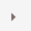

# Shipments

To search for and view Shipments go to **Sales → Shipments**.

The top area of the page enables you to search for a shipment by different search criteria:

* Start date and End date for shipments created between these dates
* Tracking number
* **Country, State/province, County, City** to search by a shipment destination
* **Warehouse** for shipments done from a specific warehouse
* Click **Load not shipped** checkbox if you do not want to load already shipped or delivered items

Select certain shipments to **Set as shipped (selected)** or **Set as delivered (selected)**. You can also **Print packaging slips (selected)** or **Print Packaging slips (all)** to print all packaging receipts.

In the list of shipments, a store owner can view all items of a shipment by clicking on  in the first column of the shipment.

If click on View, the **View shipment details** - 2 window will be opened.

In this window you can:

* Proceed to the order
* **Set tracking number** for the shipment
* **Add an Admin comment** for internal use
* See the **Shipment total weight**
* Edit the **shipment date**
* Set the shipment as **delivered**
* Print the **shipment packaging slip**
* or **Delete** the shipment

## See also

* [Setting up Shipping](xref:en/user-guide/configuring/setting-up/shipping/index)
* [Orders](xref:en/user-guide/running/order-management/orders/index)
* [Adding products](xref:en/user-guide/running/product-management/products/adding-products/index)
