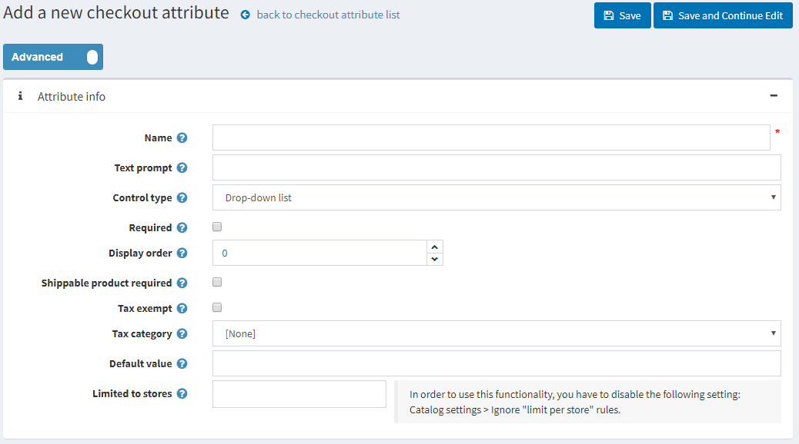
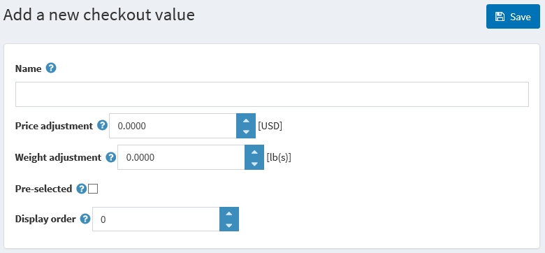

# Checkout attributes

Checkout Attributes is an additional order information that is gathered during the final stage of the shopping process.

> [!TIP]
> 
> Here shop owners can specify, for example, whether a bought product requires gift-wrapping or careful handling as in a case of fragile goods.

Checkout attributes are displayed on the Shopping Cart page and enable users to select them, if required, before the checkout.

To set up or edit checkout attributes, go to **Catalog → Attributes → Checkout attributes.**

## Adding new checkout attributes

To create a new checkout attribute, click **Add new**.

In the **Attribute Info panel**, define the following information:

- **Name** - the attribute name.
- **Text prompt** - a question or a comment that will be displayed in the checkout area on the shopping cart page.
- Ticked **Required** checkbox makes it compulsory for a customer to select an attribute value before completing the purchasing process.
- Tick **Shippable** product required checkbox in case this attribute should only be displayed for product that needs to be shipped
- Ticked **Tax exempt** checkbox indicates that tax will not be applied to this checkout attribute.
- In case the tax is applied, from the Tax category dropdown list, select the **tax category** that the checkout attribute is applied to.
- From the **Control Type dropdown list**, select the required method for displaying the attribute value: Dropdown List, Radio List, Checkboxes, Textbox, etc.

    > [!NOTE]
    > 
    > Dropdown lists, radio lists, checkboxes and color squares require the store owner to define values (such as Green, Blue, Red and so on). Textbox and Date picker control types do not require the store owner to define values since customers will be required to fill these textbox fields. In addition, for some control types, you can specify validation rules. For example: For the Textbox attribute, you can define the Minimum length, Maximum length and Default Value. For File Upload, you can define Maximum file size and Allowed file extension.
- **Display order** - display order number of the checkout attribute.
- **Limited to stores** enables you to limit the attribute to one or more stores. In order to use this functionality you have to disable the following setting: Catalog settings → Ignore "limit per store" rules.
- Click **Save and Continue Edit** to proceed to the Attribute Values tab.

## Adding new checkout values

On the **Attribute values panel**, click Add a new checkout value to create a new attribute value.

In the **Add a new checkout value** window, define the following information:

- **Name** - the attribute value name.

    > [!TIP]
    > 
    > For example, Yes or No, for questions such as Do you require fragile care handling?
- **Price adjustment** will add the entered amount to a purchase total sum in case the attribute value is selected.
- **Weight adjustment** will change an order weight by the entered amount in case the attribute value is selected.
- Tick the **Pre-selected** checkbox, to indicate the attribute value is pre-selected for a customer.
- **Display order** - display order number of the attribute value.

You can **edit** and **remove** attribute values by clicking the corresponding buttons beside the attributes on the Attribute values panel.

## Adding conditions

On the Condition tab of the Edit checkout attribute details window, a store owner can specify a condition for the checkout attribute to be visible (depending on other attributes). Conditional attribute only appears if a previous attribute is selected.

Click **Save**. The new attribute will be displayed in the public store.

## Tutorials

- [Adding checkout attributes](https://www.youtube.com/watch?v=sJcZP1qjHmY&list=PLnL_aDfmRHwsbhj621A-RFb1KnzeFxYz4&index=3)
- [Overview of conditional checkout attributes](https://www.youtube.com/watch?v=z3UiXgK8Jgo&list=PLnL_aDfmRHwsbhj621A-RFb1KnzeFxYz4&index=18)
