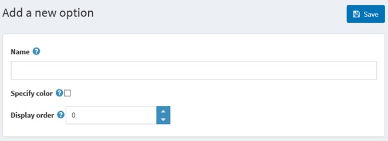

# Specification attributes

Specification attributes are similar to [product attributes](xref:en/user-guide/running/product-management/attributes/product-attributes), however, they are **only used for information purposes** (visible on product details page) and **for filtering products** on the category details page. They don’t define a product price as well as can’t be used for the inventory tracking.
> [!NOTE]
> 
> By default, there are no specification attributes precreated in nopCommerce.

To see and edit a list of specification attributes, go to **Catalog → Attributes → Specification Attributes.**

- Click **Add new** to add a new attribute.
- On the **Attribute info panel**, enter the **Name** of the specification attribute, and define its **Display order number**.
- Click **Save and Continue Edit** to proceed to the options editing window.

- On the **Options panel**, click **Add a new** option to add an attribute option.
- Enter the option **Name** and **Display order** number.

> [!NOTE]
> 
> for a color attribute, you can also tick a Specify color box, in this case, color variants will be displayed as “color squares” instead of the text names.

> [!NOTE]
> 
> for a color attribute, you can also tick a Specify color box, in this case, color variants will be displayed as “color squares” instead of the text names.

The **complete list of options** will look as follows.

Click **Edit** beside the attribute option to update it or Delete to remove it from the system.

## See also

- [Adding new products](xref:en/user-guide/running/product-management/products/adding-products/index)
- [Product attributes](xref:en/user-guide/running/product-management/attributes/product-attributes)
- [YouTube tutorial: Managing Specification Attributes](https://www.youtube.com/watch?v=YmD_vHqWzQw&index=11&list=PLnL_aDfmRHwsbhj621A-RFb1KnzeFxYz4)
