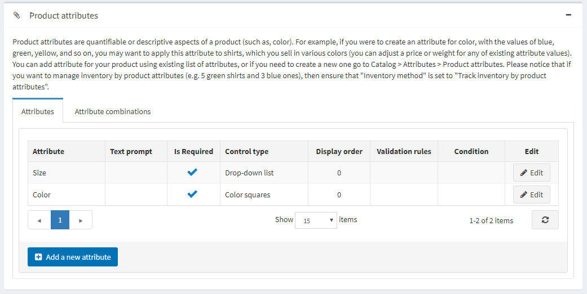

# Adding products

Setting up products in the best way possible is highly important for a store. Make sure to not miss any detail, such displaying different size and color options, giving a thorough product description, adding appealing pictures, etc.

To add a new product, go to **Catalog → Products**. Click **Add new** button in the right top corner.

> [!NOTE]
> 
> you can import a product from an external file by clicking Import from Excel. Once you have a list of products, you can export it to an external file for backup purposes, by clicking Export to XML(all) or Export to Excel (all). You can export selected products by clicking Export to XML (selected) and Export to Excel (selected). Additionally, it is possible to Download catalog as PDF to print the selected products to a PDF file. To remove products from the list, select the items to be deleted and click the Delete (selected) button.

Adding New Product page are available in two modes: **advanced** and **basic** (in Advanced mode by default). You can switch to the Basic mode and select the required fields in Settings.

## General information

Start by filling up General Information on the **Product info panel**:

- Set up your product as **Simple** or **Grouped** (read more about it here)
- Enter your **Product Name**
- Tick **Visible individually** if you want the product to be in catalog or search results, otherwise the product will be hidden in the catalog and accessible only from a grouped product details page.
- Enter the product **Short Description** that will be displayed in the catalog
- Enter the product **Full Description** that will be shown on the product page. Here you can add text, bullet points, links, or additional images. Make sure to write a detailed description as it affects your buyers' decision making
- Enter **SKU**, the product stock keeping unit, used internally for tracking the product. This is your internal unique ID used to track this product.
- Tick **Published**, to make the product visible in your store.
- Enter **Product Tags**, the keywords for product identification. Enter tags separating them by comma. The more products are associated with a particular tag, the larger it will look in the Popular Tags area, displayed in the sidebar of the Catalog page

    
- Enter **GTIN** (global trade item number). These identifiers include UPC (in North America), EAN (in Europe), JAN (in Japan), and ISBN (for Books).
- Enter **Manufacturer part number** - a part number provided by a manufacturer for the product.
- **Show on homepage**. If this checkbox is selected, the store owner can also specify the Display Order.
- Tick **Allow customer reviews**, to enable customers to provide reviews of the product.
- Define **Available Start date and/or Available End date** of the product availability.
- Tick **Mark as new**, to mark the product as recently added. This way you can manage a list of products displayed on the "New products" page. You can also specify a period during which this product will be marked as new.
- In the **Admin comment** field enter a comment for information purposes.

## Product class

Define whether the product is a

- [Gift Card](xref:en/user-guide/marketing/promotional/gift-cards)
- [Downloadable Product](xref:en/user-guide/running/product-management/products/adding-products/downloadable-products)
- [Recurring Product](xref:en/user-guide/running/product-management/products/adding-products/recurring-products)
- [Rental Product](xref:en/user-guide/running/product-management/products/adding-products/rental-products)

## Product price

In the **Prices** section define:

- **Price**, in a predefined currency. Note that you can change the store currency in **Configuration → Currencies**.
- **Old price**. If it is larger than zero it becomes visible in the public store and is displayed beside the new price for comparison purposes.
- **Product cost**, the sum of all costs associated with the production of the product or service. This cost is not displayed to customers.
- To **Disable buy button**. This can be useful for products “upon request”.
- To **Disable wishlist button**.
- **Available for pre-order** if the product is not in the store yet, but you want the customers to be able to order it. The **Pre-ordered** button will be displayed to replace the standard **Add to cart** button. When this option is selected, the **Pre-order availability start date** field is displayed. Enter the availability start date of the product in UTC. The Pre-order button will be changed to Add to cart when this date is reached.
- **Call for Price**, to show **Call for Pricing** or **Call for Quote** instead of the price. This can help you to establish a contact with your customers and provide with additional information about the product they are interested in.
- **Customer enters price**, to indicate that a customer must enter the price. When selected, the following fields are displayed:
- In the **Minimum amount** field, enter the minimum amount for the price.
- In the **Maximum amount** field, enter the maximum amount for the price.
- **PAngV (base price) enabled**, if the product has a base price. This is required according to the German law (PAngV). For example, if you sell 500ml of beer for 1,50 euro, you have to show the base price: 3.00 euro per 1L. When selected, the following fields are displayed:
- **Amount in product** - amount of the product that is being sold.
- **Unit of product** - measure of a previously entered value.
- **Reference amount** - the base amount.
- **Reference unit** - measure of a previously entered value.
- **Discounts**. Learn how to set up discounts [here](xref:en/user-guide/marketing/promotional/discounts/index).
- Whether the product is exempted from tax, by ticking **Tax exempt**. Otherwise, from the Tax category dropdown list, select the required tax classification for this product. Tax categories can be configured by the store owner in  the **Configuration → Tax → Tax Categories.**
- The product as **Telecommunications, broadcasting, and electronic services**, to apply special tax rules used in the European Union. Find more info here.
- Set up [tier prices](xref:en/user-guide/marketing/promotional/tier-prices) if required.

## Inventory settings

Define the inventory settings for the product as described [here](xref:en/user-guide/running/order-management/inventory-management).

## Shipping details

Define product-specific shipping details:

- Tick **Shipping enabled** if the product can be shipped. The section then expands for more details.
- Set the product parameters which will be used for the shipping calculation: **Weight, Length, Width, Height**. Note that you can change predefined measures in Configuration → Shipping → Measures.
- **Free shipping** if the product is shipped for free
- **Ship separately** if the product should be shipped separately from other products. If the order includes several items of the product, all of them will be shipped separately.
- **Additional shipping charge**
- **Delivery date** which will be displayed in the public store. Note that you can manage delivery date options in **Configuration → Shipping → Delivery Dates**.

## Mappings

In the Mappings section define:

- **Categories**. You can assign a product to as many categories as you want in nopCommerce. Note that you can manage [product categories](xref:en/user-guide/running/product-management/categories) in **Catalog → Categories**.
- **Manufacturer**. You can assign a product to as many manufacturers as you want in nopCommerce. Note that you can manage [manufacturers](xref:en/user-guide/running/product-management/manufacturers) in **Catalog → Manufacturers**.
- **Limited to stores**, if the product is sold in specific stores. Leave the field empty in case this functionality is not required. Note that in order to use this functionality you have to disable the following setting: **Configuration → Catalog Settings → Ignore** **“Limit per store” rules **(sitewide). Learn how to set up several stores [here](xref:en/user-guide/configuring/setting-up/main-store/multiple-store).
- **Vendor**. You can manage [vendors](xref:en/user-guide/configuring/setting-up/customers/vendors/index) in **Customers → Vendors**

## Customer roles

Choose customer roles, who will be able to see the product in the catalog. Leave this field empty if this option is not required and the product can be seen by everyone. Note that in order to use this functionality you have to disable the following setting: **Configuration → Catalog Settings → Ignore ACL rules** (sitewide).

## Require other products

Define whether the product **Requires other product**. In this case select the Required product IDs entering them by comma, ensure that there are no circular references, e.g. A requires B, B requires A. Chose to **Automatically add these products to the cart** if required.

## Related products and Cross-sells

Set up Related products and Cross-sells as described [here](xref:en/user-guide/marketing/promotional/cross-sells-related-products)

## Product pictures

Go to **Pictures** tab on Edit product details page to add product pictures.

- In the **Add a new** picture area, click Upload to select a new picture you want to upload to your product page.
- In the **Alt** field, enter a value for the "alt" attribute of "img" HTML element. If empty, then a default rule will be used (e.g. product name).
- In the **Title** field, enter a value for the "alt" attribute of "img" HTML element. If empty, then a default rule will be used (e.g. product name).
- Define the **Display order** of the image on a product page.

> [!TIP]
> 
> [YouTube tutorial: Importing mass product images](https://www.youtube.com/watch?v=9BUqR_OGiq4)

## Attributes

On the **Product attributes** tab, add Product attributes. Learn more about product attributes and how to create them [here](xref:en/user-guide/running/product-management/attributes/product-attributes). Once you have a list of the attributes created, click **Add new record** on the Attributes tab. The grid is expanded, as follows:

- From the **Attribute** dropdown list select an attribute.
- Fill the **Text Prompted** field, if you want some text to be shown in front of this attribute in a public store.
- Tick **Is required** to set this attribute as required for customers.
- Define the **Control type** for this attribute (e.g. dropdown list, radio button list, etc.).

> [!NOTE]
> 
> For the «Date picker» control type, it is possible to set a number of years to be displayed by using «catalogsettings.countdisplayedyearsdatepicker» parameter in All Settings (advanced). For example, if you set zero then only current year will be displayed. If you set 5 then current year and the next 5 years will be displayed.

- Define the **Display Order** for this attribute.
- Click **Update**.
- The **Values** field now displays a number of predefined values for this attribute. **View/Edit values**, if required.

> [!NOTE]
> 
> There are two Attribute value types, Simple and Associated to product. Choose the Associated to product type if you want this attribute value to be another product from your catalog and track its stock as well. Here you can use Bundled products functionality allowing customers to buy different combinations or sets of products as a single product and shoppers have an opportunity to set the required quantity of the attributes. (“Customer enters quantity” option).

- If required, define Conditions for this attribute, i.e. this attribute becomes visible when other attributes have certain values.

On the **Attribute Combinations** tab, define different attribute combinations and the following information for each of them:

- **Stock quantity**
- **Allow out of stock**, if you want your customers to be able to purchase products with certain attributes, when out of stock
- **SKU, Manufacturer part number, GTIN**
- **Overridden price**, if the price for products with certain attributes is different from the product regular price
- Product combination **quantity under which the admin will be notified**

On the **Specification Attributes tab**, add Specification attributes. Learn more about specification attributes and how to create them [here](xref:en/user-guide/running/product-management/attributes/specification-attributes)

 To add a new attribute, fill the **Add a new product specification attribute** section:

- Select an **Attribute type** from a drop down list.
- Choose the **Attribute** from a list of pre-created attributes.
- Choose the **Attribute option**.
- **Allow filtering** by this option on a category page, if required.
- Tick **Show on product page**, to make the attribute visible on a product page.
- Set the attribute **Display order**. 1 represents the top of the list.
- Click **Add attribute**.

## List of orders with the product

To view a list of orders in which the product was purchased, go to the **Purchased with orders** tab. Here you can check an order's status and click to view the order in details.

## SEO

Define the following SEO parameters for the product page:

- **Meta keywords** - a brief and concise list of the most important themes (keywords and key phrases) related to the product. These words will be added to the product page header.
- **Meta description** - a brief description of the product that will be added to the product page header.
- **Meta title** - a title for the Web page.
- **Search engine friendly page name** - a name of the page used by search engines. If you enter nothing then the product page URL is formed using the product name. If you enter custom-seo-page-name, then the following custom the URL will be used: `http://www.yourStore.com/custom-seo-page-name`.

Read more about SEO [here](xref:en/user-guide/marketing/content/seo).

## Stock quantity history

On this tab you can view all the product quantity changes, orders with the product.

## See also

- [Product categories](xref:en/user-guide/running/product-management/categories)
- [Order management](xref:en/user-guide/running/order-management/index)
- [Webinar. First steps in nopCommerce](https://www.youtube.com/watch?v=B_CfgJH0ylM&list=PLnL_aDfmRHwsJn1rnKaXdIcJg4pKJeeXs)

## Tutorials

- [Video tutorial: Adding a new product](https://www.youtube.com/watch?v=wVgTgdQVWPQ&index=2&list=PLnL_aDfmRHwsbhj621A-RFb1KnzeFxYz4)
