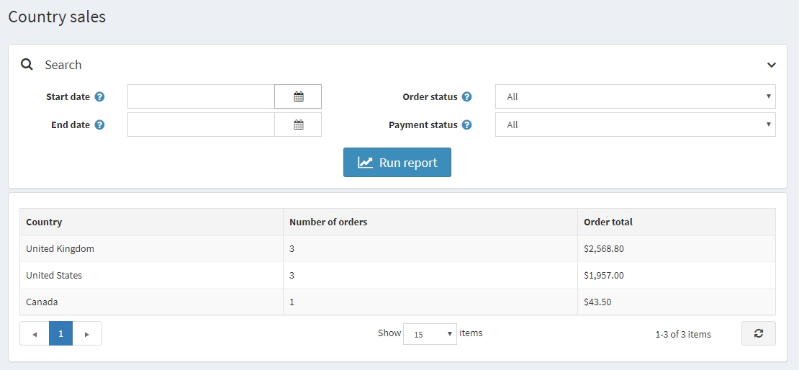

# Country report

Country report contains a list of orders that includes the number of orders and the total order sum in each country. This enables store owners to view the orders per country.

To view country reports, go to **Reports → Country Report**.

To search for the report, enter one or more of the following search criteria:

* **Start date** for the search
* **End date** for the search
* **Order status**, such as All, Pending, Processing, Complete, or Cancelled
* **Payment status**, such as All, Pending, Authorized, Paid, Refunded, Partially Refunded, or Voided

## See also

* [Customer reports](xref:en/user-guide/running/reports/customer-reports)
* [Countries](xref:en/user-guide/configuring/setting-up/main-store/countries)
* [Orders](xref:en/user-guide/running/order-management/orders/index)
