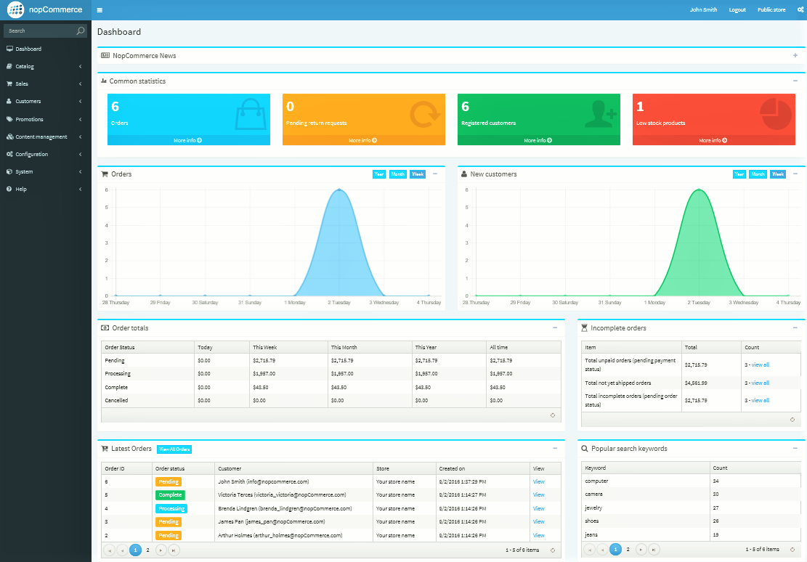
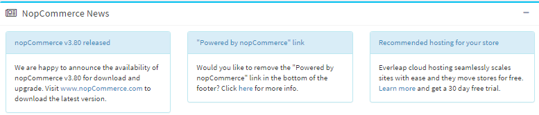
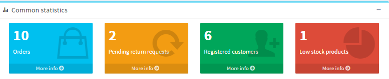
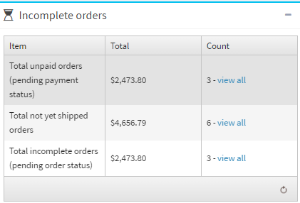
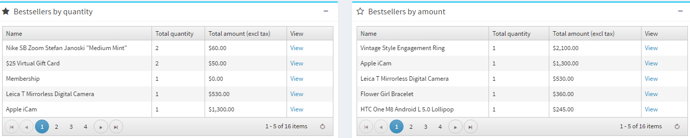

# Dashboard

The dashboard is the first page you see when accessing the admin area. It enables you to view your store statistics, including the total number of orders that were processed over the period of time you choose (year, month, week), registered customers, low stock products, the most popular products in your store, etc.

The dashboard consist of several blocks:

**nopCommerce news** Displays general nopCommerce news like new version releases.

**Common statistics.** Here you can find links to more detailed reports:

Sales → Orders

Sales → Returned requests

Customers → Registered customers

Catalog → Low stock report

**Order totals.** It enables you to know the number of orders that were processed in the last day, week, month, year and the order total.

**Incomplete orders.** It enables you to know the number of orders that are currently pending.

**Latest orders.**

**Popular search keywords.** This block displays most used keywords.

**Bestsellers.**

## See also

* [Orders](xref:en/user-guide/running/order-management/orders/index)
* [Return requests](xref:en/user-guide/running/order-management/return-requests/index)
* [Bestsellers](xref:en/user-guide/running/reports/bestsellers-never-purchased)
* [Customers](xref:en/user-guide/running/customer-management/index)
* [Country report](xref:en/user-guide/running/reports/country-report)
* [Customer reports](xref:en/user-guide/running/reports/customer-reports)
