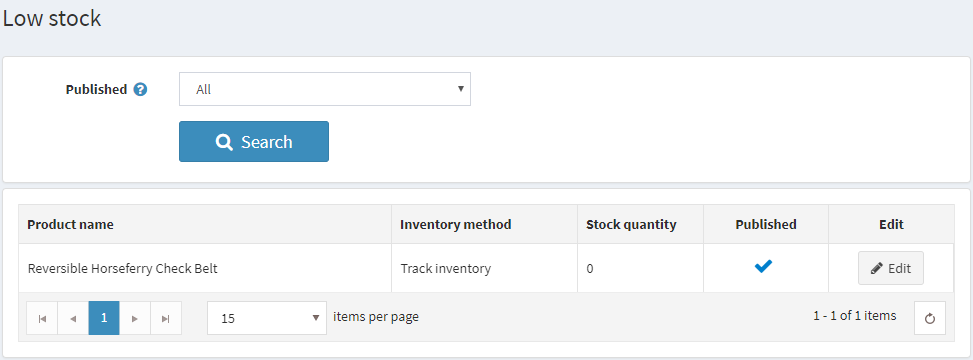

# Low Stock Reports

The low stock report contains a list of products that are currently under stock. In the example shown below, the min stock quantity was set to 20 and the stock quantity is 0, therefore a low stock report is generated for this product. You can set up low stock settings when adding the product.

**To view low stock reports:**

1. From the **Reports → Low Stock Report**. The **Product Low Stock** report window is displayed. 

    Low stock reports could be filtered by **Published** property,  which represents **Published** property of products

1. Click **Edit** to view the **Product info** tab, where these settings stock can settings can be changed.
