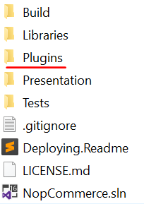
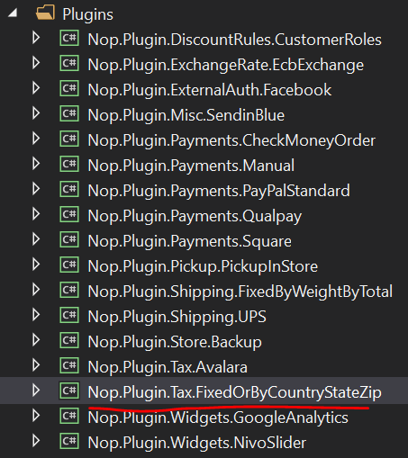
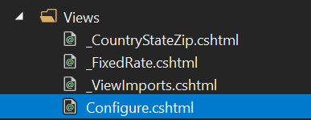
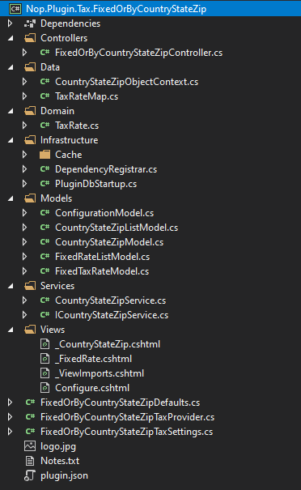

# How to write a Tax Plugin for nopCommerce

To extend nopCommerce functionality, plugins are used. There are various types of plugins like "PickupInStore" and "PayPal Standard" which are already contained in the nopCommerce distro. You can also search various plugins on the [nopCommerce official site](https://www.nopcommerce.com/marketplace) to see if someone has already created a plugin that suits your needs. If you haven't found one, then you are at the right place because this article will guide you through the process of creating plugin, especially tax plugin, according to your need.

## The plugin structure, required files, and locations

1. Start by creating a new "Class Library" project in the solution. It is recommended to place your plugin in the **Plugins** directory, located in the root folder of the source, where other plugins and widgets already resides.

    

    > [!NOTE] Do not get confused this directory with the one which exists in `Presentation\Nop.Web` directory. The Plugins directory in the Nop.Web directory contains the plugins compiled files.

    A recommended name for a plugin project is `Nop.Plugin.{Group}.{Name}`. `{Group}` is your plugin group (for example, `Payment` or `Shipping`). `{Name}` is your plugin name (for example, `FixedOrByCountryStateZip`). For example, `FixedOrByCountryStateZip` tax plugin has the following name: `Nop.Plugin.Tax.FixedOrByCountryStateZip`. But please note that it's not a requirement. And you can choose any name for a plugin. For example, `MyFirstTaxPlugin`. The Plugins directory structure of a solution looks like following.

    

1. Once the plugin project is created, the **.csproj** file content should be updated using any available text editor application. Replace the content with following one:

    ```xml
    <Project Sdk="Microsoft.NET.Sdk">
        <PropertyGroup>
            <TargetFramework>netcoreapp2.2</TargetFramework>
            <Copyright>SOME_COPYRIGHT</Copyright>
            <Company>YOUR_COMPANY</Company>
            <Authors>SOME_AUTHORS</Authors>
            <PackageLicenseUrl>PACKAGE_LICENSE_URL</PackageLicenseUrl>
            <PackageProjectUrl>PACKAGE_PROJECT_URL</PackageProjectUrl>
            <RepositoryUrl>REPOSITORY_URL</RepositoryUrl>
            <RepositoryType>Git</RepositoryType>
            <OutputPath>..\..\Presentation\Nop.Web\Plugins\PLUGIN_OUTPUT_DIRECTORY</OutputPath>
            <OutDir>$(OutputPath)</OutDir>
            <!--Set this parameter to true to get the dlls copied from the NuGet cache to the output of your        project. You need to set this parameter to true if your plugin has a nuget package to ensure that       the dlls copied from the NuGet cache to the output of your project-->
            <CopyLocalLockFileAssemblies>true</CopyLocalLockFileAssemblies>
        </PropertyGroup>
        <ItemGroup>
            <ProjectReference Include="..\..\Presentation\Nop.Web.Framework\Nop.Web.Framework.csproj" />
            <ClearPluginAssemblies Include="$(MSBuildProjectDirectory)\..\..\Build\ClearPluginAssemblies.sproj" />
        </ItemGroup>
        <!-- This target execute after "Build" target -->
        <Target Name="NopTarget" AfterTargets="Build">
            <!-- Delete unnecessary libraries from plugins path -->
            <MSBuild Projects="@(ClearPluginAssemblies)" Properties="PluginPath=$(MSBuildProjectDirectory)\ $    (OutDir)" Targets="NopClear" />
        </Target>
    </Project>
    ```

    > [!NOTE] The **PLUGIN_OUTPUT_DIRECTORY** should be replace by the plugin name, for example, `Tax.FixedOrByCountryStateZip`.

1. After updating the **.csproj** file, `plugin.json` file should be added which is required for plugin.  This file contains meta information describing your plugin. Just copy this file from any other existing plugin/widget and modify it for your needs. For information about the `plugin.json` file, please see [plugin.json file](xref:en/developer/plugins/plugin_json).

1. The last required step is to create a class which implements `BasePlugin` (`Nop.Core.Plugins` namespace) and `ITaxProvider` interface (`Nop.Services.Tax` namespace). **ITaxProvider** implements `GetTaxRate` method which returns type **CalculateTaxResult** (contains tax rate, errors if any and Boolean success status) based on the custom logic, usually based on the customer address.

## Handling requests. Controllers, models and views

Now you can see the plugin by going to **Admin area** → **Configuration** → **Local Plugins**.


When a plugin/widget is installed, you will see **Uninstall** button. It is a good practice that you uninstall plugins/widgets which are not necessary for performance improvement.


There will be **Install** and **Delete** button when a plugin/widget is not installed or uninstalled.

> [!NOTE] Deleting will remove physical files from the server.

But as you guessed our plugin does nothing. It does not even have a user interface for its configuration. Let's create a page to configure the plugin.

What we need to do now is create a controller, a model, a view and a view component.

* MVC controllers are responsible for responding to requests made against an `ASP.NET MVC` website. Each browser request is mapped to a particular controller.
* A view contains the HTML markup and content that is sent to the browser. A view is the equivalent of a page when working with an `ASP.NET MVC` application.
* A view component which implements **NopViewComponent** which contains logic and codes to render a view.
* An MVC model contains all of your application logic that is not contained in a view or a controller.

So let's start:

* **Create the model**. Add a `Models` folder in the new plugin, and then add a new model class which fits your need.
* **Create the view**. Add a `Views` folder in the new plugin, and then add a `.cshtml` file named `Configure.cshtml`. Set **Build Action** property of the view file is set to **Content**, and the **Copy to Output Directory** property is set to **Copy always**. Note that configuration page should use *_ConfigurePlugin* layout.

```html
@model Nop.Plugin.Tax.FixedOrByCountryStateZip.Models.ConfigurationModel

@{
    Layout = "_ConfigurePlugin";
}

<div class="form-group">
    <div class="col-md-12">
        <div class="onoffswitch">
            <input type="checkbox" name="onoffswitch" class="onoffswitch-checkbox" id="advanced-settings-mode" checked="@Model.CountryStateZipEnabled">
            <label class="onoffswitch-label" for="advanced-settings-mode">
                <span class="onoffswitch-inner"
                      data-locale-basic="@T("Plugins.Tax.FixedOrByCountryStateZip.Fixed")"
                      data-locale-advanced="@T("Plugins.Tax.FixedOrByCountryStateZip.TaxByCountryStateZip")"></span>
                <span class="onoffswitch-switch"></span>
            </label>
        </div>
    </div>
</div>
<script>
    function checkAdvancedSettingsMode(advanced) {
        if (advanced) {
            $("body").addClass("advanced-settings-mode");
            $("body").removeClass("basic-settings-mode");
        } else {
            $("body").removeClass("advanced-settings-mode");
            $("body").addClass("basic-settings-mode");
        }
    }
    checkAdvancedSettingsMode($("#advanced-settings-mode").is(':checked'));
    $(document).ready(function() {
        $("#advanced-settings-mode").click(function() {
            checkAdvancedSettingsMode($(this).is(':checked'));
            $.ajax({
                cache: false,
                url: "@Url.Action("SaveMode", "FixedOrByCountryStateZip")",
                type: "POST",
                data: {
                    value: $(this).is(':checked')
                },
                dataType: "json",
                error: function (jqXHR, textStatus, errorThrown) {
                    $("#saveModeAlert").click();
                }
            });
            ensureDataTablesRendered();
        });
    });
</script>
<nop-alert asp-alert-id="saveModeAlert" asp-alert-message="@T("Admin.Common.Alert.Save.Error")" />

@await Html.PartialAsync("~/Plugins/Tax.FixedOrByCountryStateZip/Views/_FixedRate.cshtml")
@await Html.PartialAsync("~/Plugins/Tax.FixedOrByCountryStateZip/Views/_CountryStateZip.cshtml", Model)
```

* Also make sure that you have **_ViewImports.cshtml** file into your `Views` directory. You can just copy it from any other existing plugin or widget.



* **Create the controller**. Add a `Controllers` folder in the new plugin, and then add a new controller class. A good practice is to name plugin controllers **{Group}{Name}Controller.cs**. For example, `FixedOrByCountryStateZipController`. Of course it's not a requirement to name controllers this way (but just a recommendation). Then create an appropriate action method for configuration page (in admin area). Let's name it `Configure`. Prepare a model class and pass it to the following view using a physical view path: **~/Plugins/{PluginOutputDirectory}/Views/Configure.cshtml**.

```cs
public IActionResult Configure()
{
    if (!_permissionService.Authorize(StandardPermissionProvider.ManageTaxSettings))
        return AccessDeniedView();

    var taxCategories = _taxCategoryService.GetAllTaxCategories();
    if (!taxCategories.Any())
        return Content("No tax categories can be loaded");

    var model = new ConfigurationModel { CountryStateZipEnabled = _countryStateZipSettings.CountryStateZipEnabled };
    //stores
    model.AvailableStores.Add(new SelectListItem { Text = "*", Value = "0" });
    var stores = _storeService.GetAllStores();
    foreach (var s in stores)
        model.AvailableStores.Add(new SelectListItem { Text = s.Name, Value = s.Id.ToString() });
    //tax categories
    foreach (var tc in taxCategories)
        model.AvailableTaxCategories.Add(new SelectListItem { Text = tc.Name, Value = tc.Id.ToString() });
    //countries
    var countries = _countryService.GetAllCountries(showHidden: true);
    foreach (var c in countries)
        model.AvailableCountries.Add(new SelectListItem { Text = c.Name, Value = c.Id.ToString() });
    //states
    model.AvailableStates.Add(new SelectListItem { Text = "*", Value = "0" });
    var defaultCountry = countries.FirstOrDefault();
    if (defaultCountry != null)
    {
        var states = _stateProvinceService.GetStateProvincesByCountryId(defaultCountry.Id);
        foreach (var s in states)
            model.AvailableStates.Add(new SelectListItem { Text = s.Name, Value = s.Id.ToString() });
    }

    return View("~/Plugins/Tax.FixedOrByCountryStateZip/Views/Configure.cshtml", model);
}
```

* Use the following attributes for your action method:

```cs
[AuthorizeAdmin] //confirms access to the admin panel
[Area(AreaNames.Admin)] //specifies the area containing a controller or action
[AdminAntiForgery] //Helps prevent malicious scripts from submitting forged page requests.
```

For example, open `FixedOrByCountryStateZip` plugin and look at its implementation of `FixedOrByCountryStateZipController`. Then for each plugin which has a configuration page you should specify a configuration url. Base class named `BasePlugin` has `GetConfigurationPageUrl` method which returns a configuration url:

```cs
public override string GetConfigurationPageUrl()
{
    return $"{_webHelper.GetStoreLocation()}Admin/{CONTROLLER_NAME}/{ACTION_NAME}";
}
```

Where *{CONTROLLER_NAME}* is a name of your controller and *{ACTION_NAME}* is a name of action (usually it's `Configure`).

For assigning different tax rate according to the customer address, a new table is required which records all data related to tax. For this purpose, `Domain` folder is added where we add a class which extends **BaseEntity** class. In this case `TaxRate.cs`


Another folder `Data` is also added which consists of Map class(es) and Object Context class(es). Mapping class implements **`NopEntityTypeConfiguration<T>`** (`Nop.Data.Mapping` namespace). Here, the configure method is overridden.

```cs
public override void Configure(EntityTypeBuilder<TaxRate> builder)
{
    builder.ToTable(nameof(TaxRate));
    builder.HasKey(rate => rate.Id);

    builder.Property(rate => rate.Percentage).HasColumnType("decimal(18, 4)");
}
```

Object Context class implements **DbContext** class (`Microsoft.EntityFrameworkCore` namespace) and **IDbContext** interface (`Nop.Data` namespace). This `IDbContext` interface consists of methods related to table creation, deletion and other custom actions like executing a raw SQL query according to the model which was previously added in `Domain` folder.

```cs
public class CountryStateZipObjectContext : DbContext, IDbContext
{
    #region Ctor

    public CountryStateZipObjectContext(DbContextOptions<CountryStateZipObjectContext> options) : base(options)
    {
    }

    #endregion

    #region Utilities

    /// <summary>
    /// Further configuration the model
    /// </summary>
    /// <param name="modelBuilder">Model muilder</param>
    protected override void OnModelCreating(ModelBuilder modelBuilder)
    {
        modelBuilder.ApplyConfiguration(new TaxRateMap());
        base.OnModelCreating(modelBuilder);
    }

    #endregion

    #region Methods

    /// <summary>
    /// Creates a DbSet that can be used to query and save instances of entity
    /// </summary>
    /// <typeparam name="TEntity">Entity type</typeparam>
    /// <returns>A set for the given entity type</returns>
    public new virtual DbSet<TEntity> Set<TEntity>() where TEntity : BaseEntity
    {
        return base.Set<TEntity>();
    }

    /// <summary>
    /// Generate a script to create all tables for the current model
    /// </summary>
    /// <returns>A SQL script</returns>
    public virtual string GenerateCreateScript()
    {
        return Database.GenerateCreateScript();
    }

    /// <summary>
    /// Creates a LINQ query for the query type based on a raw SQL query
    /// </summary>
    /// <typeparam name="TQuery">Query type</typeparam>
    /// <param name="sql">The raw SQL query</param>
    /// <param name="parameters">The values to be assigned to parameters</param>
    /// <returns>An IQueryable representing the raw SQL query</returns>
    public virtual IQueryable<TQuery> QueryFromSql<TQuery>(string sql, params object[] parameters) where TQuery : class
    {
        throw new NotImplementedException();
    }

    /// <summary>
    /// Creates a LINQ query for the entity based on a raw SQL query
    /// </summary>
    /// <typeparam name="TEntity">Entity type</typeparam>
    /// <param name="sql">The raw SQL query</param>
    /// <param name="parameters">The values to be assigned to parameters</param>
    /// <returns>An IQueryable representing the raw SQL query</returns>
    public virtual IQueryable<TEntity> EntityFromSql<TEntity>(string sql, params object[] parameters) where TEntity : BaseEntity
    {
        throw new NotImplementedException();
    }

    /// <summary>
    /// Executes the given SQL against the database
    /// </summary>
    /// <param name="sql">The SQL to execute</param>
    /// <param name="doNotEnsureTransaction">true - the transaction creation is not ensured; false - the transaction creation is ensured.</param>
    /// <param name="timeout">The timeout to use for command. Note that the command timeout is distinct from the connection timeout, which is commonly set on the database connection string</param>
    /// <param name="parameters">Parameters to use with the SQL</param>
    /// <returns>The number of rows affected</returns>
    public virtual int ExecuteSqlCommand(RawSqlString sql, bool doNotEnsureTransaction = false, int? timeout = null, params object[] parameters)
    {
        using (var transaction = Database.BeginTransaction())
        {
            var result = Database.ExecuteSqlCommand(sql, parameters);
            transaction.Commit();

            return result;
        }
    }

    /// <summary>
    /// Detach an entity from the context
    /// </summary>
    /// <typeparam name="TEntity">Entity type</typeparam>
    /// <param name="entity">Entity</param>
    public virtual void Detach<TEntity>(TEntity entity) where TEntity : BaseEntity
    {
        throw new NotImplementedException();
    }

    /// <summary>
    /// Install object context
    /// </summary>
    public void Install()
    {
        //create tables
        this.ExecuteSqlScript(GenerateCreateScript());
    }

    /// <summary>
    /// Uninstall object context
    /// </summary>
    public void Uninstall()
    {
        //drop the table
        this.DropPluginTable(nameof(TaxRate));
    }

    #endregion
}
```

For tax rates **CRUD** operation, services are created. In this case, interface **ICountryStateZipService** and class **CountryStateZipService** is created. It contains method like `InsertTaxRate`, `UpdateTaxRate`, `DeleteTaxRate`, `GetAllTaxRates` and `GetTaxRateById`. These method names are self-explanatory and will be consumed by controllers. Other methods can be introduced/added based according to the requirements.

### ICountryStateZipService.cs

```cs
public partial interface ICountryStateZipService
{
    /// <summary>
    /// Deletes a tax rate
    /// </summary>
    /// <param name="taxRate">Tax rate</param>
    void DeleteTaxRate(TaxRate taxRate);

    /// <summary>
    /// Gets all tax rates
    /// </summary>
    /// <returns>Tax rates</returns>
    IPagedList<TaxRate> GetAllTaxRates(int pageIndex = 0, int pageSize = int.MaxValue);

    /// <summary>
    /// Gets a tax rate
    /// </summary>
    /// <param name="taxRateId">Tax rate identifier</param>
    /// <returns>Tax rate</returns>
    TaxRate GetTaxRateById(int taxRateId);

    /// <summary>
    /// Inserts a tax rate
    /// </summary>
    /// <param name="taxRate">Tax rate</param>
    void InsertTaxRate(TaxRate taxRate);

    /// <summary>
    /// Updates the tax rate
    /// </summary>
    /// <param name="taxRate">Tax rate</param>
    void UpdateTaxRate(TaxRate taxRate);
}
```

#### CountryStateZipService.cs

```cs
public partial class CountryStateZipService : ICountryStateZipService
{
    #region Fields

    private readonly IEventPublisher _eventPublisher;
    private readonly IRepository<TaxRate> _taxRateRepository;
    private readonly ICacheManager _cacheManager;

    #endregion

    #region Ctor

    /// <summary>
    /// Ctor
    /// </summary>
    /// <param name="eventPublisher">Event publisher</param>
    /// <param name="cacheManager">Cache manager</param>
    /// <param name="taxRateRepository">Tax rate repository</param>
    public CountryStateZipService(IEventPublisher eventPublisher,
        ICacheManager cacheManager,
        IRepository<TaxRate> taxRateRepository)
    {
        _eventPublisher = eventPublisher;
        _cacheManager = cacheManager;
        _taxRateRepository = taxRateRepository;
    }

    #endregion

    #region Methods

    /// <summary>
    /// Deletes a tax rate
    /// </summary>
    /// <param name="taxRate">Tax rate</param>
    public virtual void DeleteTaxRate(TaxRate taxRate)
    {
        if (taxRate == null)
            throw new ArgumentNullException(nameof(taxRate));

        _taxRateRepository.Delete(taxRate);

        //event notification
        _eventPublisher.EntityDeleted(taxRate);
    }

    /// <summary>
    /// Gets all tax rates
    /// </summary>
    /// <returns>Tax rates</returns>
    public virtual IPagedList<TaxRate> GetAllTaxRates(int pageIndex = 0, int pageSize = int.MaxValue)
    {
        var key = string.Format(ModelCacheEventConsumer.TAXRATE_ALL_KEY, pageIndex, pageSize);
        return _cacheManager.Get(key, () =>
        {
            var query = from tr in _taxRateRepository.Table
                        orderby tr.StoreId, tr.CountryId, tr.StateProvinceId, tr.Zip, tr.TaxCategoryId
                        select tr;
            var records = new PagedList<TaxRate>(query, pageIndex, pageSize);
            return records;
        });
    }

    /// <summary>
    /// Gets a tax rate
    /// </summary>
    /// <param name="taxRateId">Tax rate identifier</param>
    /// <returns>Tax rate</returns>
    public virtual TaxRate GetTaxRateById(int taxRateId)
    {
        if (taxRateId == 0)
            return null;

       return _taxRateRepository.GetById(taxRateId);
    }

    /// <summary>
    /// Inserts a tax rate
    /// </summary>
    /// <param name="taxRate">Tax rate</param>
    public virtual void InsertTaxRate(TaxRate taxRate)
    {
        if (taxRate == null)
            throw new ArgumentNullException(nameof(taxRate));

        _taxRateRepository.Insert(taxRate);

        //event notification
        _eventPublisher.EntityInserted(taxRate);
    }

    /// <summary>
    /// Updates the tax rate
    /// </summary>
    /// <param name="taxRate">Tax rate</param>
    public virtual void UpdateTaxRate(TaxRate taxRate)
    {
        if (taxRate == null)
            throw new ArgumentNullException(nameof(taxRate));

        _taxRateRepository.Update(taxRate);

        //event notification
        _eventPublisher.EntityUpdated(taxRate);
    }

    #endregion
}
```

The last thing, we need is to register the services and configure plugin DB context on application startup. For this, **Infrastructure** folder is added which contains classes – `DependencyRegister` and `PluginDbStartup`.

**DependencyRegister** class implements `IDependencyRegister` interface (`Nop.Core.Infrastructure.DependencyManagement` namespace) which has `Register` method.

```cs
public class DependencyRegistrar : IDependencyRegistrar
{
    /// <summary>
    /// Register services and interfaces
    /// </summary>
    /// <param name="builder">Container builder</param>
    /// <param name="typeFinder">Type finder</param>
    /// <param name="config">Config</param>
    public virtual void Register(ContainerBuilder builder, ITypeFinder typeFinder, NopConfig config)
    {
        builder.RegisterType<FixedOrByCountryStateZipTaxProvider>().As<ITaxProvider>().InstancePerLifetimeScope();
        builder.RegisterType<CountryStateZipService>().As<ICountryStateZipService>().InstancePerLifetimeScope();

        //data context
        builder.RegisterPluginDataContext<CountryStateZipObjectContext>("nop_object_context_tax_country_state_zip");

        //override required repository with our custom context
        builder.RegisterType<EfRepository<TaxRate>>().As<IRepository<TaxRate>>()
            .WithParameter(ResolvedParameter.ForNamed<IDbContext>("nop_object_context_tax_country_state_zip"))
            .InstancePerLifetimeScope();
    }

    /// <summary>
    /// Order of this dependency registrar implementation
    /// </summary>
    public int Order => 1;
}
```

Similarly, **PluginDbStartup** class implements `INopStartup` interface (`Nop.Core.Infrastructure` namespace) which has `ConfigureServices` and `Configure` methods. For this example, object context is added in `ConfigureServices` method.

```cs
public class PluginDbStartup : INopStartup
{
    /// <summary>
    /// Add and configure any of the middleware
    /// </summary>
    /// <param name="services">Collection of service descriptors</param>
    /// <param name="configuration">Configuration of the application</param>
    public void ConfigureServices(IServiceCollection services, IConfiguration configuration)
    {
        //add object context
        services.AddDbContext<CountryStateZipObjectContext>(optionsBuilder =>
        {
            optionsBuilder.UseSqlServerWithLazyLoading(services);
        });
    }

    /// <summary>
    /// Configure the using of added middleware
    /// </summary>
    /// <param name="application">Builder for configuring an application's request pipeline</param>
    public void Configure(IApplicationBuilder application)
    {
    }

    /// <summary>
    /// Gets order of this startup configuration implementation
    /// </summary>
    public int Order => 11;
}
```

## Project structure of Tax Plugin



## Handling "Install" and "Uninstall" methods

This step is optional. Some plugins can require additional logic during its installation. For example, a plugin can insert new locale resources or add necessary tables or settings values. So open your `BasePlugin` implementation and override the following methods:

* `Install`. This method will be invoked during plugin installation. You can initialize any settings here, insert new locale resources, or create some new database tables (if required).

```cs
public override void Install()
{
    //database objects
    _objectContext.Install();

    //settings
    _settingService.SaveSetting(new FixedOrByCountryStateZipTaxSettings());

    //locales
    _localizationService.AddOrUpdatePluginLocaleResource("Plugins.Tax.FixedOrByCountryStateZip.Fixed", "Fixed rate");
    _localizationService.AddOrUpdatePluginLocaleResource("Plugins.Tax.FixedOrByCountryStateZip.TaxByCountryStateZip", "By Country");
    _localizationService.AddOrUpdatePluginLocaleResource("Plugins.Tax.FixedOrByCountryStateZip.Fields.TaxCategoryName", "Tax category");
    _localizationService.AddOrUpdatePluginLocaleResource("Plugins.Tax.FixedOrByCountryStateZip.Fields.Rate", "Rate");
    _localizationService.AddOrUpdatePluginLocaleResource("Plugins.Tax.FixedOrByCountryStateZip.Fields.Store", "Store");
    _localizationService.AddOrUpdatePluginLocaleResource("Plugins.Tax.FixedOrByCountryStateZip.Fields.Store.Hint", "If an asterisk is selected, then this shipping rate will apply to all stores.");
    _localizationService.AddOrUpdatePluginLocaleResource("Plugins.Tax.FixedOrByCountryStateZip.Fields.Country", "Country");
    _localizationService.AddOrUpdatePluginLocaleResource("Plugins.Tax.FixedOrByCountryStateZip.Fields.Country.Hint", "The country.");
    _localizationService.AddOrUpdatePluginLocaleResource("Plugins.Tax.FixedOrByCountryStateZip.Fields.StateProvince", "State / province");
    _localizationService.AddOrUpdatePluginLocaleResource("Plugins.Tax.FixedOrByCountryStateZip.Fields.StateProvince.Hint", "If an asterisk is selected, then this tax rate will apply to all customers from the given country, regardless of the state.");
    _localizationService.AddOrUpdatePluginLocaleResource("Plugins.Tax.FixedOrByCountryStateZip.Fields.Zip", "Zip");
    _localizationService.AddOrUpdatePluginLocaleResource("Plugins.Tax.FixedOrByCountryStateZip.Fields.Zip.Hint", "Zip / postal code. If zip is empty, then this tax rate will apply to all customers from the given country or state, regardless of the zip code.");
    _localizationService.AddOrUpdatePluginLocaleResource("Plugins.Tax.FixedOrByCountryStateZip.Fields.TaxCategory", "Tax category");
    _localizationService.AddOrUpdatePluginLocaleResource("Plugins.Tax.FixedOrByCountryStateZip.Fields.TaxCategory.Hint", "The tax category.");
    _localizationService.AddOrUpdatePluginLocaleResource("Plugins.Tax.FixedOrByCountryStateZip.Fields.Percentage", "Percentage");
    _localizationService.AddOrUpdatePluginLocaleResource("Plugins.Tax.FixedOrByCountryStateZip.Fields.Percentage.Hint", "The tax rate.");
    _localizationService.AddOrUpdatePluginLocaleResource("Plugins.Tax.FixedOrByCountryStateZip.AddRecord", "Add tax rate");
    _localizationService.AddOrUpdatePluginLocaleResource("Plugins.Tax.FixedOrByCountryStateZip.AddRecordTitle", "New tax rate");

    base.Install();
}
```

* `Uninstall`. This method will be invoked during plugin uninstallation. You can remove previously initialized settings, locale resources, or database tables by plugin during installation.

```cs
public override void Uninstall()
{
    //settings
    _settingService.DeleteSetting<FixedOrByCountryStateZipTaxSettings>();

    //fixed rates
    var fixedRates = _taxCategoryService.GetAllTaxCategories()
        .Select(taxCategory => _settingService.GetSetting(string.Format(FixedOrByCountryStateZipDefaults.FixedRateSettingsKey, taxCategory.Id)))
        .Where(setting => setting != null).ToList();
    _settingService.DeleteSettings(fixedRates);

    //database objects
    _objectContext.Uninstall();

    //locales
    _localizationService.DeletePluginLocaleResource("Plugins.Tax.FixedOrByCountryStateZip.Fixed");
    _localizationService.DeletePluginLocaleResource("Plugins.Tax.FixedOrByCountryStateZip.TaxByCountryStateZip");
    _localizationService.DeletePluginLocaleResource("Plugins.Tax.FixedOrByCountryStateZip.Fields.TaxCategoryName");
    _localizationService.DeletePluginLocaleResource("Plugins.Tax.FixedOrByCountryStateZip.Fields.Rate");
    _localizationService.DeletePluginLocaleResource("Plugins.Tax.FixedOrByCountryStateZip.Fields.Store");
    _localizationService.DeletePluginLocaleResource("Plugins.Tax.FixedOrByCountryStateZip.Fields.Store.Hint");
    _localizationService.DeletePluginLocaleResource("Plugins.Tax.FixedOrByCountryStateZip.Fields.Country");
    _localizationService.DeletePluginLocaleResource("Plugins.Tax.FixedOrByCountryStateZip.Fields.Country.Hint");
    _localizationService.DeletePluginLocaleResource("Plugins.Tax.FixedOrByCountryStateZip.Fields.StateProvince");
    _localizationService.DeletePluginLocaleResource("Plugins.Tax.FixedOrByCountryStateZip.Fields.StateProvince.Hint");
    _localizationService.DeletePluginLocaleResource("Plugins.Tax.FixedOrByCountryStateZip.Fields.Zip");
    _localizationService.DeletePluginLocaleResource("Plugins.Tax.FixedOrByCountryStateZip.Fields.Zip.Hint");
    _localizationService.DeletePluginLocaleResource("Plugins.Tax.FixedOrByCountryStateZip.Fields.TaxCategory");
    _localizationService.DeletePluginLocaleResource("Plugins.Tax.FixedOrByCountryStateZip.Fields.TaxCategory.Hint");
    _localizationService.DeletePluginLocaleResource("Plugins.Tax.FixedOrByCountryStateZip.Fields.Percentage");
    _localizationService.DeletePluginLocaleResource("Plugins.Tax.FixedOrByCountryStateZip.Fields.Percentage.Hint");
    _localizationService.DeletePluginLocaleResource("Plugins.Tax.FixedOrByCountryStateZip.AddRecord");
    _localizationService.DeletePluginLocaleResource("Plugins.Tax.FixedOrByCountryStateZip.AddRecordTitle");

    base.Uninstall();
}
```

> [!IMPORTANT] If you override one of these methods, do not hide its base implementation -base.Install() and base.Uninstall().
