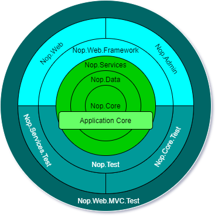

# Architecture of nopCommerce

## Introduction

nopCommerce is a highly customizable and flexible, multi-store, multi-vendor, SEO friendly, full featured open-source E-Commerce solution. Which is build on top of Microsoft `ASP.NET Core` framework. nopCommerce is always up to date with latest technology and follows best practices.

## Overview

This document provides a comprehensive architectural overview of the nopCommerce system. This documentation is targeted for new nopCommerce developers. In this documentation we will be exploring each projects in nopCommerce solution, dependencies between those projects etc.

## Overview of nopCommerce Architecture

nopCommerce is one of the most popular and successful `Dot NET based` open-source `E-Commerce` solution. Success of nopCommerce is not only because it contains most of the features required by modern E-Commerce solution out of the box and it's UI is highly customizable and User friendly, but also because the nopCommerce solution is equally organized and developer friendly. The main strength of nopCommerce is its flexible, extendable architecture and well organized source code. The nopCommerce architecture is very close to the onion architecture. Which is mainly focused on controlling the code coupling. According to this architecture all code can depend on layers more central, but code cannot depend on layers further out from the core.  In other words, all coupling is toward the center.

Which means projects can only have dependency to the other projects which resides inward from the current project. For example if you see the above diagram `Nop.Data` project can depend on `Nop.Core` project and can have `Nop.Core` and dependency, but nop.Core cannot depend on `Nop.Data` similarly `Nop.Services` can have `Nop.Data` and `Nop.Core` and it's dependency but neither `Nop.Core` nor `Nop.Data` can have `Nop.Service` as their dependency. Which means projects can only have other project as dependency only if it resides inward or more center from the layer current project resides. Which is the key for code decoupling. The main feature/advantage of this approach/architecture is that, now if we want to test the Application Core then we can do so even if we do not have any `UI` for our application , Because the Application core does not depends on `UI layer`. Or we can change our `UI framework` from `Razor` view engine and `JQuery` to `Angular` or `React` or `Vue` without effecting our Application Core and can use same core to build Mobile Application or Desktop Application. And all of this without changing a bit of code in our Application Core.

## Explain projects in nopCommerce Solution

### Application Core

This is the innermost layer in the nopCommerce architecture system. It is the core of the application. All the data access logic and Business class resides inside this layer. In nopCommerce solution we can find all of the projects for this layer inside "Libraries" directory. According to nopCommerce architecture this layer contains further three layers/projects.

#### Nop.Core

This project contains a set of core classes for nopCommerce. This project is at the center of the architecture. This project does not have any dependencies to other projects in the solution. This project contains core classes which are shared to entire solution like Domain Entities, Cashing, Events and other Helper classes.

#### Nop.Data

This project lives right after the `Nop.Core` project. So, this project has dependency to project that lives towards the middle from this project in the architecture that is `Nop.Core` project. Beside `Nop.Core` project it does not have any dependency to any other project in the solution. The `Nop.Data` project contains a set of classes and functions for reading from and writing to a database or other data store. It helps separate data-access logic from your business objects.

#### Nop.Services

In nopCommerce architecture this is the outermost layer of Application Core.This project has dependency to all other projects that belongs to Application Core. This project contains a set of core services, business logic, validations or calculations related with the data, if needed. Some people call it Business Access Layer (BAL). This layer acts as a data access layer for all other layers outside from this layer.This layer contains service classes and follows repository pattern to expose its features/functionalities. nopCommerce is using this approach to decouple core to the other layer lives outside the core layer. With this if we want to change the logic for Application core then it does not break other layers that depends on Application core or at least minimizes the code changes in other layers depending to the Application Core. This approach is also ideal for construction dependency injection.

### UI Layer

This layer resides outside the "Application Core". In nopCommerce solution we can find all of the projects for this layer inside "Presentation" directory. All the presentation logic and UI resides in this layer. This is the layer where UI which user can interact presents. In nopCommerce this layer has further two layers.

#### Nop.Web.Framework

This layer is the inner layer of "Presentation layer" this layer has dependency to the "Application Core" layer. This project is a class library project. This project acts as a "Framework" for presentation layer. It contains shared logic that is used by the both nopCommerce "public Website" and "Admin panel".

#### Nop.Web

In nopCommerce architecture this is the outermost layer of "Presentation Layer". This project contains the actual E-Commerce front end website User Interface. It is the actual website which user can Interact with. This is a "Asp .NET Core" application. This project has dependency to `Nop.Web.Framework` and "Application Core". It depends upon `Nop.Web.Framework` for the common logic that is shared between this and "Admin" and depends upon "Application Core" for the data access and data manipulations.

#### Admin

In nopCommerce it belongs in the same layer as the `Nop.Web` project. Actually this lives inside the `Nop.Web` project as an area. it is also the UI(User Interface), but this part of Presentation contains UI for Admin panel. Admin panel is where all the contents for public website is maintained and from where we can monitor the activities of our public website. As public website can be accessed without any restriction but "Admin panel" required some Authentication and Authorization to access it since it contains information that only site admin has right to access.

### Test Layer

This layer resides in the same layer as "Presentation Layer", right outside the "Application Core" This layer is all about testing the different parts of application. Testing in nopCommerce is easy and more reliable due the the architecture it follows for it's system design. In nopCommerce solution we can find all of the directories for this layer inside "Tests" directory. nopCommerce uses *NUnit* package for "Unit Testing"

#### Nop.Tests

This layer is the inner layer of "Test layer" this layer has dependency to the "Application Core" layer. This project contains the core logic for testing.

#### Nop.Services.Tests

This project lives in the outermost layer in the "Test Layer". This project is build for "Unit Testing" the `Nop.Service` project. This project contains logic to test every service classes for every operations.

#### Nop.Core.Tests

This project lives in the same layer as `Nop.Service.Test`. This project is build for "Unit Testing" the `Nop.Core` project, it tests for cashing, domain entities and so on.

#### Nop.Web.Tests

This project can be used to test the Presentation layer of the nopCommerce, which contains "Public website" and "Admin Panel".
