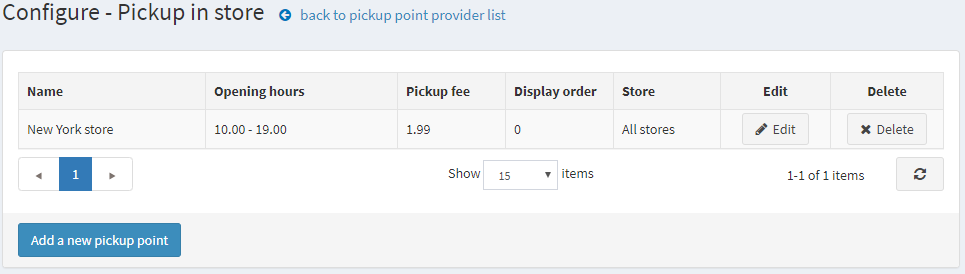
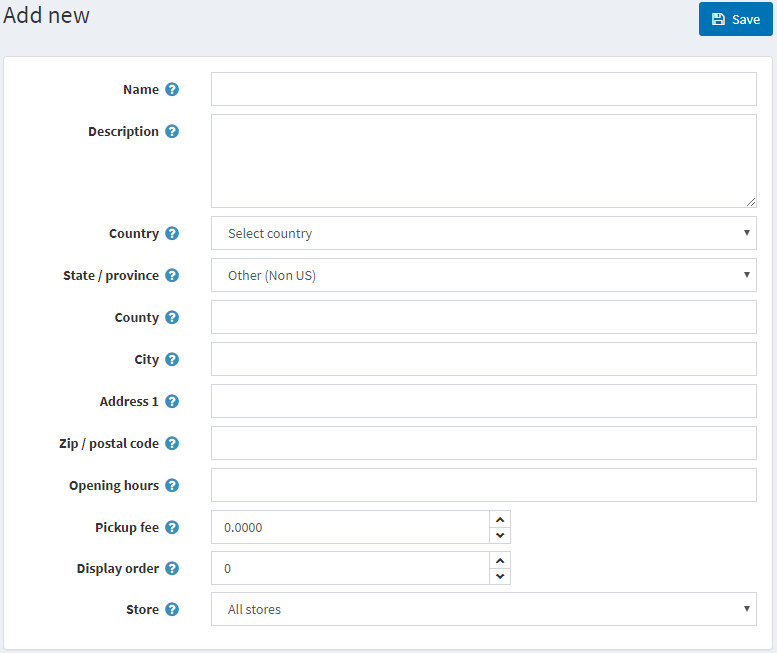

# Pickup points

Pickup point is an option providing customers the flexibility to select a point where they can receive parcels.

> [!NOTE]
> 
> This option is available only when the checkbox **"Pick up in store" enabled** is ticked on the shipping settings page (**Configuration → Settings → Shipping settings**).

To manage pickup point providers:

Go to **Configuration → Shipping → Pickup points**, the *Pickup point providers* page is displayed:

By default, only one **Pickup in store** option is available. Make sure the pickup point provider is active. If not click the **Edit** button and tick the checkbox in the **Is active** column. Then save the changes by clicking the **Update** button.

To edit existing pickup points or add new click **Configure** in the grid. The *Configure - Pickup in store* page will be opened:

Click **Add a new pickup point**, the *Add new* window is displayed:

Define the following details:

* **Name** of the pickup point.
* **Description** if needed.
* Select a **Country** from the drop-down list.
* Select a **State/province** from the drop-down list.
* **City**.
* **Address 1**.
* **Zip/postal code**.
* Pickup point **Opening hours**.
* **Pickup fee** in needed.
* **Display order** of this pickup point.
* **Store(s)** using this pickup point.

**Save** changes.

Click **Edit** beside the pickup point to edit the details entered before.