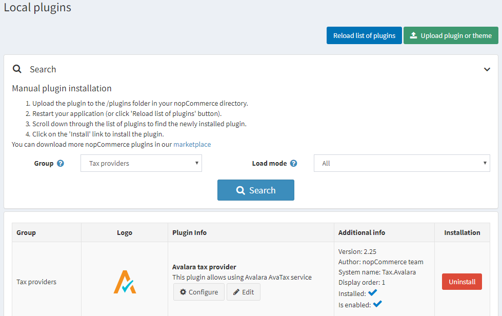
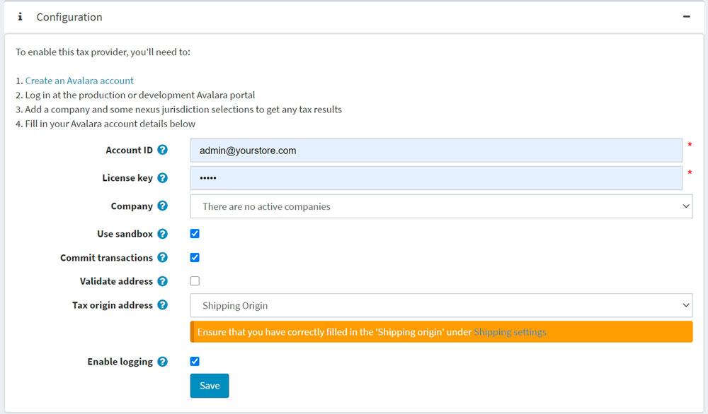
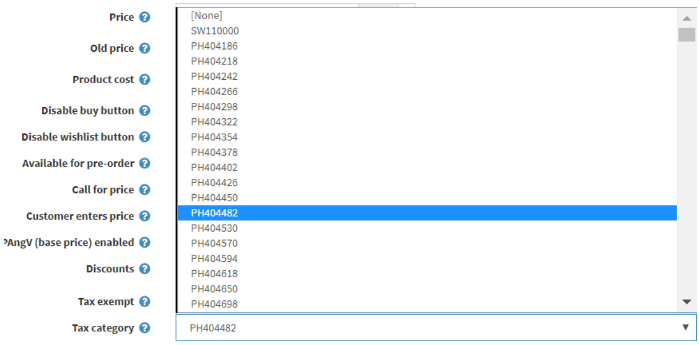

# Avalara tax provider

## Connect to AvaTax

After installing the AvaTax integration you need to configure the integration.

> [!NOTE]
> 
> Be sure that the plugin is installed and checked as "Enabled" (**Configuration → Local plugins**). To enable the plugin click **Edit** and check **Is enabled** checkbox.

To configure Avalara tax provider go to **Configuration → Tax providers**.

Click **Mark as primary provider**.

Click **Configure** beside the Avalara tax provider option in the list.

Follow the instructions on top of the page, each field's function is annotated when "?" is hovered on.

1. Configure your Avalara Tax credentials:
    * **Account ID**: provided during your AvaTax account activation process.
    * **License key**: provided during your AvaTax account activation process.
    * **Company**: company profile identifier in the AvaTax admin console.
    * **Use sandbox** is enabled to commit test transaction.
    * **Commit transactions** is enabled to commit transactions right after they are saved.
    * **Validate address** is enabled to validate address entered.
    * **Tax origin address** is used for tax requests to Avalara services.
    * **Enable logging** enables logging of all requests to Avalara services.
2. **Save** and click the **Test connection** button to perform test connection.
3. To perform the *test tax calculation* fill the address form on the bottom of the page (please note, that nopCommerce Avalara tax plugin commits transactions to US addresses only) and click **Test tax transaction**.

## Assign Avalara AvaTax code

Navigate to **Configuration → Tax categories**.

At the top right of the page you will see the branded **Avalara tax codes** button. Clicking it the drop-down menu will show the following menu:

* **Export tax codes to Avalara** – exports all codes from your store to your Avalara backend.
* **Import Avalara system tax codes** – imports all Avalara tax codes from Avalara.
* **Delete Avalara system tax codes** – deletes all codes exported from Avalara.

## Assign an Avalara tax exempt category to a customer

1. Click **Customers → Customers → Edit customer**
1. Find the highlighted **Entity use code** field and select the field, select the appropriate customer type code.

    
1. Click **Save**

> [!NOTE]
> 
> It is not necessary to check **Tax exempt** checkbox: assigning **Entity use code** is enough.

## Assign an AvaTax system tax code to an item

1. Go to **Catalog → Products**.
1. Select a product to open the product details screen and click **Edit**.
1. On the product details screen, in **Price** panel assign appropriate code from drop-down list in **Tax category** field.

    
1. **IMPORTANT:** Ensure that **SKU** is entered, for better navigation in Avalara backend.
1. Click **Save**.
1. To see a listing of all available AvaTax system tax codes, visit [http://taxcode.avatax.avalara.com](http://taxcode.avatax.avalara.com).

## Validate a customer address

1. Ensure **Validate address** checkbox is on, in that case the address will be validated automatically.
1. User will see the following screen:

    
