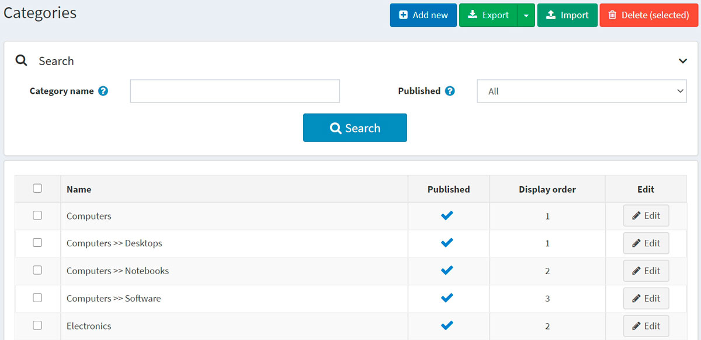
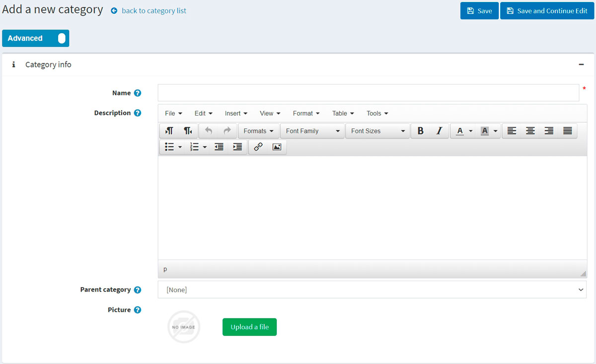
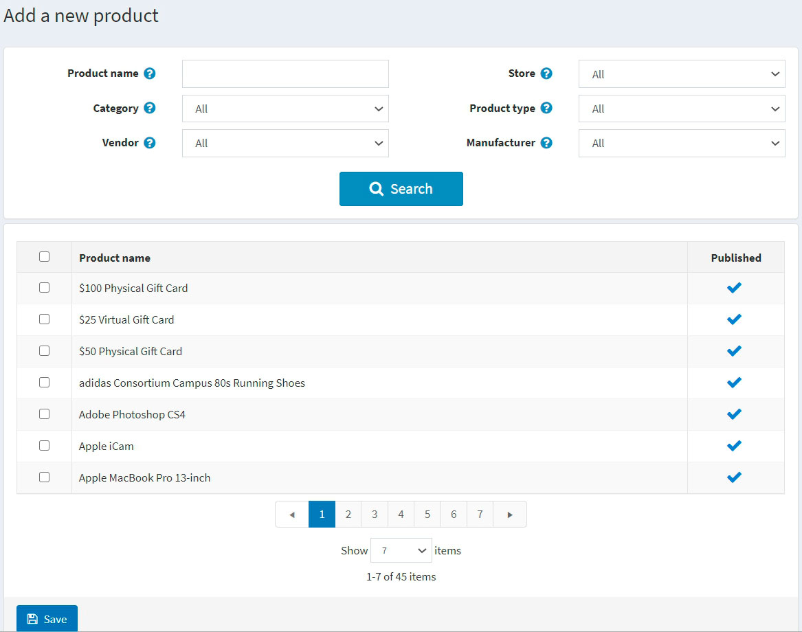

# Categories

Prior to adding new products, a store manager should create categories, to which the products will later be assigned. To manage categories, go to **Catalog → Categories**.



Search for a category in the *Search* panel by entering the **Category name** or a part of the name, by the **Published** property or among all the categories of a certain **Store** (if more than one store enabled).

> [!NOTE]
> 
> To remove categories from the list, select the items to be deleted and click the **Delete (selected)** button. You can export the categories to an external file for backup purposes, by clicking the **Export** button. After clicking the **Export** button you will see the dropdown menu enabling you to **Export to XML** or **Export to Excel**.

## Adding a new category

To add a new category click the **Add new** button in the top of the page. The *Add a new category* window will be displayed.



This page is available in two modes: **advanced** and **basic**. Switch to the basic mode which displays the only main fields or use the advanced mode displaying all the available fields.

### Category info

In the *Category info* panel, define the following category information:

- **Name** - this is the name of the category displayed in the catalog.
- **Description** - a description of the category. Use the editor for layout and fonts.
- If this category will be a subcategory, select a **Parent category** from the drop-down list. The new category will be placed under this category in the public store.
- **Picture** - an image representing the category. Upload the image from your device.

### Display


In the *Display* panel, define the following category information:

- Select the **Published** checkbox, to make the category visible in the public store.
- Select the **Show on home page** checkbox, to display the category on the home page.
- Select the **Include in top menu** checkbox, to include the category in the top menu on the home page.
- Select the **Allow customers to select page size** checkbox, to enable customers to select a page size, i.e. the number of products displayed on the category details page. The page size can be selected by customers from the page sizes list entered by the store owner in the **Page size options** field.
  - In the previous checkbox is ticked the **Page size options** is displayed. Enter a comma separated list of page size options (e.g. 10, 5, 15, 20). First option is the default page size if none are selected.
  - The **Page size** option is displayed if the **Allow customers to select page size** checkbox is unticked. It sets the page size for products in this category e.g. '4' products per page. > [!TIP] > > For example, when you add seven products to a category and you set its page size to three. Three products per page will be displayed on this category details page in the public store, and the total amount of pages will be three.

- Tick the **Price range filtering** checkbox if you want to enable filtering by price range.
  - If you want price range to be entered manually tick the **Enter price range manually** checkbox.
    - If the setting above is enabled enter the **Price 'from'**.
    - As well as the **Price 'to'**.
- **Display order** - the order number for displaying the category. This display number is used to sort categories in the public store (ascending). The category with the display order 1 will be placed at the top of the list.
- The **Category template** filed is visible if you have any custom category templates installed on the **System → Templates** page. This template defines how this category (and its products) will be displayed.

### Mappings


In the *Mappings* panel, define the following category information:

- **Discounts** - select discounts associated with this category. You can create discounts on the **Promotions → Discounts** page. Read more about discounts in the [Discounts](xref:en/running-your-store/promotional-tools/discounts) chapter.

    > [!NOTE]
    > 
    > Note that only discounts with *assigned to categories* type are visible here. After discounts are mapped to the category, they are applied to all products in this category.

    > [!NOTE]
    > 
    > If you want to use discounts make sure the **Ignore discounts (sitewide)** setting is disabled in the **Configuration → Settings → Catalog settings → Performance** panel.

- In the **Limited to customer roles** field choose the customer roles which will be able to see the category in the catalog. Leave this field empty if this option is not required and the category can be seen by everyone.

    > [!NOTE]
    > 
    > In order to use this functionality you have to disable the following setting: **Configuration → Catalog settings → Ignore ACL rules (sitewide)**. Read more about access control list [here](xref:en/running-your-store/customer-management/access-control-list).

- Choose the stores in the **Limited to stores** field if the category is sold in specific stores. Leave the field empty in case this functionality is not required.

  > [!NOTE]
  > 
  > In order to use this functionality, you have to disable the following setting: **Catalog settings → Ignore "limit per store" rules (sitewide)**. Read more about multi-store functionality [here](xref:en/getting-started/advanced-configuration/multi-store).

### SEO


In the *SEO* panel, define the following details:

- **Search engine friendly page name** - the name of the page used by search engines. If you leave the field blank, then the category page URL would be formed using the category name. If you enter custom-seo-page-name, then the following custom URL will be used: `http://www.yourStore.com/custom-seo-page-name`.

- **Meta title** specifies the title of the web page. It is a code which is inserted into the header of your web page:

    ```html
    <head>
        <title> Creating Title Tags for Search Engine Optimization & Web Usability </title>
    </head>
    ```

- **Meta keywords** - category meta keywords, which are a brief and concise list of the most important themes for the page. Meta keywords tag looks like: `<meta name="keywords" content="keyword, keyword, keyword phrase, etc.">`

- **Meta description** - a description of the category. The meta description tag is a brief and concise summary of the page content. The meta description tag looks like: `<meta name="description" content="Brief description of the contents of your page">`

Click the **Save and continue edit** button to proceed to add products to the category.

### Products

The *Products* panel contains a list of products related to the selected category, these products can be filtered by category in the catalog. The store owner can add new products to the category. Note that you need to save the category before you can add products.

Click **Add a new product** to find a product you want to include in this category. You can search by the **Product name**, **Categoty**, **Vendor**, **Store**, **Product type** and **Manufacturer**.



Select products you would like to add to the category and click the **Save** button. The products will be displayed under the selected category.


After the product was added to the category, define the following information in the *Products* table by clicking the **Edit** button beside a product:

- **Is featured product**.
- **Display order**.

> [!NOTE]
> 
> By clicking **View**, you will be redirected to the *Edit product details* page.

Click **Save**. The new category will be displayed in the public store under its parent category.

## Importing categories

If you do not want to add all the categories to your catalog manually you can use the import option.

> [!NOTE]
> 
> Before you start import you should download a table template for import in Excel format. For accurate and correct import of your categories it's crucial to name all the columns in the table properly (exactly as in the downloaded table).

It is not mandatory to fill all the table fields. The category will be created based on the filled fields.

Import requires a lot of memory resources. That's why it's not recommended to import more than 500 - 1000 records at once. If you have more records, it's better to split them into multiple Excel files and import separately.

## See also

- [Adding products](xref:en/running-your-store/catalog/products/add-products)
- [SEO](xref:en/running-your-store/search-engine-optimization)
