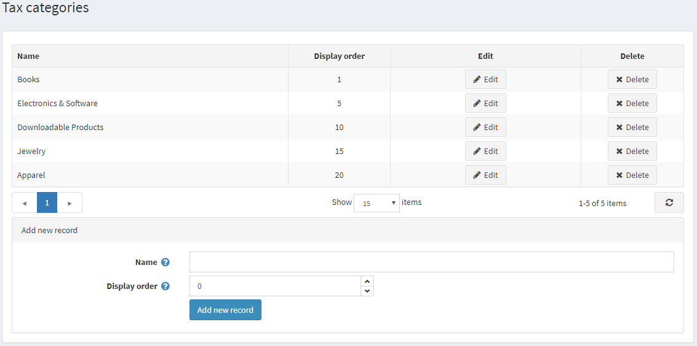

# Tax

## Tax Providers

To define tax rate providers go to **Configuration → Tax Providers**.

**Only one tax rate provider can be used for tax calculation**. The radio buttons, which are displayed beside each tax provider in the list enable you to select the default tax provider. Adding new tax providers is recommended only for advanced users.

In the Mark as primary provider column, click **Mark as primary provider** to select the default tax provider.

> [!TIP]
> If you wish to use **third-party integrations** with other tax rate providers, you can search for the required among integrations in the marketplace.

The configuration of Tax providers is described in **following chapters**:

* [Avalara tax provider](xref:user-guide/configuring/settingup/taxes/tax/methods/avalara)
* [Manual (Fixed or By Country/State/Zip)](xref:user-guide/configuring/settingup/taxes/tax/methods/manual)

## Tax Categories

To define tax categories go to **Configuration → Tax Categories**. The Tax Categories window is displayed.

To add a new tax category, click **Add new record**, the window is expanded. Enter the category Name, and the display order of this tax classification. A value of 1 represents the top of the list.

Set up the **rates** for each class in **Tax Providers** section in **Configuration → Tax providers**.

Tax categories are assigned to products on [product editing pages](xref:user-guide/running/product-management/products/adding-products/index). Taxes can also be applied to **shipping fees** and **payment method** additional fees.
