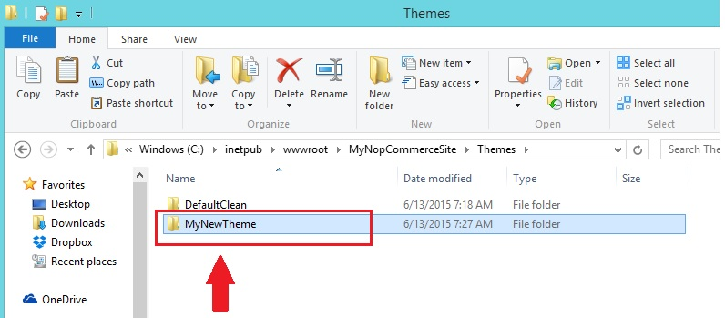

# 在 nopCommerce 中安裝 / 套用佈景主題

假設您剛下載了一個新的佈景主題，且該主題為壓縮檔（zip file）。

1. 解壓縮您的 zip 檔案，並將其內容複製到 "Themes" 資料夾下，如下圖所示： 
1. 前往後台管理區 (`http://www.yourdomain.com/admin`)
1. 前往「設定 (Configuration)」 → 「設定 (Settings)」 → 「一般與雜項設定 (General And Miscellaneous settings)」
1. 從 **預設商店佈景主題 (Default Store Theme)** 中選擇新的佈景主題，然後點擊 **儲存 (Save)**。

現在，前往前台網站。您應該就能在網站上看到新的佈景主題了。