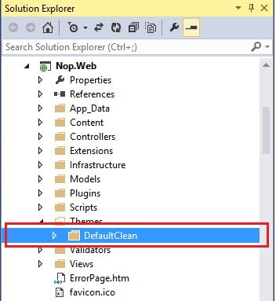
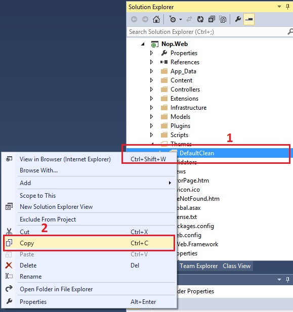
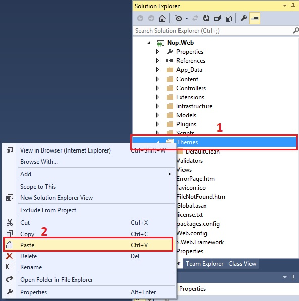
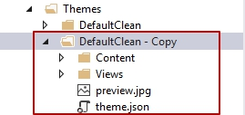
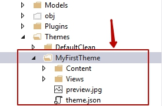
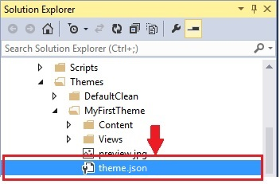
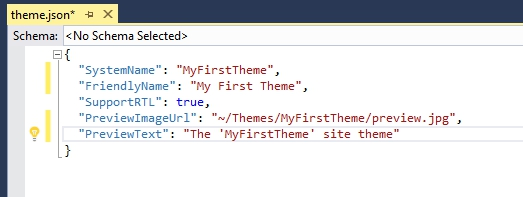
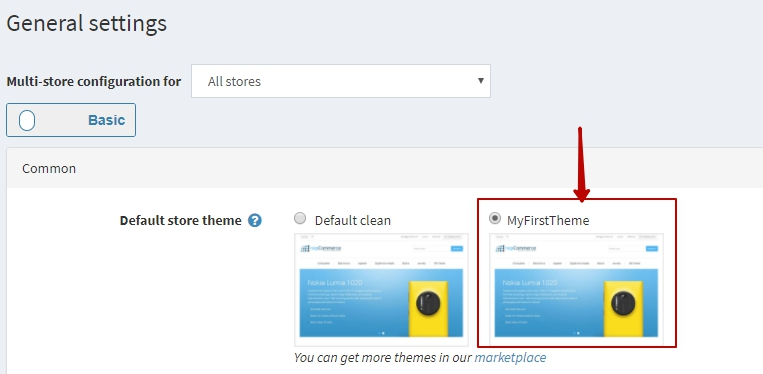

# 建立 / 編寫您的佈景主題（使用現有 / 預設佈景主題）

在 Microsoft Visual Studio 中開啟您的 nopCommerce 解決方案或網站（Web 版本） - 前往以下位置：

* 若使用原始碼版本：`\Nop.Web\Themes\`
* 若使用 Web 版本：`\[Project Root]\Themes\`

1. 選擇任何一個預設 / 現有的佈景主題

    

1. 現在，在該佈景主題上按右鍵 → 選擇 **複製 (COPY)**

    

1. 接著選取 "Themes" 資料夾 → 按右鍵 → **貼上 (PASTE)**

    

1. 您會得到一個類似「Copy of default/current theme」（預設/現有佈景主題的副本）的資料夾

    

1. 將其重新命名為您想要的新佈景主題名稱，例如：MyFirstTheme

    

1. 現在進入您的新佈景主題資料夾 "MyFirstTheme" → 開啟 `theme.json`

    

1. 將現有的佈景主題名稱更改為您的新佈景主題名稱 "MyFirstTheme"

    

1. 現在，在您的新佈景主題資料夾 **"MyFirstTheme" → Content → Images** 中，將新圖片加入 "images" 目錄，並根據您的需求開始更新/自訂 `style.css`。

    如果您想測試變更，請前往後台管理 → 套用您的新佈景主題 → 儲存變更並預覽您的前台商店。

    