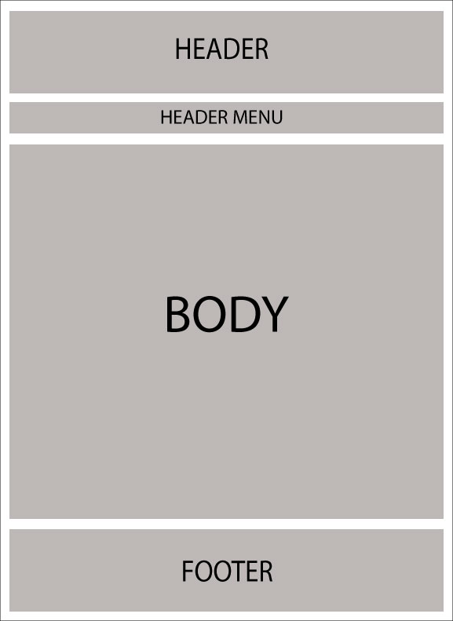
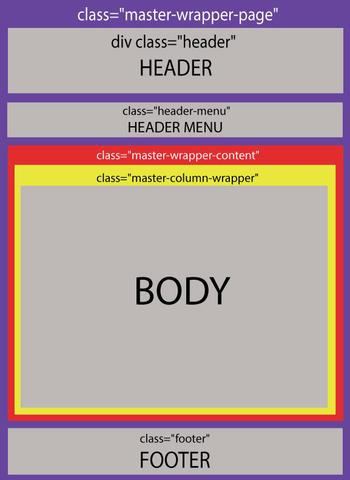
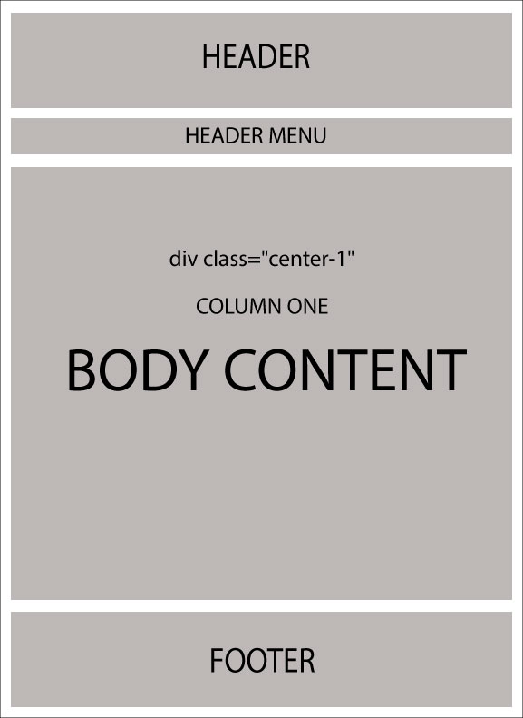
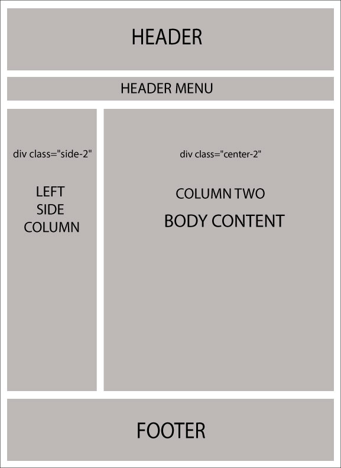

# 理解佈局 / 設計

什麼是佈局？每一位網頁開發者/設計師都希望在網站的所有頁面中維持一致的外觀與風格。早年，ASP.NET 2.0 引入了「母版頁 (Master Pages)」的概念，透過將其與 .aspx 頁面進行映射，協助開發者維護網站的一致性。

Razor 也支援類似的概念，稱為「佈局 (Layouts)」。它允許您定義一個通用的網站範本，然後讓網站上的所有視圖 (Views) / 頁面繼承其外觀與風格。

在 nopCommerce 中，有 2 種不同類型的佈局：

* `_ColumnsOne.cshtml`
* `_ColumnsTwo.cshtml`

這 2 種佈局皆繼承自一個主要佈局，稱為：`_Root.cshtml`。`_Root.cshtml` 本身則繼承自 `_Root.Head.cshtml`。如果您需要連結 CSS 樣式表或 jQuery 檔案，您需要查看 `_Root.Head.cshtml`（您可以在此處新增/連結更多 `.css` 和 `.js` 檔案）。在 nopCommerce 中，所有這些佈局的位置如下：`[nopCommerce root directory]/Views/Shared/...`。如果您使用的是原始碼版本，則路徑為：`\Presentation\Nop.Web\Views\Shared\...`

* **_Root.cshtml 的佈局**

    

* **_Root.cshtml 的佈局（關於 css class）**

    

現在，以下 2 種佈局會覆寫 `_Root.cshtml` 的主體 (body)：

* `_ColumnsOne.cshtml`

    在此情況下，主體佈局沒有變更，因此結構與 `_Root.cshtml` 幾乎相同：

    

* `_ColumnsTwo.cshtml`

    在此情況下，主體結構中有 2 個欄位：

    