# 行動應用程式說明文件

## 簡介

nopCommerce 團隊提供了 [iOS 與 Android 行動應用程式](https://www.nopcommerce.com/ecommerce-mobile-app)。這將為您的業務帶來巨大的價值。該行動應用程式已準備就緒，您可以立即開始銷售您的商品與服務。與 nopCommerce 平台一樣，此行動應用程式附帶原始程式碼，並提供無限的自訂選項。此外，它還能無縫適應您的線上商店設計與功能。將此應用程式整合到您的 nopCommerce 商店、設定其內容與功能、發布至 Google Play Store 和 App Store，以及管理其工作流程，完全不需要程式設計或設計技能。

以下是其他一些重要的功能，將確保您能有效地啟動、自訂與維護行動電商：

- 使用最新版本的 Flutter 與 Dart 建構
- 相容於 Android 與 iOS
- 使用 Riverpod（狀態管理）功能
- 易於使用的 UI 與美觀的 Material design 3
- 基於 Token 的身份驗證
- 支援國際化
- 支援深色與淺色佈景主題
- 免費圖示

## 設定

透過「nopCommerce 行動應用程式」外掛，加上「Web API Frontend」外掛，可以管理部分應用程式設定。

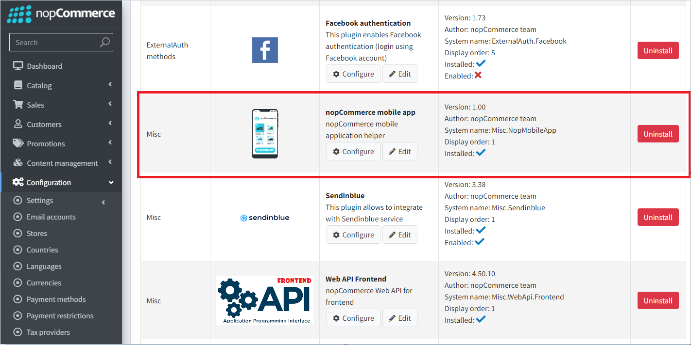

可以使用以下功能：

1. 可以將特定設定轉移到行動應用程式。這樣做是有目的的，以免開放所有應用程式設定的存取權限。如果您需要額外設定，必須確保行動應用程式支援這些設定。
1. 主畫面上的輪播圖（Slider）控制。您還可以指定使用者點擊每個輪播圖圖片後將跳轉到的商品。

## Visual Studio Code

Flutter 建議的開發環境是 [Android Studio](https://developer.android.com/studio)。一個方便的替代方案是 VS Studio Code 編輯器，下方列出了協助您舒適地編寫程式碼的基本設定，以及開發與偵錯所需的擴充功能集。

### 編輯器設定

```json
{
    "[dart]": {
        "editor.codeActionsOnSave": {
            "source.fixAll": true
        },
        "editor.selectionHighlight": false,
        "editor.suggest.snippetsPreventQuickSuggestions": false,
        "editor.suggestSelection": "first",
        "editor.tabCompletion": "onlySnippets",
        "editor.wordBasedSuggestions": false,
    },
    "dart.warnWhenEditingFilesOutsideWorkspace": false,
    "dart.renameFilesWithClasses": "prompt",
    "editor.bracketPairColorization.enabled": true,
    "editor.inlineSuggest.enabled": true,
    "editor.formatOnSave": true,
    "explorer.compactFolders": false,
    "dart.debugExternalPackageLibraries": false,
    "dart.debugSdkLibraries": false,
    "editor.minimap.enabled": false
}
```

### 擴充功能

進行開發時，您需要安裝以下擴充功能：

名稱：**Flutter**\
ID：Dart-Code.flutter\
描述：Visual Studio Code 的 Flutter 支援與偵錯工具。\
發布者：Dart Code\
VS Marketplace 連結：<https://marketplace.visualstudio.com/items?itemName=Dart-Code.flutter>

名稱：**Dart**\
ID：Dart-Code.dart-code\
描述：Visual Studio Code 的 Dart 語言支援與偵錯工具。\
發布者：Dart Code\
VS Marketplace 連結：<https://marketplace.visualstudio.com/items?itemName=Dart-Code.dart-code>

## 開始開發與自訂

在購買應用程式後，請使用 Visual Studio Code 編輯器開啟從壓縮檔中取得的原始程式碼。

在程式碼編輯器中開啟專案後，系統會立即提示您下載內含的程式庫。您也可以透過在終端機中執行以下指令自行下載：

```bash
flutter pub get
```

現在，您需要指定連接到伺服器的端點（Endpoint）以存取 API。此設定位於 `lib\constants\app_constants.dart` 檔案中：

```dart
class AppConstants {
  static const String storeUrl = 'https://yourstore.com';
}
```

現在一切準備就緒，可以執行應用程式：

```bash
flutter run
```

> [!IMPORTANT]
>
> 請確保停用 `paymentSettings.BypassPaymentMethodSelectionIfOnlyOne` 設定。
>
> 關於結帳流程設定的另一項一般建議：請勿啟用會停用或跳過步驟的設定（例如 `ordersettings.disablebillingaddresscheckoutstep`）。這類設定在行動應用程式中將不會產生任何作用。

## 專案結構

在 Flutter 上開發的行動應用程式負責透過 Web API (Frontend) 與前台網站進行互動的功能。使用者與應用程式互動的所有主要流程如下圖所示：

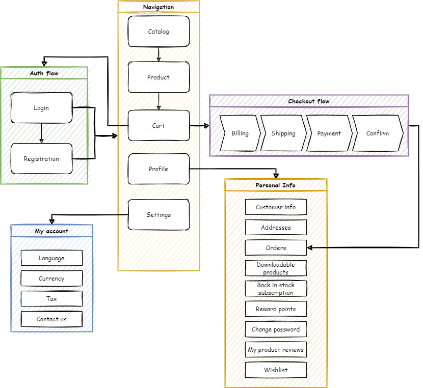

我們將採用以應用程式功能作為根資料夾的方法。在此資料夾內，我們以子資料夾的形式描述該特定功能所固有的架構層。因此，所有與我們感興趣的功能相關的內容都位於同一個資料夾中，這大大簡化了對程式碼的理解。

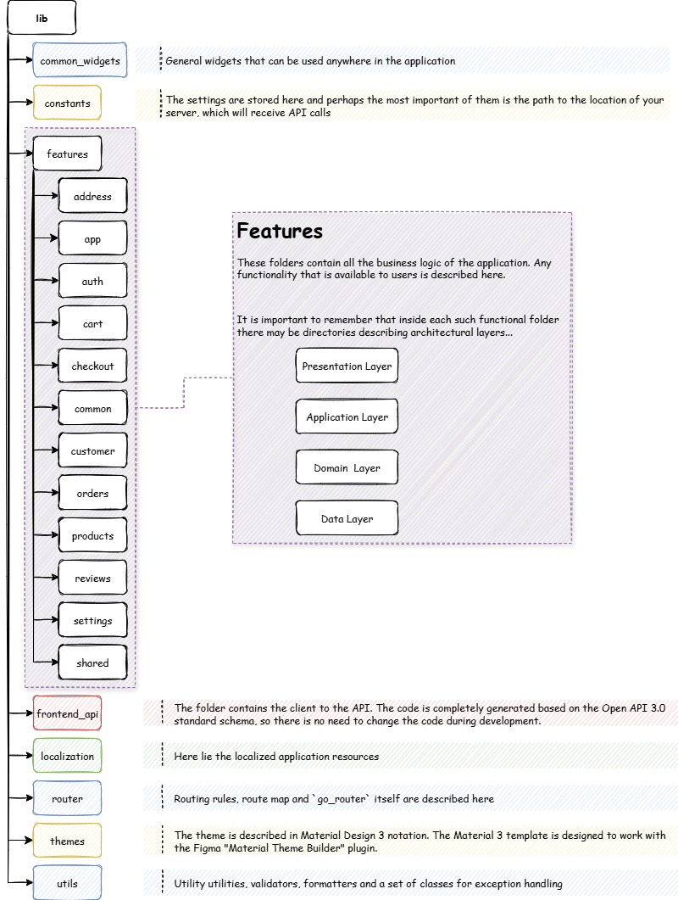

## 技術堆疊

使用的框架與程式庫：

- Flutter SDK 3.35.1
- Dart SDK 3.9.0
- flutter_riverpod: 2.6.1
- go_router: 16.1.0
- flutter_secure_storage: 9.2.4
- dio: 5.9.0

> [!IMPORTANT]
>
> 為確保應用程式正常運作，建議使用設定檔中指定的套件版本。

## 應用程式架構

應用程式架構是根據 [Android 文件](https://developer.android.com/topic/architecture) 中描述的公認標準所建構。由於專案使用 Riverpod 狀態管理系統，因此架構經過擴充，看起來如下：

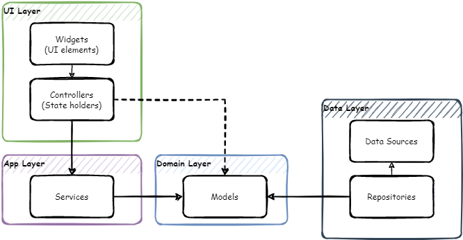

## 導航 - go_router

應用程式中的導航使用 [go_router](https://pub.dev/packages/go_router) 程式庫。這是一個建立在 [Flutter Router API](https://api.flutter.dev/flutter/widgets/Router-class.html) 之上的宣告式路由系統。

應用程式中的導航地圖如下所示：

```bash
├─/splash (SplashScreen)
└─ (ShellRoute)
  ├─/home 
  ├─/catalog 
  │ ├─/catalog/category/:id (CategoryDetailsScreen)
  │ ├─/catalog/manufacturer/:id (ManufacturerDetailsScreen)
  │ ├─/catalog/vendor/:id (VendorDetailsScreen)
  │ ├─/catalog/productsByTag/:id (ProductsByTagScreen)
  │ ├─/catalog/productSearch/:q (ProductsSearchScreen)
  │ └─/catalog/product/:id (ProductDetailsScreen)
  │   ├─/catalog/product/:id/review (ProductReviewScreen)
  │   └─/catalog/product/:id/addReview 
  ├─/cart 
  │ └─/cart/checkout 
  └─/account 
    ├─/account/logincheckout 
    ├─/account/login 
    │ └─/account/login/forgotPassword (ForgotPasswordScreen)
    ├─/account/register 
    ├─/account/settings 
    ├─/account/contactUs 
    ├─/account/wishlist (WishlistScreen)
    ├─/account/accountInfo (AccountInfoScreen)
    ├─/account/accountAddresses (AccountAddressesScreen)
    │ └─/account/accountAddresses/createUpdateAddress/:id teAddressScreen)
    ├─/account/accountOrders (AccountOrdersScreen)
    │ └─/account/accountOrders/orderDetails/:id (OrderDetailsScreen)
    ├─/account/accountDownloadableProducts nloadableProductsScreen)
    ├─/account/accountBackInStock (AccountBackInStockScreen)
    ├─/account/accountRewardPoints (AccountRewardPointsScreen)
    ├─/account/accountChangePassword (AccountChangePassword)
    ├─/account/accountProductReviews (AccountProductReviewsScreen)
    ├─/account/accountGdprTools (AccountGdprToolsScreen)
    ├─/account/accountReturnRequests (AccountReturnRequestsScreen)
    └─/account/returnRequest/:id (ReturnRequestScreen)
```

## Web API 用戶端產生

安裝 [OpenAPI Generator](https://openapi-generator.tech/) (需要 [Node.js](https://nodejs.org/en/download/))。

若要更新 OpenAPI Generator 版本，請使用下列指令，並從提供的列表中選擇最新的穩定版本。

```bash
openapi-generator-cli version-manager list
```

建立一個 *openapitools.json* 檔案。
使用 [dart-dio](https://openapi-generator.tech/docs/generators/dart-dio) 產生器。

```json
{
  "$schema": "node_modules/@openapitools/openapi-generator-cli/config.schema.json",
  "spaces": 2,
  "generator-cli": {
    "version": "7.14.0",
    "generators": {
        "frontend": {
            "input-spec": "swagger.json",
            "generator-name": "dart-dio",
            "output": "frontend_api",
            "additionalProperties": {
                "pubName": "frontend_api"
            }
        }
    }
  }
}
```

> [!NOTE]
>
> 若要更新產生器版本，請執行下列指令：
>
> ```bash
> openapi-generator-cli version-manager list
>```

It is necessary that the OpenAPI schema *swagger.json* be in the directory with the generator installed.

1. Call the following command to generate the client:

    ```bash
    openapi-generator-cli generate
    ```

1. The standard openapi-generator will only generate base code that uses libraries that rely on Dart's own code generation. Therefore, after the completion of the base generation, it is necessary to start the Dart generator:

    ```bash
    cd frontend_api
    flutter pub get  
    dart run build_runner build -d
    ```

    As a result, we get a ready-made package, which will be located where you specified in  the configuration file or console command. It remains to include it in *pubspec.yaml*:

    ```yaml
    frontend_api: # <- nopCommerce generated api library
        path: lib/frontend_api
    ```

## Localization

To localize the interface of the application itself, you need to place a file with locales in the `\lib\localization` folder. It is important that the file name is in the following format:

`intl_`**{your_language_code_from_server}**`.arb`

As a basis, you can take the *intl_en.arb* file already in the kit and translate its resources into the target language.

Run the following command in a terminal to generate the required resource files for localization.

```bash
flutter gen-l10n
```

You can make sure that all the necessary resources are generated correctly in the `lib\localization\generated\i18n` path.

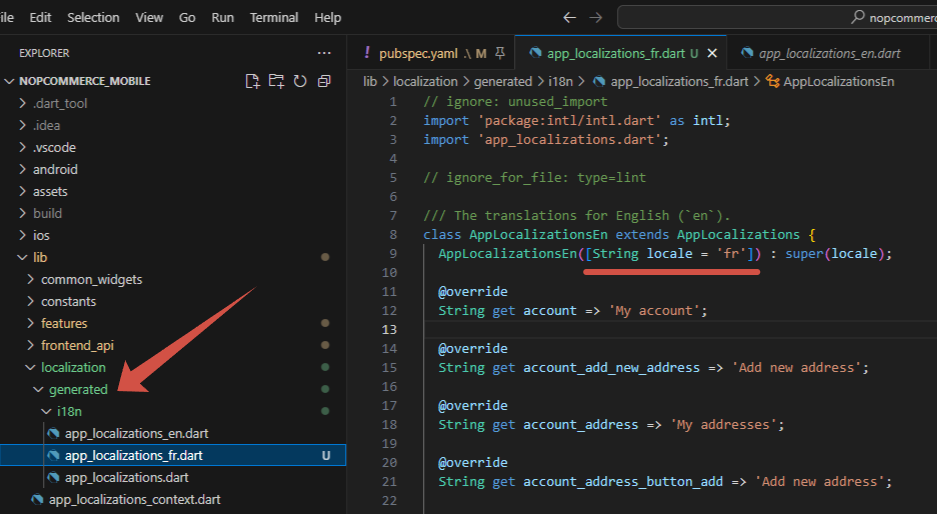

> [!WARNING]
>
> Do not make any changes to this file as this part of the code is auto-generated. All localization changes should be made strictly in the `intl_`**{your_language_code_from_server}**`.arb` file located along the path `\lib\localization`.

Now, when switching the language in the application settings, the application interface will also be localized.

> [!IMPORTANT]
>
> The language code that will be embedded in the name of the localization file must match the one added on your server. Otherwise, the interface will be localized by the default locales (i.e. `en`).

## Designing the user interface

To maintain a unified and consistent look across devices, we harnessed the potential of design tokens provided by Material 3. These tokens allow for storing styles, fonts, and animation values, enabling us to use the same style values in both design files and code.

Using tokens provides several advantages:

- Consistency: Tokens ensure consistent design across screens and components.
- Theming: Easily switch between light/dark/dynamic themes by swapping the ColorScheme or ThemeData.
- Maintainability: Change the look of the entire app from one place (no need to search and replace color codes).
- Design/Dev collaboration: Tokens serve as a bridge between Figma and Flutter.

### Integrating Tokens from Design Tools

**Material Theme Builder** (MTB) is a designer/developer tool for creating Material Design 3 (M3) color & type tokens and exporting them as code (Flutter, Compose, Android XML, design tokens, etc.). It helps you produce coordinated light/dark `ColorScheme`s from a seed/brand color, preview components, and export ready-to-use artifacts for implementation.

#### Generate a color scheme

1. Open the **[Material Theme Builder](https://m3.material.io/theme-builder)**.

1. Pick a seed / primary color

   - Enter a hex value, use the color picker, or use an eyedropper. The seed (primary) color is the single starting point from which tonal palettes are generated.

     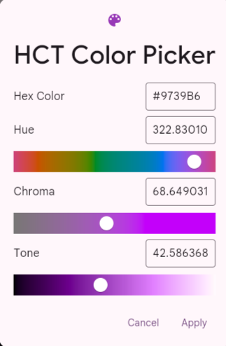

   - You can also enable *dynamic color* input (wallpaper/image) or import an image to extract colors — MTB will derive tonal palettes from that source.

     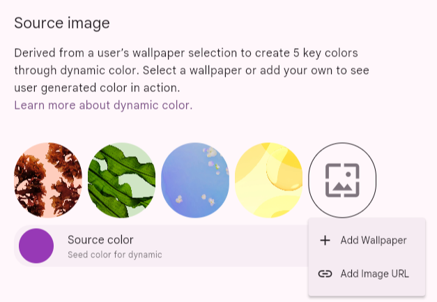

1. Choose or tweak secondary / tertiary / error / neutral colors

   MTB shows slots for common roles (secondary, tertiary, error, neutral, etc.). You can accept automatically-generated values or override specific role colors (enter hex values manually). The builder keeps role relationships consistent with M3 rules.

   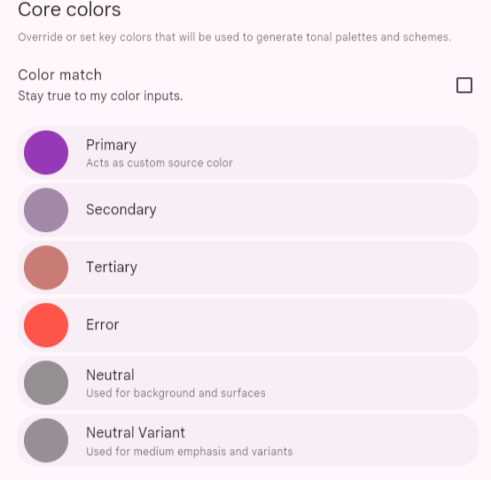

   Here you need to select the base colors for the entire scheme. You can enter them manually, for example, if your brand colors are already defined. On the **Dynamic** panel, you can upload an image and extract colors from it. It is recommended to use the service [https://coolors.co/](https://coolors.co/) to generate harmonious colors.

   Сlick **Start the generator**:

   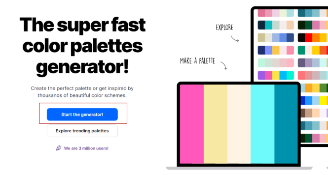

   You can delete the extra blocks until only 3 remain, and then press the spacebar to generate variations.

1. Switch between Light and Dark previews

   Toggle Light/Dark to immediately see both schemes;

   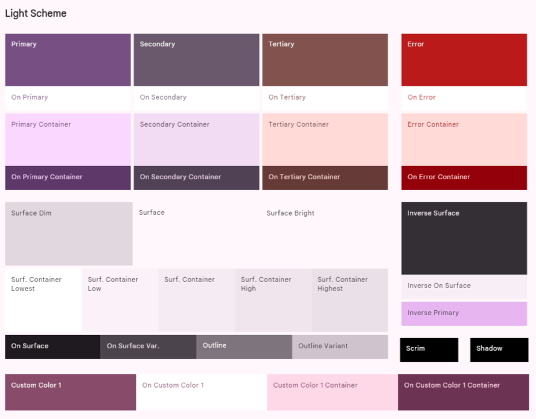

   MTB generates paired light/dark `ColorScheme`s so contrast & visual hierarchy are preserved across brightness modes.

   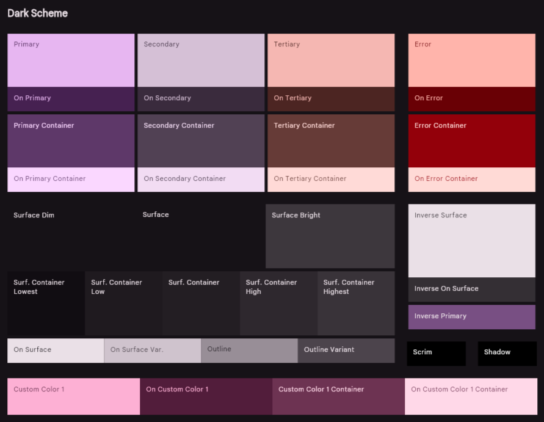

1. Preview components and surfaces

   The builder has live previews (app bars, buttons, chips, cards, list items, navigation bars, dialogs). Use them to validate how your palette behaves on surfaces, text, icons, and interactive controls.

   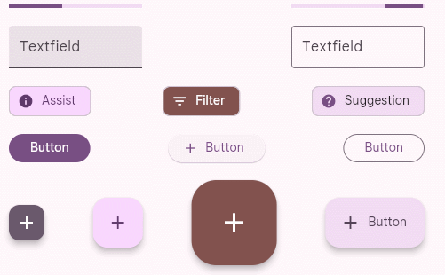

1. Use color-matching / harmonization

   If you have brand colors that clash with generated tonal palettes, MTB offers color-matching or harmonization modes that nudge palettes to harmonize with brand hues while still following M3 tonal rules. This is useful when starting from multiple brand colors.

   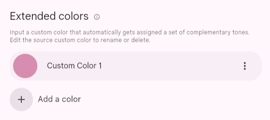

1. Typography

   Select base font family. MTB can produce tokens for typography (weights, sizes, line heights) to accompany your color tokens.

   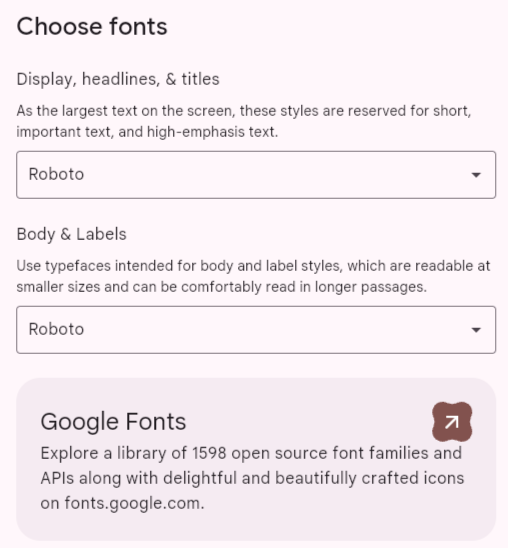

1. Export

    Choose the export format - **Flutter (Dart)**, then export/download a ZIP with code artifacts and token files. For Flutter, the builder typically generates `theme.dart` that you can drop into your project.

    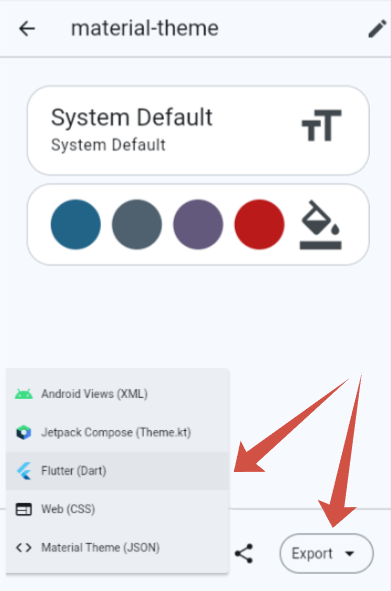

#### Overview of the theme.dart file

Once you've created your color palette in *Material Theme Builder* and exported it, you'll get a `theme.dart` file. This file is the starting point for styling your app. Typically, its main content is two `ColorScheme` objects:

- `lightScheme`: Defines a set of colors for your app's light theme (e.g. background, text, and accent colors in light mode).

- `darkScheme`: Defines the same colors for your dark theme.

These schemes are generated based on the seed color you choose and ensure a harmonious and consistent color combination throughout your app, following the principles of Material Design 3.

#### Integration `theme.dart` into the project

To keep your project structure organized, it is recommended to store theme-related files in a separate directory.

Peplace the generated `ColorScheme` objects from `theme.dart` into - `lib/themes/material_theme.dart`.

As your design system grows, you may need to introduce custom tokens (e.g., specific brand colors, semantic states). Use extensions. This code demonstrates which extension tokens are used in the mobile application.

```dart
ThemeData theme(ColorScheme colorScheme) => ThemeData(
        useMaterial3: true,
        brightness: colorScheme.brightness,
        colorScheme: colorScheme,
        textTheme: textTheme.apply(
          bodyColor: colorScheme.onSurface,
          displayColor: colorScheme.onSurface,
        ),
        scaffoldBackgroundColor: colorScheme.surface,
        canvasColor: colorScheme.surface,
        // defailt extensions - BEGIN
        extensions: [
          CustomColors(
            subTextColor: colorScheme.onSurfaceVariant,
            ratingStarColor: colorScheme.secondary,
            pictureIndicatorColor: colorScheme.surfaceContainerHighest,
            pictureIndicatorCurrentColor: colorScheme.primary,
            inStockColor: colorScheme.tertiary,
            outOfStockColor: colorScheme.error,
          ),
        ],
        // defailt extensions - END
      );
```

>[!NOTE]
>
> 您可以使用 `theme.dart` 檔案的全部內容，但請別忘了包含 `custom_color_scheme.dart` 檔案中可用的預設擴充功能。

就這樣 — 重新啟動應用程式並享受您的新配色方案。

## 發布至 Google Play Store

在 Google Play Store 上發布 Flutter 應用程式的流程包括準備、建構，然後將應用程式上傳至 Google Play Console。

關鍵步驟：

1. 註冊 Google Play 開發者帳戶：您需要註冊開發者帳戶。
1. 準備發布應用程式：這包括在 `pubspec.yaml` 檔案中設定應用程式名稱、圖示與版本號，並設定必要的權限。
1. 簽署應用程式：您必須產生一個上傳金鑰儲存庫（Upload Keystore）並使用它簽署您的應用程式，以驗證您的身份。
1. 建構發布版本：使用 `flutter build appbundle` 指令來建立應用程式的 Android App Bundle (*.aab*)。
1. 在 Google Play Console 上發布：在您的 Play Console 中建立新的應用程式列表，填寫所有必要的商店列表詳細資訊（標題、描述、截圖、隱私權政策），並上傳您的 *.aab* 檔案以供審核。

官方文件：[建構並發布 Android 應用程式](https://docs.flutter.dev/deployment/android)

## 發布至 Apple App Store

部署至 Apple App Store 需要加入 Apple Developer Program 並使用 Xcode 來管理流程的最後步驟。

關鍵步驟：

1. 加入 Apple Developer Program：這是一項付費年度訂閱，讓您擁有在 App Store 上發布的權限。
1. 在 Xcode 中設定專案：在 Xcode 中開啟專案的 `ios` 資料夾，以設定 Bundle ID、版本號與程式碼簽署設定。
1. 建立 App Store Connect 列表：登入 App Store Connect 以建立新的應用程式記錄。您將在此輸入應用程式的所有元資料，例如名稱、描述、截圖、關鍵字與隱私權資訊。
1. 建構並封存應用程式：使用 Xcode 建立應用程式的建構封存檔 (*.ipa*)。
1. 上傳至 App Store Connect：使用 Xcode 或 Transporter 工具上傳已封存的建構檔。
1. 提交審核：一旦建構檔處理完畢且所有元資料完成，您就可以提交應用程式給 Apple 進行審核。

官方文件：[建構並發布 iOS 應用程式](https://docs.flutter.dev/deployment/ios)