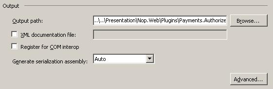
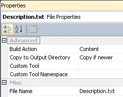
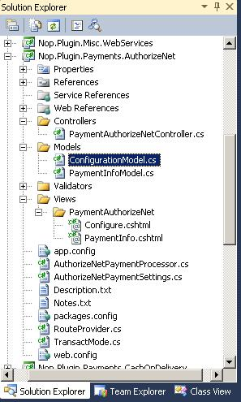

# 如何為 nopCommerce 3.90（及先前版本）撰寫外掛

> 在電腦科學中，外掛（Plug-in 或 plugin）是一組能為較大型軟體應用程式新增特定功能的軟體組件（維基百科）。

外掛用於擴充 nopCommerce 的功能。nopCommerce 擁有幾種不同類型的外掛。例如：付款方式（如 PayPal）、稅務提供者、運送方式計算方法（如 UPS、USPS、FedEx）、小工具（如「線上客服」區塊）以及許多其他功能。nopCommerce 本身已內建許多不同的外掛。您也可以在 [nopCommerce 官方網站](https://www.nopcommerce.com/marketplace) 上搜尋各種外掛，看看是否有人已經開發出符合您需求的外掛。如果沒有，本文將引導您完成開發外掛的流程。


## 外掛結構、所需檔案與存放位置

1. 您需要做的第一件事是在方案中建立一個新的「類別庫（Class Library）」專案。將所有外掛放置在方案根目錄的 `\Plugins` 資料夾中是一種良好的開發習慣（請勿與位於 `\Nop.Web` 資料夾內、用於已部署外掛的 `\Plugins` 子目錄混淆）。將所有外掛放置在「Plugins」方案資料夾中也是一種良好的做法（您可以透過 [here](http://msdn.microsoft.com/library/sx2027y2.aspx) 找到更多關於方案資料夾的資訊）。

    外掛專案的建議命名方式為「Nop.Plugin.{Group}.{Name}」。其中 {Group} 是您的外掛分組（例如：「Payment」或「Shipping」），{Name} 是您的外掛名稱（例如：「PayPalStandard」）。例如，PayPal Standard 付款外掛的名稱為：Nop.Plugin.Payments.PayPalStandard。但請注意，這並非強制規定，您可以為外掛選擇任何名稱，例如「MyGreatPlugin」。

    

1. 當外掛專案建立完成後，請更新專案的建置輸出路徑（build output path）。將其設定為 `..\..\Presentation\Nop.Web\Plugins\{Group}.{Name}`。例如，Authorize.NET 付款外掛的輸出路徑為：`..\..\Presentation\Nop.Web\Plugins\Payments.AuthorizeNet`。完成後，相關的外掛 DLL 檔案會自動複製到 `\Presentation\Nop.Web\Plugins` 目錄，nopCommerce 核心會搜尋此目錄以載入有效的插件。同樣地，這並非強制規定，您可以為外掛選擇任何輸出目錄名稱。

    

    - 在「專案（Project）」選單上，點擊「屬性（Properties）」。
    - 點擊「建置（Build）」頁籤。
    - 點擊輸出路徑框旁的「瀏覽（Browse）」按鈕，並選擇新的建置輸出目錄。

    您應該對所有現有的組態（「Debug」與「Release」）執行上述步驟。

1. 下一個步驟是為每個外掛建立一個必要的 `Description.txt` 檔案。此檔案包含描述您外掛的 meta 資訊。只需從任何現有的外掛複製此檔案並依照您的需求修改即可。例如，PayPal Standard 付款外掛的 `Description.txt` 檔案如下所示：

    ```txt
    Group: Payment methods
    FriendlyName: PayPal Standard
    SystemName: Payments.PayPalStandard
    Version: 1.28
    SupportedVersions: 3.90
    Author: nopCommerce team
    DisplayOrder: 1
    FileName: Nop.Plugin.Payments.PayPalStandard.dll
    Description: This plugin allows paying with PayPal Standard
    ```

    所有欄位皆具備說明性質，但以下是一些注意事項。**SystemName** 欄位必須是唯一的。**Version** 欄位是您的外掛版本號；您可以將其設為任何您喜歡的值。**SupportedVersions** 欄位可包含以逗號分隔的 nopCommerce 支援版本列表（請確保目前的 nopCommerce 版本包含在此列表中，否則將無法載入）。**FileName** 欄位格式為 *Nop.Plugin.{Group}.{Name}.dll*（這是您的外掛組件檔案名稱）。請確保此檔案的「複製到輸出目錄（Copy to Output Directory）」屬性設定為「如果較新則複製（Copy if newer）」。

    

1. 您也應該建立一個 web.config 檔案，並確保它有被複製到輸出目錄。只需從任何現有的外掛中複製即可。

    > [!IMPORTANT]
    > 往後請務必確保所有第三方組件參考（包括 Nop.Services.dll 或 Nop.Web.Framework.dll 等核心程式庫）的「Copy local」屬性設為「False」（不要複製）。

1. 最後一個必要的步驟是建立一個實作 `IPlugin` 介面（位於 `Nop.Core.Plugins` 命名空間）的類別。nopCommerce 擁有 `BasePlugin` 類別，它已經實作了一些 `IPlugin` 方法，讓您可以避免原始程式碼重複。nopCommerce 還提供了一些衍生自 `IPlugin` 的特定介面。例如，我們有「IPaymentMethod」介面，用於建立新的付款方式外掛。它包含了一些付款方式專屬的方法，如 ProcessPayment() 或 GetAdditionalHandlingFee()。目前，nopCommerce 擁有以下特定的外掛介面：

   - **IPaymentMethod**：這些外掛用於處理付款。
   - **IShippingRateComputationMethod**：這些外掛用於擷取可用的運送方式及對應的運費。例如：UPS、USPS、FedEx 等。
   - **IPickupPointProvider**：這些外掛用於提供取貨點。
   - **ITaxProvider**：稅務提供者用於取得稅率。
   - **IExchangeRateProvider**：用於取得貨幣匯率。
   - **IDiscountRequirementRule**：允許您建立新的折扣規則，例如「顧客的帳單國家應為……」。
   - **IExternalAuthenticationMethod**：用於建立外部驗證方法，如 Facebook、Twitter、OpenID 等。
   - **IWidgetPlugin**：允許您建立小工具。小工具會渲染在網站的某些區塊中。例如，網站左側欄位的「線上客服」區塊。
   - **IMiscPlugin**：如果您的外掛不符合上述任何介面，請使用此項。

> [!IMPORTANT]
> 每次建置專案後，在進行變更前請先清理方案（clean the solution）。某些資源會被快取，這可能會導致開發人員抓狂。

## 處理請求：Controller、Model 與 View

現在您可以透過前往 **後台 → 設定 → 外掛** 來查看該外掛。但如您所料，我們的外掛目前什麼都沒做，甚至還沒有用於設定的外掛使用者介面。讓我們來建立一個頁面來設定此外掛。

我們現在需要做的是建立一個 Controller、一個 Model 和一個 View。

- MVC Controller 負責回應針對 ASP.NET MVC 網站提出的請求。每個瀏覽器請求都會對應到特定的 Controller。
- View 包含傳送至瀏覽器的 HTML 標記與內容。在 ASP.NET MVC 應用程式中，View 就相當於一個頁面。
- MVC Model 包含應用程式中所有未包含在 View 或 Controller 內的邏輯。

您可以查看 [here](http://www.asp.net/mvc/tutorials/older-versions/overview/understanding-models-views-and-controllers-cs) 以了解更多關於 MVC 模式的資訊。

讓我們開始吧：

- **建立 Model**：在新的外掛中加入一個 Models 資料夾，然後加入符合您需求的新的 Model 類別。
- **建立 View**：在新的外掛中加入一個 Views 資料夾，接著加入一個 {Name} 資料夾（{Name} 是您的外掛名稱），最後加入一個名為 `Configure.cshtml` 的 cshtml 檔案。重要提示：對於 2.00-3.30 版本，該 View 應標記為內嵌資源 (Embedded Resource)。自 3.40 版本起，請確保該 View 檔案的「Build Action」屬性設為「Content」，且「Copy to Output Directory」屬性設為「Copy if newer」。
- **建立 Controller**：在新的外掛中加入一個 Controllers 資料夾，然後加入一個新的 Controller 類別。良好的做法是將外掛的 Controller 命名為 `{Group}{Name}Controller.cs`。例如：PaymentAuthorizeNetController。當然，這並非強制規定（僅為建議）。接著，為設定頁面（在後台區域）建立一個適當的 Action 方法。讓我們將其命名為「Configure」。準備一個 Model 類別並將其傳遞給對應的 View。對於 nopCommerce 2.00-3.30 版本，您應該傳遞內嵌的 View 路徑 - "Nop.Plugin.{Group}.{Name}.Views. {Group}{Name}.Configure"。而自 nopCommerce 3.40 版本起，您應該傳遞實體的 View 路徑 - `~/Plugins/{PluginOutputDirectory}/Views/{ControllerName}/Configure.cshtml`。例如，請開啟 Authorize.NET 付款外掛並查看其 PaymentAuthorizeNetController 的實作方式。

    > [!TIP]
    >
    > - 完成上述步驟最簡單的方法是開啟任何其他的現有外掛，並將這些檔案複製到您的外掛專案中，然後重新命名對應的類別與目錄即可。
    >
    > - 如果您想限制只有管理員（商店擁有者）才能存取 Controller 的特定 Action 方法，只需加上 [AdminAuthorize] 屬性即可。

    例如，Authorize.NET 外掛的專案結構如下圖所示：

    


## 路由 (Routes)

現在我們需要註冊適當的外掛路由。ASP.NET 路由負責將傳入的瀏覽器請求對應到特定的 MVC Controller Action。您可以查看 [here](http://www.asp.net/mvc/tutorials/older-versions/controllers-and-routing/asp-net-mvc-routing-overview-cs) 以了解更多關於路由的資訊。請依照下列步驟操作：

- 一些特定的外掛介面（如上所述）以及 "IMiscPlugin" 介面包含以下方法："GetConfigurationRoute"。它應回傳一個指向用於外掛設定的 Controller Action 路由。請實作您外掛介面中的 "GetConfigurationRoute" 方法。此方法會告知 nopCommerce 外掛設定所使用的路由為何。如果您的外掛沒有設定頁面，則 "GetConfigurationRoute" 應回傳 null。例如，請參閱以下程式碼：

    ```csharp
    public void GetConfigurationRoute(out string actionName,
                out string controllerName,
                out RouteValueDictionary routeValues)
    {
        actionName = "Configure";
        controllerName = "PaymentAuthorizeNet";
        routeValues = new RouteValueDictionary()
        {
            { "Namespaces", "Nop.Plugin.Payments.AuthorizeNet.Controllers" },
            { "area", null }
        };
    }
    ```

- (optional) If you need to add some custom route, then create the `RouteProvider.cs` file. It informs the nopCommerce system about plugin routes. For example, the following RouteProvider class adds a new route which can be accessed by opening your web browser and navigating to `http://www.yourStore.com/Plugins/PaymentPayPalStandard/PDTHandler` URL (used by PayPal plugin):

    ```csharp
    public partial class RouteProvider : IRouteProvider
    {
        public void RegisterRoutes(RouteCollection routes)
        {
             routes.MapRoute("Plugin.Payments.PayPalStandard.PDTHandler",
                 "Plugins/PaymentPayPalStandard/PDTHandler",
                 new { controller = "PaymentPayPalStandard", action = "PDTHandler" },
                 new[] { "Nop.Plugin.Payments.PayPalStandard.Controllers"  }
            );
        }

        public int Priority
        {
            get
            {
                return 0;
            }
        }
    }
    ```

    Once you have installed your plugin and added the configuration method you will find a link to configure your plugin under Admin → Configuration → Plugins.


## Handling "Install" and "Uninstall" methods

This step is optional. Some plugins can require additional logic during plugin installation. For example, a plugin can insert new locale resources. So open your IPlugin implementation (in most cases it'll be derived from BasePlugin class) and override the following methods:

- Install. This method will be invoked during plugin installation. You can initialize any settings here, insert new locale resources, or create some new database tables (if required).
- Uninstall. This method will be invoked during plugin uninstallation.

> [!IMPORTANT]
> If you override one of these methods, do not hide its base implementation.

For example, the project structure of the Authorize.NET plugin looks like the image below

```csharp
public override void Install()
{
    var settings = new AuthorizeNetPaymentSettings()
    {
        UseSandbox = true,
        TransactMode = TransactMode.Authorize,
        TransactionKey = "123",
        LoginId = "456"
    };
    _settingService.SaveSetting(settings);
    base.Install();
}
```

> [!TIP]
> 已安裝外掛的清單位於 `\App_Data\InstalledPlugins.txt`。此清單會在安裝期間建立。


## 升級 nopCommerce 可能會導致外掛失效

部分外掛可能會過時，無法在新版本的 nopCommerce 中運作。如果您在升級到新版本後遇到問題，請刪除該外掛，並造訪 nopCommerce 官方網站查看是否有新版本可用。許多外掛作者會更新其外掛以適應新版本，但有些則不會，這類外掛將會隨著 nopCommerce 的改進而變得過時。但在大多數情況下，您只需要開啟對應的 `plugin.json` 檔案並更新 **SupportedVersions** 欄位即可。


## 結論

希望這些內容能協助您開始使用 nopCommerce，並為您打造更複雜的外掛做好準備。