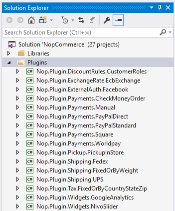

# 如何為 nopCommerce 4.10 編寫外掛

> 在電腦運算中，外掛（Plugin）是一組能為大型軟體應用程式添加特定功能的軟體元件（資料來源：Wikipedia）。

外掛用於擴充 nopCommerce 的功能。nopCommerce 擁有多種類型的外掛。例如，付款方式（如 PayPal）、稅務提供程序、配送方式計算方法（如 UPS、USPS、FedEx）、小部件（如「即時交談」區塊）以及其他許多類型。nopCommerce 本身已經內建了許多不同的外掛。您也可以在 [nopCommerce 官方網站](https://www.nopcommerce.com/marketplace) 上搜尋各種外掛，看看是否已經有人開發了符合您需求的外掛。如果沒有，本文將引導您完成建立外掛的過程。

## 外掛結構、必要檔案與存放位置

1. 您首先要做的是在解決方案中建立一個新的「類別庫 (Class Library)」專案。建議將所有外掛放置在方案根目錄的 `\Plugins` 資料夾中（請勿與位於 `\Nop.Web` 目錄下的 `\Plugins` 子目錄混淆，該目錄是供已部署的外掛使用的）。將所有外掛放置在「Plugins」解決方案資料夾中是一個良好的實作方式（您可以從[此處](http://msdn.microsoft.com/library/sx2027y2.aspx)找到更多關於解決方案資料夾的資訊）。

    建議的外掛專案命名方式為「Nop.Plugin.{Group}.{Name}」。其中 {Group} 是您的外掛分組（例如，「Payments」或「Shipping」）。{Name} 是您的外掛名稱（例如，「PayPalStandard」）。例如，PayPal Standard 付款外掛的名稱如下：Nop.Plugin.Payments.PayPalStandard。但請注意，這並非強制規定，您可以為外掛選擇任何名稱，例如「MyGreatPlugin」。

    

1. 建立外掛專案後，您必須使用任何文字編輯器開啟其 `.csproj` 檔案，並將其內容替換為以下內容：

    ```xml
    <Project Sdk="Microsoft.NET.Sdk">
        <PropertyGroup>
        <TargetFramework>netcoreapp2.1</TargetFramework>
        </PropertyGroup>
        <PropertyGroup Condition="'$(Configuration)|$(Platform)'=='Release|AnyCPU'">
        <OutputPath>..\..\Presentation\Nop.Web\Plugins\PLUGIN_OUTPUT_DIRECTORY</OutputPath>
        <OutDir>$(OutputPath)</OutDir>
        </PropertyGroup>
        <PropertyGroup Condition="'$(Configuration)|$(Platform)'=='Debug|AnyCPU'">
        <OutputPath>..\..\Presentation\Nop.Web\Plugins\PLUGIN_OUTPUT_DIRECTORY</OutputPath>
        <OutDir>$(OutputPath)</OutDir>
        </PropertyGroup>
        <!-- This target execute after "Build" target -->
        <Target Name="NopTarget" AfterTargets="Build">
        <!-- Delete unnecessary libraries from plugins path -->
        <MSBuild Projects="$(MSBuildProjectDirectory)\..\..\Build\ClearPluginAssemblies.proj"    Properties="PluginPath=$(MSBuildProjectDirectory)\$(OutDir)" Targets="NopClear" />
        </Target>
    </Project>
    ```

    Where PLUGIN_OUTPUT_DIRECTORY should be replaced with the plugin name, for example, Payments.PayPalStandard.

    We do it this way to be able to use a new approach to add third-party references which were introduced in .NET Core. But it's not required. Moreover, references from already referenced libraries will be loaded automatically. So it is very convenient.

1. The next step is creating a `plugin.json` file required for each plugin. This file contains meta-information describing your plugin. Just copy this file from any other existing plugin and modify it for your needs. For information about the `plugin.json` file, please see [plugin.json file](xref:zh-Hant/developer/plugins/plugin_json).

1. The last required step is to create a class that implements the `IPlugin` interface (Nop.Core.Plugins namespace). nopCommerce has the `BasePlugin` class which already implements some IPlugin methods and allows you to avoid source code duplication. nopCommerce also provides you with some specific interfaces derived from `IPlugin`. For example, we have the "IPaymentMethod" interface which is used for creating new payment method plugins. It contains some methods which are specific only for payment methods such as ProcessPayment() or GetAdditionalHandlingFee(). Currently, nopCommerce has the following specific plugin interfaces:

   - **IPaymentMethod**. These plugins are used for payment processing.
   - **IShippingRateComputationMethod**. These plugins are used for retrieving accepted delivery methods and appropriate shipping rates. For example, UPS, UPS, FedEx, etc.
   - **IPickupPointProvider**. These plugins are used for providing pickup points.
   - **ITaxProvider**. Tax providers are used for getting tax rates.
   - **IExchangeRateProvider**. Used for getting currency exchange rate.
   - **IDiscountRequirementRule**. Allows you to create new discount rules such as "Billing country of a customer should be…"
   - **IExternalAuthenticationMethod**. Used for creating external authentication methods such as Facebook, Twitter, OpenID, etc.
   - **IWidgetPlugin**. It allows you to create widgets. Widgets are rendered on some parts of your site. For example, it can be a "Live chat" block on your site's left column.
   - **IMiscPlugin**. If your plugin doesn't fit any of the interfaces above.

> [!IMPORTANT]
> After each project build, clean the solution before making changes. Some resources will be cached and can lead to developer insanity.

## Handling requests. Controllers, models, and views

Now you can see the plugin by going to **Admin area → Configuration → Plugins**. But as you guessed our plugin does nothing. It does not even have a user interface for its configuration. Let's create a page to configure the plugin.

What we need to do now is create a controller, a model, and a view.

- MVC controllers are responsible for responding to requests made against an ASP.NET MVC website. Each browser request is mapped to a particular controller.
- A view contains the HTML markup and content that is sent to the browser. A view is the equivalent of a page when working with an ASP.NET MVC application.
- An MVC model contains all of your application logic that is not contained in a view or a controller.

You can find more information about the MVC pattern [here](http://www.asp.net/mvc/tutorials/older-versions/overview/understanding-models-views-and-controllers-cs).

So let's start:

- **Create the model**. Add a Models folder in the new plugin, and then add a new model class that fits your need.
- **Create the view**. Add a Views folder in the new plugin, and then add a cshtml file named `Configure.cshtml`. Set "Build Action" property of the view file is set to "Content", and the "Copy to Output Directory" property is set to "Copy if newer". Note that the configuration page should use the `_ConfigurePlugin` layout. Also, make sure that you have the `_ViewImports` file in your \Views directory. You can just copy it from any other existing plugin.
- **Create the controller**. Add a Controllers folder in the new plugin, and then add a new controller class. A good practice is to name plugin controllers `{Group}{Name}Controller.cs`. For example, PaymentPayPalStandardController. Of course, it's not a requirement to name controllers this way (but just a recommendation). Then create an appropriate action method for the configuration page (in the admin area). Let's name it "Configure". Prepare a model class and pass it to the following view using a physical view path: - `~/Plugins/{PluginOutputDirectory}/Views/Configure.cshtml`.
- Use the following attributes for your action method:

    ```csharp
    [AuthorizeAdmin] //confirms access to the admin panel
    [Area(AreaNames.Admin)] //specifies the area containing a controller or action
    ```

    For example, open PayPalStandard payment plugin and look at its implementation of PaymentPayPalStandardController.

Then for each plugin that has a configuration page, you should specify a configuration URL. A base class named `BasePlugin` has `GetConfigurationPageUrl` method which returns a configuration URL:

```csharp
return $"{_webHelper.GetStoreLocation()}Admin/ControllerName/ActionName";
```

Where ControllerName is the name of your controller and ActionName is a name of the action (usually it's "Configure").

Once you have installed your plugin and added the configuration method you will find a link to configure your plugin under Admin → Configuration → Plugins.

> [!TIP]
> The easiest way to complete the steps described above is by opening any other plugin and copying these files into your plugin project. Then just rename appropriate classes and directories.

For example, the project structure of the PayPalStandard plugin looks like the image below:


## Handling "Install" and "Uninstall" methods

This step is optional. Some plugins can require additional logic during plugin installation. For example, a plugin can insert new locale resources. So open your IPlugin implementation (in most cases it'll be derived from BasePlugin class) and override the following methods:

- Install. This method will be invoked during plugin installation. You can initialize any settings here, insert new locale resources, or create some new database tables (if required).
- Uninstall. This method will be invoked during plugin uninstallation.

> [!IMPORTANT]
> If you override one of these methods, do not hide its base implementation.

For example, overridden "Install" method should include the following method call: base.Install(). The "Install" method of the PayPalStandard plugin looks like the code below

```csharp
public override void Install()
{
    var settings = new PayPalStandardPaymentSettings()
    {
        UseSandbox = true
    };
    _settingService.SaveSetting(settings);
    base.Install();
}
```

> [!TIP]
> 已安裝的外掛清單位於 `\App_Data\installedPlugins.json`。該清單是在安裝過程中建立的。

## 路由 (Routes)

在此我們將探討如何註冊外掛路由。ASP.NET Core 路由負責將傳入的瀏覽器請求對應到特定的 MVC 控制器動作。您可以從[此處](https://docs.microsoft.com/aspnet/core/fundamentals/routing)找到更多關於路由的資訊。請按照下列步驟操作：

- 如果您需要新增自訂路由，請建立 `RouteProvider.cs` 檔案。它會通知 nopCommerce 系統關於外掛路由的資訊。例如，以下的 RouteProvider 類別新增了一個新路由，透過開啟瀏覽器並導向 `http://www.yourStore.com/Plugins/PaymentPayPalStandard/PDTHandler` URL 即可存取（PayPal 外掛使用此方式）：

    ```csharp
    public partial class RouteProvider : IRouteProvider
    {
        public void RegisterRoutes(IRouteBuilder routeBuilder)
        {
             routeBuilder.MapRoute("Plugin.Payments.PayPalStandard.PDTHandler", "Plugins/   PaymentPayPalStandard/PDTHandler",
             new { controller = "PaymentPayPalStandard", action = "PDTHandler" });
        }
        public int Priority
        {
            get
            {
                return -1;
            }
        }
    }
    ```

## 升級 nopCommerce 可能會導致外掛失效

某些外掛可能會過時，無法再與新版本的 nopCommerce 搭配運作。如果您在升級至新版本後遇到問題，請刪除該外掛，並造訪 nopCommerce 官方網站查看是否有更新版本。許多外掛作者會更新其外掛以適應新版本，但有些則不會，這些外掛會隨著 nopCommerce 的改進而變得過時。但在大多數情況下，您只需開啟對應的 `plugin.json` 檔案並更新 **SupportedVersions** 欄位即可。

## 結論

希望這能幫助您開始使用 nopCommerce，並為您建立更精細的外掛做好準備。