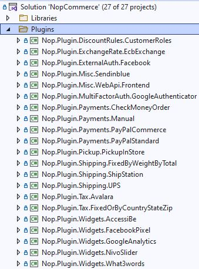
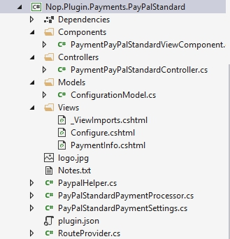

# 如何編寫 nopCommerce 外掛

外掛用於擴充 nopCommerce 的功能。nopCommerce 擁有多種類型的外掛。例如，付款方式（如 PayPal）、稅務提供程序、配送方式計算方法（如 UPS、USPS、FedEx）、小部件（如「線上客服」區塊）等等。nopCommerce 本身已內建許多不同的外掛。您也可以在 [nopCommerce 官方網站](https://www.nopcommerce.com/marketplace) 上搜尋各種外掛，看看是否已有符合您需求的外掛。如果沒有，本文將引導您完成建立外掛的過程。

## 外掛結構、必要檔案與存放位置

1. 首先，您需要在解決方案中建立一個新的 *`Class Library`*（類別庫）專案。將所有外掛放置在解決方案根目錄下的 `\Plugins` 資料夾是一個良好的習慣（請勿與位於 `\Nop.Web` 目錄下用於已部署外掛的 `\Plugins` 子目錄混淆）。將所有外掛放置在 `Plugins` 解決方案資料夾中也是一種良好的做法。

    推薦的外掛專案命名方式為 **`Nop.Plugin.{Group}.{Name}`**。**`{Group}`** 是您的外掛群組（例如 *Payment* 或 *Shipping*）。**`{Name}`** 是您的外掛名稱（例如 *PayPalStandard*）。例如，PayPal Standard 付款外掛的名稱為：**`Nop.Plugin.Payments.PayPalStandard`**。但請注意，這並非強制規定，您可以為外掛選擇任何名稱，例如 `MyGreatPlugin`。

    

1. 外掛專案建立完成後，您必須在任何文字編輯器中開啟其 `.csproj` 檔案，並將其內容替換為以下內容：

    ```csharp
    public override string GetConfigurationPageUrl()
    {
        return $"{_webHelper.GetStoreLocation()}Admin/{CONTROLLER_NAME}/{ACTION_NAME}";
    }
    ```

    ```

Where **{CONTROLLER_NAME}** is the name of your controller and **{ACTION_NAME}** is the name of the action (usually it's `Configure`).

Once you have installed your plugin and added the configuration method you will find a link to configure your plugin under **Admin → Configuration → Local Plugins**.

> [!TIP]
> The easiest way to complete the steps described above is by opening any other plugin and copying these files into your plugin project. Then just rename appropriate classes and directories.

For example, the project structure of the *PayPalStandard* plugin looks like the image below:



## Handling "InstallAsync", "UninstallAsync" and "UpdateAsync" methods

This step is optional. Some plugins can require additional logic during plugin installation. For example, a plugin can insert new locale resources. So open your `IPlugin` implementation (in most cases it'll be derived from the `BasePlugin` class) and override the following methods:

1. **InstallAsync**. This method will be invoked during plugin installation. You can initialize any settings here, insert new locale resources, or create some new database tables (if required).
1. **UninstallAsync**. This method will be invoked during plugin uninstallation.
1. **UpdateAsync**. This method will be invoked during plugin update (when its version is changed in the `plugin.json` file).

> [!IMPORTANT]
> If you override one of these methods, do not hide its base implementation.

For example, overridden `InstallAsync` method should include the following method call: *`base.Install()`*. The `InstallAsync` method of the *PayPalStandard* plugin looks like the code below

```csharp
    public override async Task InstallAsync()
    {
        await _settingService.SaveSettingAsync(new PayPalStandardPaymentSettings
        {
            UseSandbox = true
        });
        
        await _localizationService.AddLocaleResourceAsync(new Dictionary<string, string>
        {
            ...
        });
        await base.InstallAsync();
    }
    ```

> [!TIP]
> The list of installed plugins is located in `\App_Data\plugins.json`. The list is created during installation.

## Routes

Here we will have a look at how to register plugin routes. ASP.NET Core routing is responsible for mapping incoming browser requests to particular MVC controller actions. You can find more information about routing [here](https://docs.microsoft.com/aspnet/core/fundamentals/routing). So follow the next steps:

If you need to add some custom route, then create the `RouteProvider.cs` file. It informs the nopCommerce system about plugin routes. For example, the following `RouteProvider` class adds a new route which can be accessed by opening your web browser and navigating to `http://www.yourStore.com/Plugins/PaymentPayPalStandard/PDTHandler` URL (used by *PayPal* plugin):

```csharp
    public partial class RouteProvider : IRouteProvider
    {
        public void RegisterRoutes(IEndpointRouteBuilder endpointRouteBuilder)
        {
            //PDT
            endpointRouteBuilder.MapControllerRoute("Plugin.Payments.PayPalStandard.PDTHandler", "Plugins/PaymentPayPalStandard/PDTHandler",
                    new { controller = "PaymentPayPalStandard", action = "PDTHandler" });
        }
        public int Priority => -1;
    }
    ```

## 升級 nopCommerce 可能會導致外掛失效

某些外掛可能會過時，並無法在較新版本的 nopCommerce 中運作。如果您在升級到較新版本後遇到問題，請刪除該外掛，並造訪 nopCommerce 官方網站，查看是否有更新的版本可用。許多外掛開發者會更新其外掛以適應新版本，但有些則不會，隨著 nopCommerce 的改進，這些外掛將會被淘汰。不過在大多數情況下，您只需開啟相應的 `plugin.json` 檔案並更新 **SupportedVersions** 欄位即可。

## 結論

希望這篇文章能讓您開始接觸 nopCommerce，並為您建構更複雜的外掛做好準備。

## 外掛模板

您可以使用我們為 nopCommerce 新外掛提供的 Visual Studio 模板。它可以為開發者節省大量時間，因為現在不需要手動執行所有初始步驟。例如資料夾建立（Controllers、Views、Models 等）、其他必要檔案（DependencyRegistrar.cs、_ViewImports.cshtml、ObjectContex、plugin.json 等）、設定、專案參考等。請點擊[此處](https://github.com/nopSolutions/nopCommerce-plugin-template-VS/)取得模板與安裝說明。