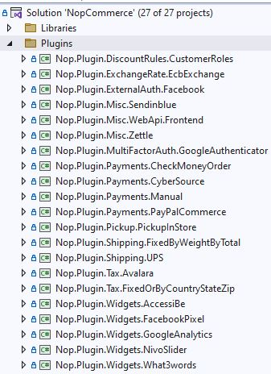

# 如何為 nopCommerce 編寫外掛

外掛用於擴充 nopCommerce 的功能。nopCommerce 擁有多種類型的外掛。例如，付款提供程序（如 PayPal）、稅務提供程序、配送方式計算方法（如 UPS、USP、FedEx）、小部件（如「即時聊天」區塊）以及許多其他類型。nopCommerce 本身已內建許多不同的外掛。您也可以在 [nopCommerce 官方網站](https://www.nopcommerce.com/marketplace) 上搜尋各種外掛，看看是否已經有人開發出符合您需求的外掛。如果沒有，本文將引導您完成建立外掛的過程。

## 外掛結構、必要檔案與位置

1. 您需要做的第一件事是在解決方案中建立一個新的 *`Class Library`* 專案。將所有外掛放置在解決方案根目錄的 `\Plugins` 資料夾中是一個良好的實作方式（請勿與 `\Nop.Web` 目錄下用於已部署外掛的 `\Plugins` 子目錄混淆）。同時，將所有外掛放置在 `Plugins` 解決方案資料夾中也是一種良好的實作建議。

    建議的外掛專案命名方式為 **`Nop.Plugin.{Group}.{Name}`**。**`{Group}`** 是您的外掛類別（例如 *Payment* 或 *Shipping*）。**`{Name}`** 是您的外掛名稱（例如 *PayPalCommerce*）。例如，PayPal Commerce 付款外掛的名稱為：**`Nop.Plugin.Payments.PayPalCommerce`**。但請注意，這並非強制規定，您可以為外掛選擇任何名稱。例如，`MyGreatPlugin`。

    

1. 當外掛專案建立完成後，您必須在任何文字編輯器中開啟其 `.csproj` 檔案，並將其內容取代為以下內容：

    ```xml
    <Project Sdk="Microsoft.NET.Sdk">
        <PropertyGroup>
            <TargetFramework>net7.0</TargetFramework>
            <Copyright>SOME_COPYRIGHT</Copyright>
            <Company>YOUR_COMPANY</Company>
            <Authors>SOME_AUTHORS</Authors>
            <PackageLicenseUrl>PACKAGE_LICENSE_URL</PackageLicenseUrl>
            <PackageProjectUrl>PACKAGE_PROJECT_URL</PackageProjectUrl>
            <RepositoryUrl>REPOSITORY_URL</RepositoryUrl>
            <RepositoryType>Git</RepositoryType>
            <OutputPath>..\..\Presentation\Nop.Web\Plugins\PLUGIN_OUTPUT_DIRECTORY</OutputPath>
            <OutDir>$(OutputPath)</OutDir>
            <!--Set this parameter to true to get the dlls copied from the NuGet cache to the output of your    project. You need to set this parameter to true if your plugin has a nuget package to ensure that   the dlls copied from the NuGet cache to the output of your project-->
            <CopyLocalLockFileAssemblies>true</CopyLocalLockFileAssemblies>
        </PropertyGroup>
        <ItemGroup>
            <ProjectReference Include="..\..\Presentation\Nop.Web.Framework\Nop.Web.Framework.csproj" />
            <ClearPluginAssemblies Include="$(MSBuildProjectDirectory)\..\..\Build\ClearPluginAssemblies.proj" />
        </ItemGroup>
        <!-- This target execute after "Build" target -->
        <Target Name="NopTarget" AfterTargets="Build">
            <!-- Delete unnecessary libraries from plugins path -->
            <MSBuild Projects="@(ClearPluginAssemblies)" Properties="PluginPath=$(MSBuildProjectDirectory)\$(OutDir)" Targets="NopClear" />
        </Target>
    </Project>
    ```

    > [!TIP]
    > 其中 **PLUGIN_OUTPUT_DIRECTORY** 應替換為外掛名稱，例如 `Payments.PayPalStandard`。
    >
    > 我們這樣做是為了能夠使用 .NET Core 中引入的新方法來添加第三方參考。但實際上，這並非必要。此外，已經參考過的函式庫所包含的參考會自動載入，這非常方便。

1. 下一個步驟是建立每個外掛都必須具備的 `plugin.json` 檔案。此檔案包含描述您外掛的中繼資料。只需從任何其他現有的外掛複製此檔案，並根據您的需求進行修改即可。有關 `plugin.json` 檔案的詳細資訊，請參閱 [plugin.json 檔案](xref:zh-Hant/developer/plugins/plugin_json)。

1. 最後一個必要的步驟是建立一個實作 **`IPlugin`** 介面（位於 `Nop.Services.Plugins` 命名空間）的類別。nopCommerce 提供了 **`BasePlugin`** 類別，它已經實作了一些 `IPlugin` 方法，讓您可以避免原始程式碼重複。nopCommerce 也提供了一些衍生自 `IPlugin` 的特定介面。例如，我們有 `IPaymentMethod` 介面，用於建立新的付款方式外掛。它包含一些僅針對付款方式的特定方法，例如 *`ProcessPaymentAsync()`* 或 *`GetAdditionalHandlingFeeAsync()`*。目前，nopCommerce 擁有以下特定的外掛介面：

   - **IPaymentMethod**。這些外掛用於處理付款。
   - **IShippingRateComputationMethod**。這些外掛用於取得已接受的配送方式與適用的運費。例如，UPS、FedEx 等。
   - **IPickupPointProvider**。這些外掛用於提供取貨點。
   - **ITaxProvider**。稅務提供程序用於取得稅率。
   - **IExchangeRateProvider**。用於取得貨幣匯率。
   - **IDiscountRequirementRule**。允許您建立新的折扣規則，例如「顧客的帳單國家/地區必須為……」。
   - **IExternalAuthenticationMethod**。用於建立外部驗證方法，例如 Facebook、Twitter、OpenID 等。
   - **IMultiFactorAuthenticationMethod**。用於建立多重驗證方法，例如 *GoogleAuthenticator* 等。
     >[!NOTE]
     > 這是一個新的介面，自 4.40 版本起，我們直接提供用於 MFA 整合的對應基礎架構。
- **IWidgetPlugin**。它允許您建立小部件。小部件會呈現在您網站的某些區塊中。例如，它可以是您網站左欄的一個「即時交談」區塊。
- **IMiscPlugin**。如果您的外掛不適用於上述任何介面，請使用此介面。

> [!IMPORTANT]
> 在每次專案建置後，請在進行任何變更前先清理方案。某些資源會被快取，這可能會讓開發人員感到困擾。
>
> 新增外掛後，您可能需要重建方案。如果您在 `Nop.Web\Plugins\PLUGIN_OUTPUT_DIRECTORY` 下沒有看到外掛的 DLL 檔案，則需要重建方案。如果您的 DLL 檔案不存在於 `Nop.Web` 中的正確資料夾內，nopCommerce 將不會在*本機外掛*頁面中列出您的外掛。

## 處理請求：控制器、模型與檢視

現在，您可以透過前往 **後台管理 → 設定 → 本地外掛** 來查看該外掛。但正如您所料，我們的外掛目前還沒有任何功能。它甚至沒有用於設定的使用者介面。讓我們建立一個頁面來設定此小部件外掛。

我們現在需要做的是建立一個控制器（Controller）、一個模型（Model）和一個檢視（View）。

1. MVC 控制器負責回應針對 ASP.NET Core MVC 網站提出的請求。每個瀏覽器請求都會對應到一個特定的控制器。
2. 檢視包含發送到瀏覽器的 HTML 標記與內容。在 `ASP.NET Core MVC` 應用程式中，檢視等同於一個頁面。
3. MVC 模型包含應用程式中所有未包含在檢視或控制器中的邏輯。

您可以找到關於 MVC 模式的更多資訊 [here](https://docs.microsoft.com/aspnet/core/mvc/overview?view=aspnetcore-6.0)。

那麼，讓我們開始吧：

- **建立模型**：在新的外掛中加入一個 **Models** 資料夾，然後加入一個符合您需求的模型類別。
- **建立檢視**：在新的外掛中加入一個 **Views** 資料夾，然後加入一個名為 `Configure.cshtml` 的 `*.cshtml` 檔案。將檢視檔案的 **"建置動作" (Build Action)** 屬性設定為 **"內容" (Content)**，並將 **"複製到輸出目錄" (Copy to Output Directory)** 屬性設定為 **"永遠複製" (Copy always)**。請注意，設定頁面應使用 `_ConfigurePlugin` 版面配置。
- 同時請確保您的 \Views 目錄中有 `_ViewImports.cshtml` 檔案。您可以直接從任何其他現有的外掛中複製它。
- **建立控制器**：在新的外掛中加入一個 **Controllers** 資料夾，然後加入一個控制器類別。良好的做法是將外掛控制器命名為 `{Group}{Name}Controller.cs`。例如：PaymentPayPalStandardController。當然，這並非強制命名規範（僅為建議）。接著，為設定頁面（在後台管理區域）建立適當的動作方法。讓我們將其命名為 *`Configure`*。準備一個模型類別，並使用實體檢視路徑將其傳遞給檢視：`~/Plugins/{PluginOutputDirectory}/Views/Configure.cshtml`。
- 請為您的動作方法使用下列屬性：

```csharp
public override string GetConfigurationPageUrl()
{
    return $"{_webHelper.GetStoreLocation()}Admin/{CONTROLLER_NAME}/{ACTION_NAME}";
}
```

其中 **{CONTROLLER_NAME}** 是您的控制器名稱，而 **{ACTION_NAME}** 是動作名稱（通常為 `Configure`）。

一旦您安裝了外掛並新增了設定方法，您將會在 **後台管理 → 設定 → 本地外掛** 下方找到一個連結來設定您的外掛。

> [!TIP]
> 完成上述步驟最簡單的方法是開啟任何其他外掛，並將這些檔案複製到您的外掛專案中。然後，只需重新命名適當的類別和目錄即可。

例如，*PayPalCommerce* 外掛的專案結構如下圖所示：


## 處理 "InstallAsync"、"UninstallAsync" 與 "UpdateAsync" 方法

此步驟為選用。有些外掛在安裝過程中可能需要額外的邏輯。例如，外掛可能需要插入新的在地化資源。因此，請開啟您的 `IPlugin` 實作（大多數情況下將繼承自 `BasePlugin` 類別）並覆寫下列方法：

1. **InstallAsync**。此方法將在外掛安裝期間被呼叫。您可以在此初始化任何設定、插入新的在地化資源，或建立新的資料庫資料表（若有需要）。
1. **UninstallAsync**。此方法將在外掛解除安裝期間被呼叫。
1. **UpdateAsync**。此方法將在外掛更新期間（當 `plugin.json` 檔案中的版本號變更時）被呼叫。

> [!IMPORTANT]
> 如果您覆寫了這些方法中的其中一個，請勿隱藏其基礎實作。

例如，覆寫後的 `InstallAsync` 方法應包含下列方法呼叫：*`base.InstallAsync()`*。*PayPalStandard* 外掛的 `InstallAsync` 方法看起來如下列程式碼所示：

```csharp
public override async Task InstallAsync()
{
    await _settingService.SaveSettingAsync(new PayPalStandardPaymentSettings
    {
        UseSandbox = true
    });
    
    await _localizationService.AddLocaleResourceAsync(new Dictionary<string, string>
    {
        ...
    });
    await base.InstallAsync();
}
```

> [!TIP]
> 已安裝外掛的列表位於 `\App_Data\plugins.json`。該列表是在安裝過程中建立的。

## 路由

在這裡，我們將探討如何註冊外掛路由。ASP.NET Core 路由負責將傳入的瀏覽器請求映射至特定的 MVC 控制器動作。您可以前往 [here](https://docs.microsoft.com/aspnet/core/fundamentals/routing) 找到關於路由的更多資訊。請遵循以下步驟：

如果您需要新增自訂路由，請建立 `RouteProvider.cs` 檔案。它會告知 nopCommerce 系統關於外掛路由的資訊。例如，下方的 `RouteProvider` 類別新增了一個路由，您可以透過開啟網頁瀏覽器並瀏覽至 `http://www.yourStore.com/Plugins/PayPalCommerceWebhook/WebhookHandler` 網址來存取它：

```csharp
public class RouteProvider : IRouteProvider
    {
        /// <summary>
        /// Register routes
        /// </summary>
        /// <param name="endpointRouteBuilder">Route builder</param>
        public void RegisterRoutes(IEndpointRouteBuilder endpointRouteBuilder)
        {
            endpointRouteBuilder.MapControllerRoute(PayPalCommerceDefaults.WebhookRouteName,
                "Plugins/PayPalCommerce/Webhook",
                new { controller = "PayPalCommerceWebhook", action = "WebhookHandler" });
        }

        /// <summary>
        /// Gets a priority of route provider
        /// </summary>
        public int Priority => 0;
    }
```

## 升級 nopCommerce 可能會導致外掛失效

部分外掛可能會過時，並無法再與新版本的 nopCommerce 相容。如果您在升級到新版本後遇到問題，請刪除該外掛，並前往 nopCommerce 官方網站查看是否有提供新版本。許多外掛開發者會更新其外掛以適應新版本，但也有部分開發者不會這麼做，導致其外掛隨著 nopCommerce 的改進而變得不再適用。不過在大多數情況下，您只需開啟對應的 `plugin.json` 檔案，並更新 **SupportedVersions** 欄位即可。

## 結論

希望這能幫助您順利開始使用 nopCommerce，並為您開發更複雜的外掛做好準備。

## 外掛範本

您可以使用我們為 nopCommerce 新外掛提供的 Visual Studio 範本。這可以為開發人員節省大量時間，因為現在他們不必手動執行所有初始步驟，例如建立資料夾（Controllers、Views、Models 等）、建立其他必要檔案（PluginNopStartup.cs、_ViewImports.cshtml、ObjectContex、plugin.json 等）、設定組態、專案參照等。請參閱相關資訊與安裝說明 [here](https://github.com/nopSolutions/nopCommerce-plugin-template-VS/)