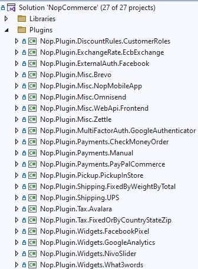
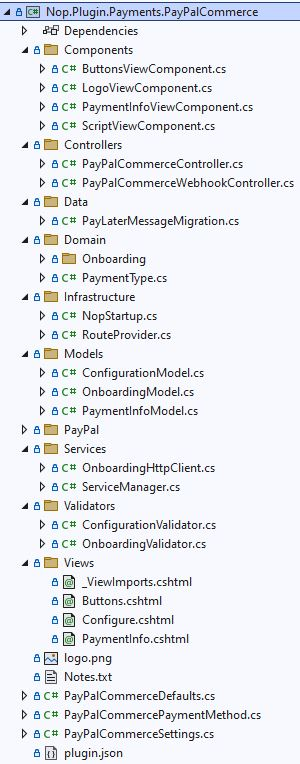

# 如何為 nopCommerce 編寫外掛

外掛用於擴充 nopCommerce 的功能。nopCommerce 擁有多種類型的外掛。例如，付款提供程序（如 PayPal）、稅務提供程序、配送方式計算方法（如 UPS、USPS、FedEx）、小部件（如「即時交談」區塊）以及其他許多類型。nopCommerce 已經內建了許多不同的外掛。您也可以在 [nopCommerce 官方網站](https://www.nopcommerce.com/marketplace) 上搜尋各種外掛，看看是否已經有人開發出符合您需求的外掛。如果沒有，這篇文章將指引您完成建立外掛的流程。

## 外掛結構、必要檔案與位置

1. 首先，您需要於解決方案中建立一個新的 *`Class Library`* 專案。將所有外掛放置於解決方案根目錄的 `\Plugins` 目錄中是一個良好的開發習慣（請勿與位於 `\Nop.Web` 目錄下、用於已部署外掛的 `\Plugins` 子目錄混淆）。同時，建議將所有外掛放置於解決方案的 Plugins 資料夾中。

    外掛專案的建議命名格式為 **`Nop.Plugin.{Group}.{Name}`**。**`{Group}`** 是您的外掛群組（例如 *Payment* 或 *Shipping*），**`{Name}`** 是您的外掛名稱（例如 *PayPalCommerce*）。舉例來說，PayPal Commerce 付款外掛的名稱為：**`Nop.Plugin.Payments.PayPalCommerce`**。但請注意，這並非強制規定，您可以為外掛選擇任何名稱，例如 `MyGreatPlugin`。

    

1. 當外掛專案建立完成後，您必須在任何文字編輯器中開啟其 `.csproj` 檔案，並將其內容取代為以下內容：

    ```xml
    <Project Sdk="Microsoft.NET.Sdk">
        <PropertyGroup>
            <TargetFramework>net8.0</TargetFramework>
            <Copyright>SOME_COPYRIGHT</Copyright>
            <Company>YOUR_COMPANY</Company>
            <Authors>SOME_AUTHORS</Authors>
            <PackageLicenseUrl>PACKAGE_LICENSE_URL</PackageLicenseUrl>
            <PackageProjectUrl>PACKAGE_PROJECT_URL</PackageProjectUrl>
            <RepositoryUrl>REPOSITORY_URL</RepositoryUrl>
            <RepositoryType>Git</RepositoryType>
            <OutputPath>..\..\Presentation\Nop.Web\Plugins\PLUGIN_OUTPUT_DIRECTORY</OutputPath>
            <OutDir>$(OutputPath)</OutDir>
            <!--Set this parameter to true to get the dlls copied from the NuGet cache to the output of your    project. You need to set this parameter to true if your plugin has a nuget package to ensure that   the dlls copied from the NuGet cache to the output of your project-->
            <CopyLocalLockFileAssemblies>true</CopyLocalLockFileAssemblies>
            <ImplicitUsings>enable</ImplicitUsings>
        </PropertyGroup>
        <ItemGroup>
            <ProjectReference Include="..\..\Presentation\Nop.Web.Framework\Nop.Web.Framework.csproj" />
            <ClearPluginAssemblies Include="$(MSBuildProjectDirectory)\..\..\Build\ClearPluginAssemblies.proj" />
        </ItemGroup>
        <!-- This target executes after "Build" target -->
        <Target Name="NopTarget" AfterTargets="Build">
            <!-- Delete unnecessary libraries from plugins path -->
            <MSBuild Projects="@(ClearPluginAssemblies)" Properties="PluginPath=$(MSBuildProjectDirectory)\$(OutDir)" Targets="NopClear" />
        </Target>
    </Project>
    ```

    > [!TIP]
    > 其中 **PLUGIN_OUTPUT_DIRECTORY** 應替換為外掛名稱，例如 `Payments.PayPalStandard`。
    >
    > 我們採用這種方式是為了能夠使用 .NET Core 引入的新方法來新增第三方參考。事實上，這並非絕對必要，此外，來自已參考函式庫的參考將會自動載入，這非常方便。

1. 下一步是為每個外掛建立必要的 `plugin.json` 檔案。此檔案包含描述您外掛的中繼資訊。只需從任何其他現有的外掛複製此檔案，並根據您的需求進行修改即可。關於 `plugin.json` 檔案的詳細資訊，請參閱 [plugin.json 檔案](xref:zh-Hant/developer/plugins/plugin_json)。

1. 最後一個必要步驟是建立一個實作 **`IPlugin`** 介面（位於 `Nop.Services.Plugins` 命名空間）的類別。nopCommerce 提供了 **`BasePlugin`** 類別，它已經實作了一些 `IPlugin` 方法，讓您可以避免原始碼重複。nopCommerce 也提供了一些衍生自 `IPlugin` 的特定介面。例如，我們有用於建立新付款方式外掛的 `IPaymentMethod` 介面。它包含一些僅針對付款方式特定的方法，例如 *`ProcessPaymentAsync()`* 或 *`GetAdditionalHandlingFeeAsync()`*。目前，nopCommerce 擁有以下特定的外掛介面：

   - **IPaymentMethod**：這些外掛用於處理付款。
   - **IShippingRateComputationMethod**：這些外掛用於擷取可接受的配送方式與對應的運費。例如 UPS、FedEx 等。
   - **IPickupPointProvider**：這些外掛用於提供取貨點。
   - **ITaxProvider**：稅務提供程序用於獲取稅率。
   - **IExchangeRateProvider**：用於獲取貨幣匯率。
   - **IDiscountRequirementRule**：允許您建立新的折扣規則，例如「顧客的帳單地址國家必須是……」。
   - **IExternalAuthenticationMethod**：用於建立外部驗證方法，例如 Facebook、Twitter、OpenID 等。
   - **IMultiFactorAuthenticationMethod**：用於建立多重驗證方法，例如 *GoogleAuthenticator* 等。
     > [!NOTE]
     > 這是一個新的介面，自 4.40 版本起，我們已內建提供對應的基礎架構以進行 MFA 整合。
   - **IWidgetPlugin**。它允許您建立小部件。小部件會呈現於您網站的某些部分。例如，它可以是您網站左側欄位中的「線上客服」區塊。
   - **IMiscPlugin**。如果您的外掛不適合上述任何一種介面時使用。

> [!IMPORTANT]
> 在每次建置專案後，進行修改前請先清理解決方案。某些資源會被快取，這可能會導致開發人員抓狂。
>
> 在加入外掛後，您可能需要重新建置您的解決方案。如果您在 `Nop.Web\Plugins\PLUGIN_OUTPUT_DIRECTORY` 下沒有看到您的外掛 DLL，則需要重新建置解決方案。如果您的 DLL 沒有存在於 `Nop.Web` 內的正確資料夾中，nopCommerce 將不會在*本機外掛*頁面中列出您的外掛。

## 處理請求：控制器、模型與檢視

現在，您可以前往 **後台管理 → 設定 → 本地外掛** 看到該外掛。但正如您所料，我們的外掛目前什麼都沒做，甚至連設定的使用者介面都沒有。讓我們來建立一個頁面來設定外掛。

我們現在需要做的是建立一個控制器（Controller）、一個模型（Model）和一個檢視（View）。

1. MVC 控制器負責回應針對 ASP.NET Core MVC 網站所發出的請求。每個瀏覽器請求都會映射到特定的控制器。
1. 檢視包含發送到瀏覽器的 HTML 標記與內容。在開發 `ASP.NET Core MVC` 應用程式時，檢視即等同於頁面。
1. MVC 模型包含應用程式中所有未包含在檢視或控制器中的邏輯。

您可以透過 [here](https://docs.microsoft.com/aspnet/core/mvc/overview) 找到更多關於 MVC 模式的資訊。

那麼，讓我們開始吧：

- **建立模型**。在新的外掛中新增一個 **Models** 資料夾，然後新增一個符合您需求的模型類別。
- **建立檢視**。在新的外掛中新增一個 **Views** 資料夾，然後新增一個名為 `Configure.cshtml` 的 `*.cshtml` 檔案。將檢視檔案的 **「建置動作」(Build Action)** 屬性設定為 **「內容」(Content)**，並將 **「複製到輸出目錄」(Copy to Output Directory)** 屬性設定為 **「永遠複製」(Copy always)**。請注意，設定頁面應使用 `_ConfigurePlugin` 版面配置。
- 同時請確保您的 \Views 目錄中有 `_ViewImports.cshtml` 檔案。您可以直接從任何其他現有的外掛中複製該檔案。
- **建立控制器**。在新的外掛中新增一個 **Controllers** 資料夾，然後新增一個控制器類別。一個良好的慣例是將外掛控制器命名為 `{Group}{Name}Controller.cs`。例如：`PaymentPayPalStandardController`。當然，這並非強制命名方式（僅為建議）。接著，為設定頁面（在後台管理區域）建立適當的動作方法（Action Method）。讓我們將其命名為 *`Configure`*。準備一個模型類別，並使用實體檢視路徑將其傳遞給檢視：`~/Plugins/{PluginOutputDirectory}/Views/Configure.cshtml`。
- 請為您的動作方法使用以下屬性：

    ```csharp
    [AutoValidateAntiforgeryToken]
    [AuthorizeAdmin] //confirms access to the admin panel
    [Area(AreaNames.ADMIN)] //specifies the area containing a controller or action
    public class PayPalCommerceController : BasePluginController
    {
        public async Task<IActionResult> Configure(bool showtour = false)
        {
            return View("~/Plugins/Payments.PayPalCommerce/Views/Configure.cshtml");
        }
    }
    ```

    > [!TIP]
    > You can also add these attributes directly to the controller. In this case, there is no need to tag each method with them.

    For example, open `PayPalStandard` payment plugin and look at its implementation of `PaymentPayPalStandardController`.

Then for each plugin that has a configuration page, you should specify a configuration URL. Base class named `BasePlugin` has `GetConfigurationPageUrl` method which returns a configuration URL:

```
```csharp
protected readonly IWebHelper _webHelper;

public PaymentPayPalStandardProvider(IWebHelper webHelper)
{
    _webHelper = webHelper;
}

public override string GetConfigurationPageUrl()
{
    return $"{_webHelper.GetStoreLocation()}Admin/{CONTROLLER_NAME}/{ACTION_NAME}";
}
```

其中 **{CONTROLLER_NAME}** 是您的控制器名稱，而 **{ACTION_NAME}** 是動作名稱（通常為 `Configure`）。

一旦您安裝了外掛並新增了設定方法，您將會在 **後台管理 → 設定 → 本地外掛** 下方找到一個連結來設定您的外掛。

> [!TIP]
> 完成上述步驟最簡單的方法是打開任何其他外掛，並將這些檔案複製到您的外掛專案中，然後重新命名對應的類別與目錄即可。

例如，*PayPalCommerce* 外掛的專案結構如下圖所示：



## 處理 "InstallAsync"、"UninstallAsync" 與 "UpdateAsync" 方法

此步驟為選用。有些外掛在安裝過程中可能需要額外的邏輯。例如，外掛可能需要插入新的在地化資源。因此，請開啟您的 `IPlugin` 實作（大多數情況下將繼承自 `BasePlugin` 類別）並覆寫以下方法：

1. **InstallAsync**。此方法將在外掛安裝期間被呼叫。您可以在此初始化任何設定、插入新的在地化資源，或建立新的資料庫資料表（如有需要）。
2. **UninstallAsync**。此方法將在外掛解除安裝期間被呼叫。
3. **UpdateAsync**。此方法將在外掛更新期間（當其版本在 `plugin.json` 檔案中變更時）被呼叫。

> [!IMPORTANT]
> 如果您覆寫了這些方法中的其中一個，請勿隱藏其基礎實作。

例如，覆寫後的 `InstallAsync` 方法應包含以下方法呼叫：*`base.InstallAsync()`*。*PayPalStandard* 外掛的 `InstallAsync` 方法如下方程式碼所示：

```csharp
public override async Task InstallAsync()
{
    await _settingService.SaveSettingAsync(new PayPalStandardPaymentSettings
    {
        UseSandbox = true
    });
    
    await _localizationService.AddOrUpdateLocaleResourceAsync(new Dictionary<string, string>
    {
        ...
    });
    await base.InstallAsync();
}
```

> [!TIP]
> 已安裝外掛的清單位於 `\App_Data\plugins.json`。該清單是在安裝過程中建立的。

## 路由

在這裡，我們將探討如何註冊外掛路由。ASP.NET Core 路由負責將傳入的瀏覽器請求映射到特定的 MVC 控制器動作。您可以在 [here](https://docs.microsoft.com/aspnet/core/fundamentals/routing) 找到更多關於路由的資訊。請依照下列步驟操作：

如果您需要新增自訂路由，請建立 `RouteProvider.cs` 檔案。它會通知 nopCommerce 系統有關外掛路由的資訊。例如，下方的 `RouteProvider` 類別新增了一個新路由，可以透過開啟網頁瀏覽器並前往 `http://www.yourStore.com/Plugins/PayPalCommerceWebhook/WebhookHandler` URL 來存取：

```csharp
public class RouteProvider : IRouteProvider
    {
        /// <summary>
        /// Register routes
        /// </summary>
        /// <param name="endpointRouteBuilder">Route builder</param>
        public void RegisterRoutes(IEndpointRouteBuilder endpointRouteBuilder)
        {
            endpointRouteBuilder.MapControllerRoute(PayPalCommerceDefaults.ConfigurationRouteName,
                "Admin/PayPalCommerce/Configure",
                new { controller = "PayPalCommerce", action = "Configure" });

            endpointRouteBuilder.MapControllerRoute(PayPalCommerceDefaults.WebhookRouteName,
                "Plugins/PayPalCommerce/Webhook",
                new { controller = "PayPalCommerceWebhook", action = "WebhookHandler" });
        }

        /// <summary>
        /// Gets a priority of route provider
        /// </summary>
        public int Priority => 0;
    }
```

## 升級 nopCommerce 可能導致外掛失效

有些外掛可能會因為過時而無法在新版本的 nopCommerce 中運作。如果您在升級至新版本後遇到問題，請刪除該外掛，並前往 nopCommerce 官方網站查看是否有更新的版本可供使用。許多外掛開發者會更新他們的外掛以適應新版本，但也有部分開發者不會更新，導致其外掛隨著 nopCommerce 的改進而變得不再適用。不過在大多數情況下，您只需開啟對應的 `plugin.json` 檔案並更新 **SupportedVersions** 欄位即可。

## 結論

希望這能幫助您開始使用 nopCommerce，並為您構建更複雜的外掛做好準備。

## 外掛範本

您可以使用我們為新 nopCommerce 外掛提供的 Visual Studio 範本。這能為開發者節省大量時間，因為現在不必手動執行所有的初始步驟，例如資料夾建立（Controllers、Views、Models 等）、其他必要檔案（PluginNopStartup.cs、_ViewImports.cshtml、ObjectContex、plugin.json 等）、設定、專案參考等。請點選此處 [here](https://github.com/nopSolutions/nopCommerce-plugin-template-VS/) 查看範本及安裝說明。