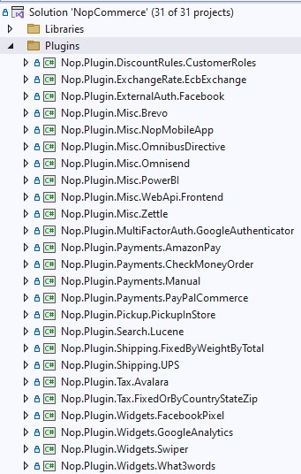

# 如何為 nopCommerce 編寫外掛

外掛用於擴充 nopCommerce 的功能。nopCommerce 擁有幾種類型的外掛。例如，付款方式（如 PayPal）、稅務提供程序、配送方式計算方法（如 UPS、USPS、FedEx）、小部件（如「線上客服」區塊）等等。nopCommerce 本身已經隨附了許多不同的外掛。您也可以在 [nopCommerce 官方網站](https://www.nopcommerce.com/marketplace) 上搜尋各種外掛，看看是否已經有人開發出符合您需求的外掛。如果沒有，本文將引導您完成建立外掛的流程。

## 外掛結構、必要檔案與位置

1. 您需要做的第一件事是在解決方案中建立一個新的 *`Class Library`* 專案。將所有外掛放在解決方案根目錄下的 `\Plugins` 目錄中是一個好習慣（請勿與位於 `\Nop.Web` 目錄下、用於已部署外掛的 `\Plugins` 子目錄混淆）。將所有外掛放在 `Plugins` 解決方案資料夾中是一個良好的實踐。

    外掛專案的建議命名方式為 **`Nop.Plugin.{群組}.{名稱}`**。**`{群組}`** 是您的外掛群組（例如 *Payment* 或 *Shipping*）。**`{名稱}`** 是您的外掛名稱（例如 *PayPalCommerce*）。例如，PayPal Commerce 付款外掛的名稱如下：**`Nop.Plugin.Payments.PayPalCommerce`**。但請注意，這並非強制要求。您可以為外掛選擇任何名稱。例如，`MyGreatPlugin`。

    

1. 一旦建立外掛專案，您必須在任何文字編輯器中開啟其 `.csproj` 檔案，並將其內容替換為以下內容：

    ```csharp
protected readonly IWebHelper _webHelper;

public PaymentPayPalStandardProvider(IWebHelper webHelper)
{
    _webHelper = webHelper;
}

public override string GetConfigurationPageUrl()
{
    return $"{_webHelper.GetStoreLocation()}Admin/{CONTROLLER_NAME}/{ACTION_NAME}";
}
```

```csharp
public override async Task InstallAsync()
{
    await _settingService.SaveSettingAsync(new PayPalStandardPaymentSettings
    {
        UseSandbox = true
    });
    
    await _localizationService.AddOrUpdateLocaleResourceAsync(new Dictionary<string, string>
    {
        ...
    });
    await base.InstallAsync();
}
```

```csharp
public class RouteProvider : IRouteProvider
    {
        /// <summary>
        /// 註冊路由
        /// </summary>
        /// <param name="endpointRouteBuilder">路由產生器</param>
        public void RegisterRoutes(IEndpointRouteBuilder endpointRouteBuilder)
        {
            endpointRouteBuilder.MapControllerRoute(PayPalCommerceDefaults.ConfigurationRouteName,
                "Admin/PayPalCommerce/Configure",
                new { controller = "PayPalCommerce", action = "Configure" });

            endpointRouteBuilder.MapControllerRoute(PayPalCommerceDefaults.WebhookRouteName,
                "Plugins/PayPalCommerce/Webhook",
                new { controller = "PayPalCommerceWebhook", action = "WebhookHandler" });
        }

        /// <summary>
        /// 取得路由提供程序的優先級
        /// </summary>
        public int Priority => 0;
    }
```

## 升級 nopCommerce 可能會導致外掛失效

有些外掛可能會過時，無法再與較新版本的 nopCommerce 配合使用。如果您在升級到新版本後遇到問題，請刪除該外掛，並造訪 nopCommerce 官方網站查看是否有可用的新版本。許多外掛作者會更新其外掛以適應新版本，但有些則不會，隨著 nopCommerce 的改進，這些外掛將會被淘汰。但在大多數情況下，您只需開啟對應的 `plugin.json` 檔案並更新 **SupportedVersions** 欄位即可。

## 結論

希望這能幫助您開始使用 nopCommerce，並為您構建更複雜的外掛做好準備。

## 外掛模板

您可以針對新的 nopCommerce 外掛使用我們的 Visual Studio 模板。它可以為開發者節省大量時間，因為現在他們不必手動執行所有初始步驟。例如建立資料夾（Controllers、Views、Models 等）、其他必要檔案（PluginNopStartup.cs、_ViewImports.cshtml、ObjectContex、plugin.json 等）、設定、專案參考等。請點選[這裡](https://github.com/nopSolutions/nopCommerce-plugin-template-VS/)獲取下載連結與安裝說明。