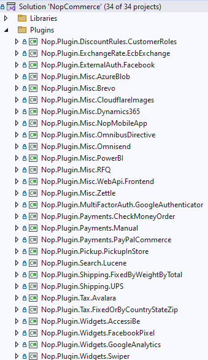
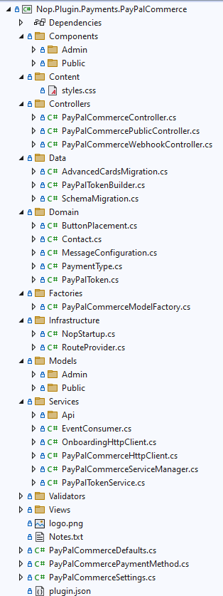

# 如何為 nopCommerce 編寫外掛

外掛（Plugin）用於擴充 nopCommerce 的功能。nopCommerce 擁有多種類型的外掛。例如，付款提供程序（如 PayPal）、稅務提供程序、配送方式計算方法（如 UPS、USPS、FedEx）、小部件（如「線上客服」區塊）等等。nopCommerce 本身已經隨附了許多不同的外掛。您也可以在 [nopCommerce 官方網站](https://www.nopcommerce.com/marketplace) 上搜尋各種外掛，看看是否已經有人開發了符合您需求的外掛。如果沒有，本文將引導您完成建立外掛的過程。

## 外掛結構、必要檔案與位置

1. 您首先需要做的是在解決方案中建立一個新的 *`Class Library`* 專案。將所有外掛放置在解決方案根目錄的 `\Plugins` 資料夾中是一個好的做法（不要與位於 `\Nop.Web` 目錄中、用於已部署外掛的 `\Plugins` 子目錄混淆）。將所有外掛放置在 `Plugins` 解決方案資料夾中是一個良好的習慣。

    建議的外掛專案命名格式為 **`Nop.Plugin.{Group}.{Name}`**。**`{Group}`** 是您的外掛分組（例如 *Payments* 或 *Shipping*）。**`{Name}`** 是您的外掛名稱（例如 *PayPalCommerce*）。例如，PayPal Commerce 付款外掛的名稱如下：**`Nop.Plugin.Payments.PayPalCommerce`**。但請注意，這並非強制規定，您可以為外掛選擇任何名稱，例如 `MyGreatPlugin`。

    

1. 一旦外掛專案建立完成，您必須在任何文字編輯器中開啟其 `.csproj` 檔案，並將其內容替換為以下內容：

    ```xml
    <Project Sdk="Microsoft.NET.Sdk">
        <PropertyGroup>
            <TargetFramework>net9.0</TargetFramework>
            <Copyright>SOME_COPYRIGHT</Copyright>
            <Company>YOUR_COMPANY</Company>
            <Authors>SOME_AUTHORS</Authors>
            <PackageLicenseUrl>PACKAGE_LICENSE_URL</PackageLicenseUrl>
            <PackageProjectUrl>PACKAGE_PROJECT_URL</PackageProjectUrl>
            <RepositoryUrl>REPOSITORY_URL</RepositoryUrl>
            <RepositoryType>Git</RepositoryType>
            <OutputPath>$(SolutionDir)\Presentation\Nop.Web\Plugins\PLUGIN_OUTPUT_DIRECTORY</OutputPath>
            <OutDir>$(OutputPath)</OutDir>
            <!--Set this parameter to true to get the dlls copied from the NuGet cache to the output of your    project. You need to set this parameter to true if your plugin has a nuget package to ensure that   the dlls copied from the NuGet cache to the output of your project-->
            <CopyLocalLockFileAssemblies>true</CopyLocalLockFileAssemblies>
            <ImplicitUsings>enable</ImplicitUsings>
        </PropertyGroup>
        <ItemGroup>
            <ProjectReference Include="$(SolutionDir)\Presentation\Nop.Web.Framework\Nop.Web.Framework.csproj" />
            <ClearPluginAssemblies Include="$(SolutionDir)\Build\ClearPluginAssemblies.proj" />
        </ItemGroup>
        <!-- This target executes after "Build" target -->
        <Target Name="NopTarget" AfterTargets="Build">
            <!-- Delete unnecessary libraries from plugins path -->
            <MSBuild Projects="@(ClearPluginAssemblies)" Properties="PluginPath=$(OutDir)" Targets="NopClear" />
        </Target>
    </Project>
    ```

    > [!TIP]
    > Where **PLUGIN_OUTPUT_DIRECTORY** should be replaced with the plugin name, for example, `Payments.PayPalCommerce`.
    >
    > We do it this way to be able to use a new approach to add third-party references which were introduced in .NET Core. But actually, it's not required. Moreover, references from already referenced libraries will be loaded automatically. So it is very convenient.

1. The next step is creating a `plugin.json` file required for each plugin. This file contains meta-information describing your plugin. Just copy this file from any other existing plugin and modify it for your needs. For information about the `plugin.json` file, please see [plugin.json file](xref:zh-Hant/developer/plugins/plugin_json)

1. The last required step is to create a class that implements **`IPlugin`** interface (`Nop.Services.Plugins` namespace). nopCommerce has **`BasePlugin`** class which already implements some `IPlugin` methods and allows you to avoid source code duplication. nopCommerce also provides you with some specific interfaces derived from `IPlugin`. For example, we have the `IPaymentMethod` interface which is used for creating new payment method plugins. It contains some methods which are specific only for payment methods such as *`ProcessPaymentAsync()`* or *`GetAdditionalHandlingFeeAsync()`*. Currently, nopCommerce has the following specific plugin interfaces:

   - **IPaymentMethod**. These plugins are used for payment processing.
   - **IShippingRateComputationMethod**. These plugins are used for retrieving accepted delivery methods and appropriate shipping rates. For example, UPS, UPS, FedEx, etc.
   - **IPickupPointProvider**. These plugins are used for providing pickup points.
   - **ITaxProvider**. Tax providers are used for getting tax rates.
   - **IExchangeRateProvider**. Used for getting currency exchange rate.
   - **IDiscountRequirementRule**. Allows you to create new discount rules such as "Billing country of a customer should be…"
   - **IExternalAuthenticationMethod**. Used for creating external authentication methods such as Facebook, Twitter, OpenID, etc.
   - **IMultiFactorAuthenticationMethod**. Used for creating multi-factor authentication methods such as *GoogleAuthenticator*, etc.
     >[!NOTE]
     > This is a new interface, since version 4.40 we have provided the corresponding infrastructure for MFA integrations out of the box.

   - **IWidgetPlugin**. It allows you to create widgets. Widgets are rendered on some parts of your site. For example, it can be a "Live chat" block on your site's left column.
   - **IMiscPlugin**. If your plugin doesn't fit any of the interfaces above.

> [!IMPORTANT]
> After each project build, clean the solution before making changes. Some resources will be cached, which can lead to developer insanity.
>
> You may need to rebuild your solution after adding your plugin. If you do not see DLLs for your plugin under `Nop.Web\Plugins\PLUGIN_OUTPUT_DIRECTORY`, you need to rebuild your solution. nopCommerce will not list your plugin in the *Local Plugins* page if your DLLs do not exist in the correct folder in `Nop.Web`.

## Handling requests. Controllers, models, and views

Now you can see the plugin by going to **Admin area → Configuration → Local Plugins**. But as you guessed our plugin does nothing. It does not even have a user interface for its configuration. Let's create a page to configure the plugin.

What we need to do now is create a controller, a model, and a view.

1. MVC controllers are responsible for responding to requests made against an ASP.NET Core MVC website. Each browser request is mapped to a particular controller.
1. A view contains the HTML markup and content that is sent to the browser. A view is the equivalent of a page when working with an `ASP.NET Core MVC` application.
1. An MVC model contains all of your application logic that is not contained in a view or a controller.

You can find more information about the [MVC pattern here](https://docs.microsoft.com/aspnet/core/mvc/overview).

So let's start:

- **Create the model**. Add a **Models** folder in the new plugin, and then add a new model class that fits your needs.
- **Create the view**. Add a **Views** folder in the new plugin, and then add a `*.cshtml` file named `Configure.cshtml`. Set **"Build Action"** property of the view file is set to **"Content"**, and the **"Copy to Output Directory"** property is set to **"Copy always"**. Note that the configuration page should use `_ConfigurePlugin` layout.
- Also make sure that you have the `_ViewImports.cshtml` file in your \Views directory. You can just copy it from any other existing plugin.
- **Create the controller**. Add a **Controllers** folder in the new plugin, and then add a new controller class. A good practice is to name plugin controllers `{Group}{Name}Controller.cs`. For example, PaymentPayPalStandardController. Of course, it's not a requirement to name controllers this way (but just a recommendation). Then create an appropriate action method for the configuration page (in the admin area). Let's name it *`Configure`*. Prepare a model class and pass it to the following view using a physical view path: `~/Plugins/{PluginOutputDirectory}/Views/Configure.cshtml`.
- Use the following attributes for your action method:

    ```csharp
    [AutoValidateAntiforgeryToken]
    [AuthorizeAdmin] //confirms access to the admin panel
    [Area(AreaNames.ADMIN)] //specifies the area containing a controller or action
    public class PayPalCommerceController : BasePluginController
    {
        public async Task<IActionResult> Configure(bool showtour = false)
        {
            return View("~/Plugins/Payments.PayPalCommerce/Views/Admin/Configure.cshtml");
        }
    }
    ```

    > [!TIP]
    > You can also add these attributes directly to the controller. In this case, there is no need to tag each method with them.

    For example, open `PayPalCommerce` payment plugin and look at its implementation of `PayPalCommerceController`.

Then for each plugin that has a configuration page, you should specify a configuration URL. Base class named `BasePlugin` has `GetConfigurationPageUrl` method which returns a configuration URL:

```csharp
private readonly INopUrlHelper _nopUrlHelper;

public PayPalCommercePaymentMethod(INopUrlHelper nopUrlHelper)
{
    _nopUrlHelper = nopUrlHelper;
}

public override string GetConfigurationPageUrl()
{
    return _nopUrlHelper.RouteUrl(PayPalCommerceDefaults.Route.Configuration);
}

```

*INopUrlHelper* is now used for routing outside of controllers. The names of the standard routes are stored in plugin defaults as constants.

```csharp
/// <summary>
/// Represents the plugin constants
/// </summary>
public class PayPalCommerceDefaults
{
    /// <summary>
    /// Represents the route names
    /// </summary>
    public class Route
    {
        /// <summary>
        /// Gets the configuration route name
        /// </summary>
        public static string Configuration => "Plugin.Payments.PayPalCommerce.Configure";
    }
}
```

Registering the route to the plugin configuration page will look like below.

```csharp
endpointRouteBuilder.MapControllerRoute(name: PayPalCommerceDefaults.Route.Configuration,
    pattern: "Admin/PayPalCommerce/Configure",
    defaults: new { controller = "{CONTROLLER_NAME}", action = "{ACTION_NAME}", area = AreaNames.ADMIN });
```

Where **{CONTROLLER_NAME}** is the name of your controller and **{ACTION_NAME}** is the name of the action (usually it's `Configure`).

Once you have installed your plugin and added the configuration method you will find a link to configure your plugin under **Admin → Configuration → Local Plugins**.

> [!TIP]
> The easiest way to complete the steps described above is by opening any other plugin and copying these files into your plugin project. Then just rename appropriate classes and directories.

For example, the project structure of the *PayPalCommerce* plugin looks like the image below:



## Handling "InstallAsync", "UninstallAsync" and "UpdateAsync" methods

This step is optional. Some plugins can require additional logic during plugin installation. For example, a plugin can insert new locale resources. So open your `IPlugin` implementation (in most cases it'll be derived from the `BasePlugin` class) and override the following methods:

1. **InstallAsync**. This method will be invoked during plugin installation. You can initialize any settings here, insert new locale resources, or create some new database tables (if required).
1. **UninstallAsync**. This method will be invoked during plugin uninstallation.
1. **UpdateAsync**. This method will be invoked during the plugin update (when its version is changed in the `plugin.json` file).

> [!IMPORTANT]
> If you override one of these methods, do not hide its base implementation.

For example, the overridden `InstallAsync` method should include the following method call: *`base.Install()`*. The `InstallAsync` method of the *PayPalStandard* plugin looks like the code below

```csharp
public override async Task InstallAsync()
{
    await _settingService.SaveSettingAsync(new PayPalStandardPaymentSettings
    {
        UseSandbox = true
    });
    
    await _localizationService.AddOrUpdateLocaleResourceAsync(new Dictionary<string, string>
    {
        ...
    });
    await base.InstallAsync();
}
```

> [!TIP]
> The list of installed plugins is located in `\App_Data\plugins.json`. The list is created during installation.

## Routes

Here we will have a look at how to register plugin routes. ASP.NET Core routing is responsible for mapping incoming browser requests to particular MVC controller actions. You can find more [routing information here](https://docs.microsoft.com/aspnet/core/fundamentals/routing). So follow the next steps:

If you need to add some custom route, then create the `RouteProvider.cs` file. It informs the nopCommerce system about plugin routes. For example, the following `RouteProvider` class adds a new route which can be accessed by opening your web browser and navigating to `http://www.yourStore.com/Plugins/PayPalCommerceWebhook/WebhookHandler` URL :

```csharp
public class RouteProvider : IRouteProvider
{
    /// <summary>
    /// Register routes
    /// </summary>
    /// <param name="endpointRouteBuilder">Route builder</param>
    public void RegisterRoutes(IEndpointRouteBuilder endpointRouteBuilder)
    {
        ...
        endpointRouteBuilder.MapControllerRoute(name: PayPalCommerceDefaults.Route.Webhook,
            pattern: "Plugins/PayPalCommerce/Webhook",
            defaults: new { controller = "PayPalCommerceWebhook", action = "WebhookHandler" });
    }

    /// <summary>
    /// Gets a priority of route provider
    /// </summary>
    public int Priority => 0;
}
```

## 升級 nopCommerce 可能會導致外掛失效

有些外掛可能會因為過時而無法在新版本的 nopCommerce 中運作。如果您在升級到新版本後遇到問題，請刪除該外掛，並造訪 nopCommerce 官方網站查看是否有可用的新版本。許多外掛作者會更新其外掛以適應新版本，但有些作者不會，因此這些外掛會隨著 nopCommerce 的改進而過時。但在大多數情況下，您只需開啟對應的 `plugin.json` 檔案並更新 **SupportedVersions** 欄位即可。

## 結論

希望這能幫助您開始使用 nopCommerce，並為建構更複雜的外掛做好準備。

## 外掛範本

您可以使用我們為 nopCommerce 新外掛提供的 Visual Studio 範本。這可以為開發人員節省大量時間，因為他們現在不需要手動執行所有初始步驟，例如資料夾建立（Controllers、Views、Models 等）、其他必要檔案（PluginNopStartup.cs、_ViewImports.cshtml、ObjectContex、plugin.json、設定、專案參考等）。請在此處找到它與[安裝說明](https://github.com/nopSolutions/nopCommerce-plugin-template-VS/)。