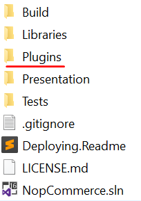
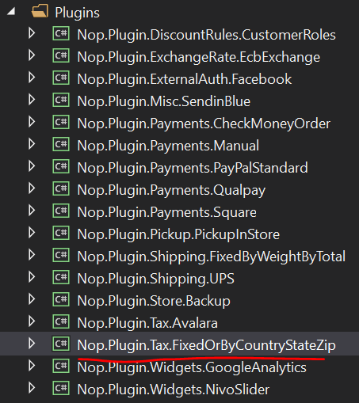
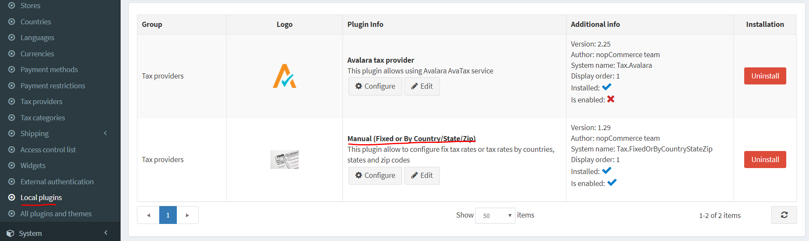
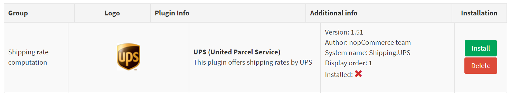
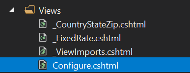
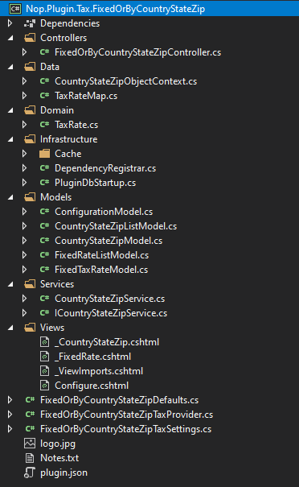

# 如何為 nopCommerce 編寫稅務外掛

為了擴充 nopCommerce 的功能，我們使用外掛。nopCommerce 發行版中已經包含多種類型的外掛，例如「門市取貨 (PickupInStore)」和「PayPal 標準 (PayPal Standard)」。您也可以在 [nopCommerce 官方網站](https://www.nopcommerce.com/marketplace) 上搜尋各類外掛，看看是否已經有人開發出符合您需求的外掛。如果您尚未找到合適的，那麼您來對地方了，因為本文將引導您根據需求完成外掛（特別是稅務外掛）的開發流程。

## 外掛結構、必要檔案與位置

1. 首先在方案中建立一個新的「類別庫 (Class Library)」專案。建議將您的外掛放置在原始碼根目錄下的 **Plugins** 資料夾中，其他外掛和小部件也都是存放在此。

    

    > [!NOTE]
    > 請勿將此目錄與 `Presentation\Nop.Web` 目錄中存在的同名目錄混淆。`Nop.Web` 目錄中的 Plugins 資料夾包含的是外掛編譯後的檔案。

    外掛專案的建議命名方式為 `Nop.Plugin.{Group}.{Name}`。`{Group}` 是您的外掛群組（例如 `Payment` 或 `Shipping`）。`{Name}` 是您的外掛名稱（例如 `FixedOrByCountryStateZip`）。例如，`FixedOrByCountryStateZip` 稅率外掛的完整名稱為：`Nop.Plugin.Tax.FixedOrByCountryStateZip`。但請注意，這並非強制要求，您可以為外掛選擇任何名稱，例如 `MyFirstTaxPlugin`。方案中的 Plugins 目錄結構如下所示。

    

1. 建立外掛專案後，請使用任何可用的文字編輯器應用程式更新 **.csproj** 檔案內容。將其內容替換為以下程式碼：

    ```xml
    <Project Sdk="Microsoft.NET.Sdk">
        <PropertyGroup>
            <TargetFramework>netcoreapp2.2</TargetFramework>
            <Copyright>SOME_COPYRIGHT</Copyright>
            <Company>YOUR_COMPANY</Company>
            <Authors>SOME_AUTHORS</Authors>
            <PackageLicenseUrl>PACKAGE_LICENSE_URL</PackageLicenseUrl>
            <PackageProjectUrl>PACKAGE_PROJECT_URL</PackageProjectUrl>
            <RepositoryUrl>REPOSITORY_URL</RepositoryUrl>
            <RepositoryType>Git</RepositoryType>
            <OutputPath>..\..\Presentation\Nop.Web\Plugins\PLUGIN_OUTPUT_DIRECTORY</OutputPath>
            <OutDir>$(OutputPath)</OutDir>
            <!--Set this parameter to true to get the dlls copied from the NuGet cache to the output of your        project. You need to set this parameter to true if your plugin has a nuget package to ensure that       the dlls copied from the NuGet cache to the output of your project-->
            <CopyLocalLockFileAssemblies>true</CopyLocalLockFileAssemblies>
        </PropertyGroup>
        <ItemGroup>
            <ProjectReference Include="..\..\Presentation\Nop.Web.Framework\Nop.Web.Framework.csproj" />
            <ClearPluginAssemblies Include="$(MSBuildProjectDirectory)\..\..\Build\ClearPluginAssemblies.sproj" />
        </ItemGroup>
        <!-- This target execute after "Build" target -->
        <Target Name="NopTarget" AfterTargets="Build">
            <!-- Delete unnecessary libraries from plugins path -->
            <MSBuild Projects="@(ClearPluginAssemblies)" Properties="PluginPath=$(MSBuildProjectDirectory)\ $    (OutDir)" Targets="NopClear" />
        </Target>
    </Project>
    ```

    > [!NOTE]
    > The **PLUGIN_OUTPUT_DIRECTORY** should be replace by the plugin name, for example, `Tax.FixedOrByCountryStateZip`.

1. After updating the **.csproj** file, the `plugin.json` file should be added which is required for the plugin.  This file contains meta-information describing your plugin. Just copy this file from any other existing plugin/widget and modify it for your needs. For information about the `plugin.json` file, please see [plugin.json file](xref:zh-Hant/developer/plugins/plugin_json).

1. The last required step is to create a class that implements `BasePlugin` (`Nop.Core.Plugins` namespace) and `ITaxProvider` interface (`Nop.Services.Tax` namespace). **ITaxProvider** implements the `GetTaxRate` method which returns type **CalculateTaxResult** (contains tax rate, errors if any, and `Boolean` success status) based on the custom logic, usually based on the customer address.

## Handling requests. Controllers, models, and views

Now you can see the plugin by going to **Admin area** → **Configuration** → **Local Plugins**.



When a plugin/widget is installed, you will see the **Uninstall** button. It is a good practice that you uninstall plugins/widgets which are not necessary for performance improvement.



There will be the **Install** and **Delete** buttons when a plugin/widget is not installed or uninstalled.

> [!NOTE]
> Deleting will remove physical files from the server.

But as you guessed our plugin does nothing. It does not even have a user interface for its configuration. Let's create a page to configure the plugin.

What we need to do now is create a controller, a model, a view, and a view component.

* MVC controllers are responsible for responding to requests made against an `ASP.NET MVC` website. Each browser request is mapped to a particular controller.
* A view contains the HTML markup and content that is sent to the browser. A view is the equivalent of a page when working with an `ASP.NET MVC` application.
* A view component that implements **NopViewComponent** which contains logic and codes to render a view.
* An MVC model contains all of your application logic that is not contained in a view or a controller.

So let's start:

* **Create the model**. Add a `Models` folder in the new plugin, and then add a new model class that fits your need.
* **Create the view**. Add a `Views` folder in the new plugin, and then add a `.cshtml` file named `Configure.cshtml`. Set **Build Action** property of the view file is set to **Content**, and the **Copy to Output Directory** property is set to **Copy always**. Note that the configuration page should use the *_ConfigurePlugin* layout.

```html
@model Nop.Plugin.Tax.FixedOrByCountryStateZip.Models.ConfigurationModel

@{
    Layout = "_ConfigurePlugin";
}

<div class="form-group">
    <div class="col-md-12">
        <div class="onoffswitch">
            <input type="checkbox" name="onoffswitch" class="onoffswitch-checkbox" id="advanced-settings-mode" checked="@Model.CountryStateZipEnabled">
            <label class="onoffswitch-label" for="advanced-settings-mode">
                <span class="onoffswitch-inner"
                      data-locale-basic="@T("Plugins.Tax.FixedOrByCountryStateZip.Fixed")"
                      data-locale-advanced="@T("Plugins.Tax.FixedOrByCountryStateZip.TaxByCountryStateZip")"></span>
                <span class="onoffswitch-switch"></span>
            </label>
        </div>
    </div>
</div>
<script>
    function checkAdvancedSettingsMode(advanced) {
        if (advanced) {
            $("body").addClass("advanced-settings-mode");
            $("body").removeClass("basic-settings-mode");
        } else {
            $("body").removeClass("advanced-settings-mode");
            $("body").addClass("basic-settings-mode");
        }
    }
    checkAdvancedSettingsMode($("#advanced-settings-mode").is(':checked'));
    $(document).ready(function() {
        $("#advanced-settings-mode").click(function() {
            checkAdvancedSettingsMode($(this).is(':checked'));
            $.ajax({
                cache: false,
                url: "@Url.Action("SaveMode", "FixedOrByCountryStateZip")",
                type: "POST",
                data: {
                    value: $(this).is(':checked')
                },
                dataType: "json",
                error: function (jqXHR, textStatus, errorThrown) {
                    $("#saveModeAlert").click();
                }
            });
            ensureDataTablesRendered();
        });
    });
</script>
<nop-alert asp-alert-id="saveModeAlert" asp-alert-message="@T("Admin.Common.Alert.Save.Error")" />

@await Html.PartialAsync("~/Plugins/Tax.FixedOrByCountryStateZip/Views/_FixedRate.cshtml")
@await Html.PartialAsync("~/Plugins/Tax.FixedOrByCountryStateZip/Views/_CountryStateZip.cshtml", Model)
```

* Also make sure that you have **_ViewImports.cshtml** file into your `Views` directory. You can just copy it from any other existing plugin or widget.



* **Create the controller**. Add a `Controllers` folder in the new plugin, and then add a new controller class. A good practice is to name plugin controllers **{Group}{Name}Controller.cs**. For example, `FixedOrByCountryStateZipController`. Of course, it's not a requirement to name controllers this way (but just a recommendation). Then create an appropriate action method for the configuration page (in the admin area). Let's name it `Configure`. Prepare a model class and pass it to the following view using a physical view path: **~/Plugins/{PluginOutputDirectory}/Views/Configure.cshtml**.

```cs
public IActionResult Configure()
{
    if (!_permissionService.Authorize(StandardPermissionProvider.ManageTaxSettings))
        return AccessDeniedView();

    var taxCategories = _taxCategoryService.GetAllTaxCategories();
    if (!taxCategories.Any())
        return Content("No tax categories can be loaded");

    var model = new ConfigurationModel { CountryStateZipEnabled = _countryStateZipSettings.CountryStateZipEnabled };
    //stores
    model.AvailableStores.Add(new SelectListItem { Text = "*", Value = "0" });
    var stores = _storeService.GetAllStores();
    foreach (var s in stores)
        model.AvailableStores.Add(new SelectListItem { Text = s.Name, Value = s.Id.ToString() });
    //tax categories
    foreach (var tc in taxCategories)
        model.AvailableTaxCategories.Add(new SelectListItem { Text = tc.Name, Value = tc.Id.ToString() });
    //countries
    var countries = _countryService.GetAllCountries(showHidden: true);
    foreach (var c in countries)
        model.AvailableCountries.Add(new SelectListItem { Text = c.Name, Value = c.Id.ToString() });
    //states
    model.AvailableStates.Add(new SelectListItem { Text = "*", Value = "0" });
    var defaultCountry = countries.FirstOrDefault();
    if (defaultCountry != null)
    {
        var states = _stateProvinceService.GetStateProvincesByCountryId(defaultCountry.Id);
        foreach (var s in states)
            model.AvailableStates.Add(new SelectListItem { Text = s.Name, Value = s.Id.ToString() });
    }

    return View("~/Plugins/Tax.FixedOrByCountryStateZip/Views/Configure.cshtml", model);
}
```

* Use the following attributes for your action method:

```cs
[AuthorizeAdmin] //確認是否擁有後台管理存取權限
[Area(AreaNames.Admin)] //指定包含控制器或動作的區域
[AdminAntiForgery] //協助防止惡意指令碼提交偽造的頁面請求。
```

For example, open `FixedOrByCountryStateZip` plugin and look at its implementation of `FixedOrByCountryStateZipController`.
Then for each plugin that has a configuration page, you should specify a configuration URL. Base class named `BasePlugin` has `GetConfigurationPageUrl` method which returns a configuration URL:

```cs
public override string GetConfigurationPageUrl()
{
    return $"{_webHelper.GetStoreLocation()}Admin/{CONTROLLER_NAME}/{ACTION_NAME}";
}
```

Where *{CONTROLLER_NAME}* is the name of your controller and *{ACTION_NAME}* is the name of the action (usually it's `Configure`).

For assigning different tax rates according to the customer address, a new table is required which records all data related to tax. For this purpose, the `Domain` folder is added where we add a class that extends the **BaseEntity** class. In this case `TaxRate.cs`


Another folder `Data` is also added which consists of Map class(es) and Object Context class(es). Mapping class implements **`NopEntityTypeConfiguration<T>`** (`Nop.Data.Mapping` namespace). Here, the configure method is overridden.

```cs
public override void Configure(EntityTypeBuilder<TaxRate> builder)
{
    builder.ToTable(nameof(TaxRate));
    builder.HasKey(rate => rate.Id);

---
    builder.Property(rate => rate.Percentage).HasColumnType("decimal(18, 4)");
}
```

Object Context class implements **DbContext** class (`Microsoft.EntityFrameworkCore` namespace) and **IDbContext** interface (`Nop.Data` namespace). This `IDbContext` interface consists of methods related to table creation, deletion, and other custom actions like executing a raw SQL query according to the model which was previously added in the `Domain` folder.

```cs
public class CountryStateZipObjectContext : DbContext, IDbContext
{
    #region Ctor

    public CountryStateZipObjectContext(DbContextOptions<CountryStateZipObjectContext> options) : base(options)
    {
    }

    #endregion

    #region Utilities

    /// <summary>
    /// 進一步設定模型
    /// </summary>
    /// <param name="modelBuilder">模型產生器</param>
    protected override void OnModelCreating(ModelBuilder modelBuilder)
    {
        modelBuilder.ApplyConfiguration(new TaxRateMap());
        base.OnModelCreating(modelBuilder);
    }

    #endregion

    #region Methods

    /// <summary>
    /// 建立一個可用於查詢和儲存實體執行個體的 DbSet
    /// </summary>
    /// <typeparam name="TEntity">實體型別</typeparam>
    /// <returns>給定實體型別的集合</returns>
    public new virtual DbSet<TEntity> Set<TEntity>() where TEntity : BaseEntity
    {
        return base.Set<TEntity>();
    }

    /// <summary>
    /// 產生用於為目前模型建立所有資料表的指令碼
    /// </summary>
    /// <returns>SQL 指令碼</returns>
    public virtual string GenerateCreateScript()
    {
        return Database.GenerateCreateScript();
    }

    /// <summary>
    /// 根據原始 SQL 查詢為查詢型別建立 LINQ 查詢
    /// </summary>
    /// <typeparam name="TQuery">查詢型別</typeparam>
    /// <param name="sql">原始 SQL 查詢</param>
    /// <param name="parameters">要指派給參數的值</param>
    /// <returns>表示原始 SQL 查詢的 IQueryable</returns>
    public virtual IQueryable<TQuery> QueryFromSql<TQuery>(string sql, params object[] parameters) where TQuery : class
    {
        throw new NotImplementedException();
    }

    /// <summary>
    /// 根據原始 SQL 查詢為實體建立 LINQ 查詢
    /// </summary>
    /// <typeparam name="TEntity">實體型別</typeparam>
    /// <param name="sql">原始 SQL 查詢</param>
    /// <param name="parameters">要指派給參數的值</param>
    /// <returns>表示原始 SQL 查詢的 IQueryable</returns>
    public virtual IQueryable<TEntity> EntityFromSql<TEntity>(string sql, params object[] parameters) where TEntity : BaseEntity
    {
        throw new NotImplementedException();
    }

    /// <summary>
    /// 對資料庫執行給定的 SQL
    /// </summary>
    /// <param name="sql">要執行的 SQL</param>
    /// <param name="doNotEnsureTransaction">true - 不確保交易建立；false - 確保交易建立。</param>
    /// <param name="timeout">用於指令的逾時時間。請注意，指令逾時與連接逾時不同，後者通常在資料庫連接字串中設定</param>
    /// <param name="parameters">與 SQL 一起使用的參數</param>
    /// <returns>受影響的資料列數目</returns>
    public virtual int ExecuteSqlCommand(RawSqlString sql, bool doNotEnsureTransaction = false, int? timeout = null, params object[] parameters)
    {
        using (var transaction = Database.BeginTransaction())
        {
            var result = Database.ExecuteSqlCommand(sql, parameters);
            transaction.Commit();

            return result;
        }
    }

    /// <summary>
    /// 從內容中分離實體
    /// </summary>
    /// <typeparam name="TEntity">實體型別</typeparam>
    /// <param name="entity">實體</param>
    public virtual void Detach<TEntity>(TEntity entity) where TEntity : BaseEntity
    {
        throw new NotImplementedException();
    }

    /// <summary>
    /// 安裝物件內容
    /// </summary>
    public void Install()
    {
        //建立資料表
        this.ExecuteSqlScript(GenerateCreateScript());
    }

    /// <summary>
    /// 解除安裝物件內容
    /// </summary>
    public void Uninstall()
    {
        //刪除資料表
        this.DropPluginTable(nameof(TaxRate));
    }

    #endregion
}
```

For tax rates **CRUD** operation, services are created. In this case, interface **ICountryStateZipService** and class **CountryStateZipService** is created. It contains method like `InsertTaxRate`, `UpdateTaxRate`, `DeleteTaxRate`, `GetAllTaxRates` and `GetTaxRateById`. These method names are self-explanatory and will be consumed by controllers. Other methods can be introduced/added based according to the requirements.

### ICountryStateZipService.cs

```cs
public partial interface ICountryStateZipService
{
    /// <summary>
    /// 刪除稅率
    /// </summary>
    /// <param name="taxRate">稅率</param>
    void DeleteTaxRate(TaxRate taxRate);

    /// <summary>
    /// 取得所有稅率
    /// </summary>
    /// <returns>稅率</returns>
    IPagedList<TaxRate> GetAllTaxRates(int pageIndex = 0, int pageSize = int.MaxValue);

    /// <summary>
    /// 取得稅率
    /// </summary>
    /// <param name="taxRateId">稅率識別碼</param>
    /// <returns>稅率</returns>
    TaxRate GetTaxRateById(int taxRateId);

---
    /// <summary>
    /// 插入稅率
    /// </summary>
    /// <param name="taxRate">稅率</param>
    void InsertTaxRate(TaxRate taxRate);

    /// <summary>
    /// 更新稅率
    /// </summary>
    /// <param name="taxRate">稅率</param>
    void UpdateTaxRate(TaxRate taxRate);
}
```

#### CountryStateZipService.cs

```cs
public partial class CountryStateZipService : ICountryStateZipService
{
    #region Fields

    private readonly IEventPublisher _eventPublisher;
    private readonly IRepository<TaxRate> _taxRateRepository;
    private readonly ICacheManager _cacheManager;

    #endregion

    #region Ctor

    /// <summary>
    /// 建構函式
    /// </summary>
    /// <param name="eventPublisher">事件發布者</param>
    /// <param name="cacheManager">快取管理員</param>
    /// <param name="taxRateRepository">稅率儲存庫</param>
    public CountryStateZipService(IEventPublisher eventPublisher,
        ICacheManager cacheManager,
        IRepository<TaxRate> taxRateRepository)
    {
        _eventPublisher = eventPublisher;
        _cacheManager = cacheManager;
        _taxRateRepository = taxRateRepository;
    }

    #endregion

    #region Methods

    /// <summary>
    /// 刪除稅率
    /// </summary>
    /// <param name="taxRate">稅率</param>
    public virtual void DeleteTaxRate(TaxRate taxRate)
    {
        if (taxRate == null)
            throw new ArgumentNullException(nameof(taxRate));

        _taxRateRepository.Delete(taxRate);

        //事件通知
        _eventPublisher.EntityDeleted(taxRate);
    }

    /// <summary>
    /// 取得所有稅率
    /// </summary>
    /// <returns>稅率</returns>
    public virtual IPagedList<TaxRate> GetAllTaxRates(int pageIndex = 0, int pageSize = int.MaxValue)
    {
        var key = string.Format(ModelCacheEventConsumer.TAXRATE_ALL_KEY, pageIndex, pageSize);
        return _cacheManager.Get(key, () =>
        {
            var query = from tr in _taxRateRepository.Table
                        orderby tr.StoreId, tr.CountryId, tr.StateProvinceId, tr.Zip, tr.TaxCategoryId
                        select tr;
            var records = new PagedList<TaxRate>(query, pageIndex, pageSize);
            return records;
        });
    }

    /// <summary>
    /// 取得稅率
    /// </summary>
    /// <param name="taxRateId">稅率識別碼</param>
    /// <returns>稅率</returns>
    public virtual TaxRate GetTaxRateById(int taxRateId)
    {
        if (taxRateId == 0)
            return null;

       return _taxRateRepository.GetById(taxRateId);
    }

    /// <summary>
    /// 插入稅率
    /// </summary>
    /// <param name="taxRate">稅率</param>
    public virtual void InsertTaxRate(TaxRate taxRate)
    {
        if (taxRate == null)
            throw new ArgumentNullException(nameof(taxRate));

        _taxRateRepository.Insert(taxRate);

        //事件通知
        _eventPublisher.EntityInserted(taxRate);
    }

    /// <summary>
    /// 更新稅率
    /// </summary>
    /// <param name="taxRate">稅率</param>
    public virtual void UpdateTaxRate(TaxRate taxRate)
    {
        if (taxRate == null)
            throw new ArgumentNullException(nameof(taxRate));

        _taxRateRepository.Update(taxRate);

        //事件通知
        _eventPublisher.EntityUpdated(taxRate);
    }

    #endregion
}
```

The last thing, we need is to register the services and configure plugin DB context on application startup. For this, the **Infrastructure** folder is added which contains classes – `DependencyRegister` and `PluginDbStartup`.

**DependencyRegister** class implements `IDependencyRegister` interface (`Nop.Core.Infrastructure.DependencyManagement` namespace) which has `Register` method.

```cs
public class DependencyRegistrar : IDependencyRegistrar
{
    /// <summary>
    /// 註冊服務與介面
    /// </summary>
    /// <param name="builder">容器建構器</param>
    /// <param name="typeFinder">型別尋找器</param>
    /// <param name="config">配置</param>
    public virtual void Register(ContainerBuilder builder, ITypeFinder typeFinder, NopConfig config)
    {
        builder.RegisterType<FixedOrByCountryStateZipTaxProvider>().As<ITaxProvider>().InstancePerLifetimeScope();
        builder.RegisterType<CountryStateZipService>().As<ICountryStateZipService>().InstancePerLifetimeScope();

        //資料內容相關
        builder.RegisterPluginDataContext<CountryStateZipObjectContext>("nop_object_context_tax_country_state_zip");

        //使用自定義內容覆寫必要的儲存庫
        builder.RegisterType<EfRepository<TaxRate>>().As<IRepository<TaxRate>>()
            .WithParameter(ResolvedParameter.ForNamed<IDbContext>("nop_object_context_tax_country_state_zip"))
            .InstancePerLifetimeScope();
    }

    /// <summary>
    /// 此依賴註冊實作的順序
    /// </summary>
    public int Order => 1;
}
```

Similarly, **PluginDbStartup** class implements `INopStartup` interface (`Nop.Core.Infrastructure` namespace) which has `ConfigureServices` and `Configure` methods. For this example, object context is added in `ConfigureServices` method.

```cs
public class PluginDbStartup : INopStartup
{
    /// <summary>
    /// 加入並設定任何中介軟體
    /// </summary>
    /// <param name="services">服務描述項集合</param>
    /// <param name="configuration">應用程式配置</param>
    public void ConfigureServices(IServiceCollection services, IConfiguration configuration)
    {
        //加入物件內容
        services.AddDbContext<CountryStateZipObjectContext>(optionsBuilder =>
        {
            optionsBuilder.UseSqlServerWithLazyLoading(services);
        });
    }

    /// <summary>
    /// 設定所加入中介軟體的使用方式
    /// </summary>
    /// <param name="application">用於設定應用程式要求管線的建構器</param>
    public void Configure(IApplicationBuilder application)
    {
    }

    /// <summary>
    /// 取得此啟動設定實作的順序
    /// </summary>
    public int Order => 11;
}
```

## Project structure of Tax Plugin



## Handling "Install" and "Uninstall" methods

This step is optional. Some plugins can require additional logic during their installation. For example, a plugin can insert new locale resources or add necessary tables or settings values. So open your `BasePlugin` implementation and override the following methods:

* `Install`. This method will be invoked during plugin installation. You can initialize any settings here, insert new locale resources, or create some new database tables (if required).

```cs
public override void Install()
{
    //資料庫物件
    _objectContext.Install();

    //設定
    _settingService.SaveSetting(new FixedOrByCountryStateZipTaxSettings());

    //在地化資源
    _localizationService.AddOrUpdatePluginLocaleResource("Plugins.Tax.FixedOrByCountryStateZip.Fixed", "固定稅率");
    _localizationService.AddOrUpdatePluginLocaleResource("Plugins.Tax.FixedOrByCountryStateZip.TaxByCountryStateZip", "依國家/地區");
    _localizationService.AddOrUpdatePluginLocaleResource("Plugins.Tax.FixedOrByCountryStateZip.Fields.TaxCategoryName", "稅率類別");
    _localizationService.AddOrUpdatePluginLocaleResource("Plugins.Tax.FixedOrByCountryStateZip.Fields.Rate", "稅率");
    _localizationService.AddOrUpdatePluginLocaleResource("Plugins.Tax.FixedOrByCountryStateZip.Fields.Store", "商店");
    _localizationService.AddOrUpdatePluginLocaleResource("Plugins.Tax.FixedOrByCountryStateZip.Fields.Store.Hint", "如果選擇星號，則此稅率將適用於所有商店。");
    _localizationService.AddOrUpdatePluginLocaleResource("Plugins.Tax.FixedOrByCountryStateZip.Fields.Country", "國家/地區");
    _localizationService.AddOrUpdatePluginLocaleResource("Plugins.Tax.FixedOrByCountryStateZip.Fields.Country.Hint", "國家/地區。");
    _localizationService.AddOrUpdatePluginLocaleResource("Plugins.Tax.FixedOrByCountryStateZip.Fields.StateProvince", "州/省");
    _localizationService.AddOrUpdatePluginLocaleResource("Plugins.Tax.FixedOrByCountryStateZip.Fields.StateProvince.Hint", "如果選擇星號，則此稅率將適用於來自該國家/地區的所有顧客，而不論其所在州別為何。");
    _localizationService.AddOrUpdatePluginLocaleResource("Plugins.Tax.FixedOrByCountryStateZip.Fields.Zip", "郵遞區號");
    _localizationService.AddOrUpdatePluginLocaleResource("Plugins.Tax.FixedOrByCountryStateZip.Fields.Zip.Hint", "郵遞區號。如果留空，則此稅率將適用於來自該國家/地區或州/省的所有顧客，而不論其郵遞區號為何。");
    _localizationService.AddOrUpdatePluginLocaleResource("Plugins.Tax.FixedOrByCountryStateZip.Fields.TaxCategory", "稅率類別");
    _localizationService.AddOrUpdatePluginLocaleResource("Plugins.Tax.FixedOrByCountryStateZip.Fields.TaxCategory.Hint", "稅率類別。");
    _localizationService.AddOrUpdatePluginLocaleResource("Plugins.Tax.FixedOrByCountryStateZip.Fields.Percentage", "百分比");
    _localizationService.AddOrUpdatePluginLocaleResource("Plugins.Tax.FixedOrByCountryStateZip.Fields.Percentage.Hint", "稅率百分比。");
    _localizationService.AddOrUpdatePluginLocaleResource("Plugins.Tax.FixedOrByCountryStateZip.AddRecord", "新增稅率");
    _localizationService.AddOrUpdatePluginLocaleResource("Plugins.Tax.FixedOrByCountryStateZip.AddRecordTitle", "新稅率");

    base.Install();
}
```

* `Uninstall`. This method will be invoked during plugin uninstallation. You can remove previously initialized settings, locale resources, or database tables by plugin during installation.

```cs
public override void Uninstall()
{
    //設定
    _settingService.DeleteSetting<FixedOrByCountryStateZipTaxSettings>();

    //固定稅率
    var fixedRates = _taxCategoryService.GetAllTaxCategories()
        .Select(taxCategory => _settingService.GetSetting(string.Format(FixedOrByCountryStateZipDefaults.FixedRateSettingsKey, taxCategory.Id)))
        .Where(setting => setting != null).ToList();
    _settingService.DeleteSettings(fixedRates);

    //資料庫物件
    _objectContext.Uninstall();

    //在地化資源
    _localizationService.DeletePluginLocaleResource("Plugins.Tax.FixedOrByCountryStateZip.Fixed");
    _localizationService.DeletePluginLocaleResource("Plugins.Tax.FixedOrByCountryStateZip.TaxByCountryStateZip");
    _localizationService.DeletePluginLocaleResource("Plugins.Tax.FixedOrByCountryStateZip.Fields.TaxCategoryName");
    _localizationService.DeletePluginLocaleResource("Plugins.Tax.FixedOrByCountryStateZip.Fields.Rate");
    _localizationService.DeletePluginLocaleResource("Plugins.Tax.FixedOrByCountryStateZip.Fields.Store");
    _localizationService.DeletePluginLocaleResource("Plugins.Tax.FixedOrByCountryStateZip.Fields.Store.Hint");
    _localizationService.DeletePluginLocaleResource("Plugins.Tax.FixedOrByCountryStateZip.Fields.Country");
    _localizationService.DeletePluginLocaleResource("Plugins.Tax.FixedOrByCountryStateZip.Fields.Country.Hint");
    _localizationService.DeletePluginLocaleResource("Plugins.Tax.FixedOrByCountryStateZip.Fields.StateProvince");
    _localizationService.DeletePluginLocaleResource("Plugins.Tax.FixedOrByCountryStateZip.Fields.StateProvince.Hint");
    _localizationService.DeletePluginLocaleResource("Plugins.Tax.FixedOrByCountryStateZip.Fields.Zip");
    _localizationService.DeletePluginLocaleResource("Plugins.Tax.FixedOrByCountryStateZip.Fields.Zip.Hint");
    _localizationService.DeletePluginLocaleResource("Plugins.Tax.FixedOrByCountryStateZip.Fields.TaxCategory");
    _localizationService.DeletePluginLocaleResource("Plugins.Tax.FixedOrByCountryStateZip.Fields.TaxCategory.Hint");
    _localizationService.DeletePluginLocaleResource("Plugins.Tax.FixedOrByCountryStateZip.Fields.Percentage");
    _localizationService.DeletePluginLocaleResource("Plugins.Tax.FixedOrByCountryStateZip.Fields.Percentage.Hint");
    _localizationService.DeletePluginLocaleResource("Plugins.Tax.FixedOrByCountryStateZip.AddRecord");
    _localizationService.DeletePluginLocaleResource("Plugins.Tax.FixedOrByCountryStateZip.AddRecordTitle");

```csharp
    base.Uninstall();
}
```

> [!IMPORTANT]
> 如果您覆寫了這些方法，請勿隱藏其基礎實作 - base.Install() 與 base.Uninstall()。