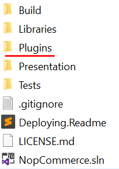
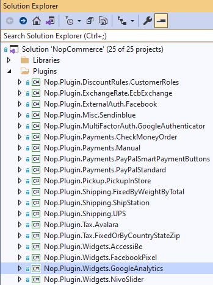
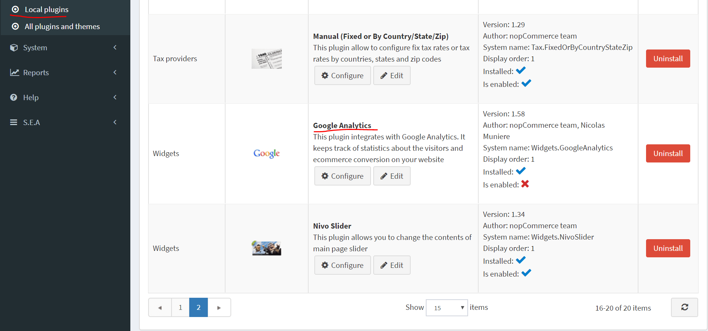
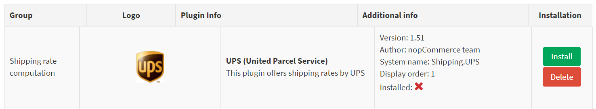
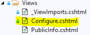
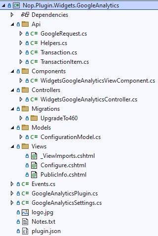

# 如何為 nopCommerce 編寫小部件

為了擴充 nopCommerce 的功能，我們使用小部件。nopCommerce 儲存庫中已經包含了各種類型的小部件，例如 [Swiper](https://github.com/nopSolutions/nopCommerce/tree/master/src/Plugins/Nop.Plugin.Widgets.Swiper) 和 [Google Analytics](https://github.com/nopSolutions/nopCommerce/tree/master/src/Plugins/Nop.Plugin.Widgets.GoogleAnalytics)。nopCommerce 市集中也提供了各種（免費和付費的）小部件，可能已經滿足您的需求。如果您還沒找到合適的，那麼您來對地方了，因為本文將引導您完成根據需求建立小部件的過程。

## 小部件的結構、必要檔案與位置

1. 首先，在方案中建立一個新的 **類別庫 (Class Library)** 專案。建議將您的小部件放置在原始碼根目錄下的 **Plugins** 資料夾中，其他小部件與外掛也存放在此處。

    

    > [!NOTE]
    > 請勿將此目錄與 *Presentation\Nop.Web* 目錄下的目錄混淆。*Nop.Web* 目錄中的 *Plugins* 目錄包含外掛編譯後的檔案。

    建議的小部件專案命名格式為 `Nop.Plugin.Widgets.{Name}`。其中 `{Name}` 是您的小部件名稱（例如，「**GoogleAnalytics**」）。例如，*Google Analytics 小部件* 的名稱為：`Nop.Plugin.Widgets.GoogleAnalytics`。但請注意，這並非強制要求，您可以為小部件選擇任何名稱。例如，「*MyFirstNopWidget*」。方案的 *Plugins* 目錄結構如下所示。

    

1. 建立小部件專案後，應使用任何文字編輯器應用程式更新 **.csproj** 檔案內容。請將內容替換為以下內容：

    ```xml
    <Project Sdk="Microsoft.NET.Sdk">
        <PropertyGroup>
            <TargetFramework>net9.0</TargetFramework>
            <Copyright>SOME_COPYRIGHT</Copyright>
            <Company>YOUR_COMPANY</Company>
            <Authors>SOME_AUTHORS</Authors>
            <PackageLicenseUrl>PACKAGE_LICENSE_URL</PackageLicenseUrl>
            <PackageProjectUrl>PACKAGE_PROJECT_URL</PackageProjectUrl>
            <RepositoryUrl>REPOSITORY_URL</RepositoryUrl>
            <RepositoryType>Git</RepositoryType>
            <OutputPath>$(SolutionDir)\Presentation\Nop.Web\Plugins\WIDGET_OUTPUT_DIRECTORY</OutputPath>
            <OutDir>$(OutputPath)</OutDir>
            <!--Set this parameter to true to get the dlls copied from the NuGet cache to the output of your    project. You need to set this parameter to true if your plugin has a nuget package to ensure that   the dlls copied from the NuGet cache to the output of your project-->
            <CopyLocalLockFileAssemblies>true</CopyLocalLockFileAssemblies>
            <ImplicitUsings>enable</ImplicitUsings>
        </PropertyGroup>
        <ItemGroup>
            <ProjectReference Include="$(SolutionDir)\Presentation\Nop.Web.Framework\Nop.Web.Framework.csproj" />
            <ClearPluginAssemblies Include="$(SolutionDir)\Build\ClearPluginAssemblies.csproj" />
        </ItemGroup>
        <!-- This target execute after "Build" target -->
        <Target Name="NopTarget" AfterTargets="Build">
            <!-- Delete unnecessary libraries from plugins path -->
            <MSBuild Projects="@(ClearPluginAssemblies)" Properties="PluginPath=$(OutDir)" Targets="NopClear" />
        </Target>
    </Project>
    ```

    > [!NOTE]
    > **WIDGET_OUTPUT_DIRECTORY** 應替換為外掛名稱，例如 *Widgets.GoogleAnalytics*。

1. 更新 *.csproj* 檔案後，應加入小部件所需的 **plugin.json** 檔案。此檔案包含描述您小部件的元資訊。只需從任何其他現有的外掛/小部件複製此檔案並根據您的需求進行修改即可。有關 `plugin.json` 檔案的資訊，請參閱 [plugin.json 檔案](xref:zh-Hant/developer/plugins/plugin_json)。

    最後一個必要的步驟是建立一個實作 **BasePlugin**（位於 *Nop.Core.Plugins* 命名空間）和 **IWidgetPlugin** 介面（位於 *Nop.Services.Cms* 命名空間）的類別。IWidgetPlugin 允許您建立小部件。小部件會呈現在您網站的某些部分。例如，它可以是網站右下角的即時交談區塊。

## 處理請求：控制器、模型與檢視

現在，您可以透過前往 **後台管理** → **設定 (Configuration)** → **在地外掛 (Local Plugins)** 來查看該小部件。



當外掛/小部件安裝後，您會看到 **解除安裝 (Uninstall)** 按鈕。*為了提升效能，建議您解除安裝不需要的外掛/小部件*。


當外掛/小部件未安裝或已解除安裝時，將會顯示 **安裝 (Install)** 和 **刪除 (Delete)** 按鈕。*刪除將會從伺服器移除實體檔案*。

但您可能猜到了，我們的小部件目前什麼也做不了。它甚至沒有用於設定的使用者介面。讓我們建立一個頁面來設定該小部件。

我們現在需要做的是建立一個控制器、一個模型、一個檢視和一個檢視元件 (View Component)。

- **MVC 控制器** 負責回應針對 *ASP.NET MVC* 網站所提出的請求。每個瀏覽器請求都會映射到特定的控制器。
- 檢視包含傳送到瀏覽器的 **HTML** 標記和內容。在使用 *ASP.NET MVC* 應用程式時，檢視等同於一個頁面。
- 實作 **NopViewComponent** 的檢視元件，其中包含轉譯檢視的邏輯與程式碼。
- **MVC 模型** 包含未包含在檢視或控制器中的所有應用程式邏輯。

那麼我們開始吧：

1. 建立模型。在新的小部件中加入一個 `Models` 資料夾，然後加入一個符合您需求的模型類別。

1. 建立檢視。在新的小部件中加入一個 `Views` 資料夾，然後加入一個名為 `Configure.cshtml` 的 `cshtml` 檔案。將檢視檔案的「**建置動作 (Build Action)**」屬性設為「**內容 (Content)**」，並將「**複製到輸出目錄 (Copy to Output Directory)**」屬性設為「**永遠複製 (Copy always)**」。請注意，設定頁面應使用「**_ConfigurePlugin**」版面配置。

    ```cs
    @{
        Layout = "_ConfigurePlugin";
    }
    ```

1. 另外，請確保您的 `Views` 目錄中有 **_ViewImports.cshtml** 檔案。您可以直接從任何其他現有的外掛或小部件複製它。

    

1. 建立控制器。在新的小部件中加入一個 `Controllers` 資料夾，然後加入一個新的控制器類別。慣例上將外掛控制器命名為 `Widgets{Name}Controller.cs` 是個好習慣。例如，**WidgetsGoogleAnalyticsController**。當然，並非強制要求一定要這樣命名控制器，這只是一個建議。接著，為設定頁面（在後台管理區域中）建立適當的動作方法。我們將其命名為 `Configure`。準備一個模型類別，並使用實體檢視路徑將其傳遞給檢視：`~/Plugins/{PluginOutputDirectory}/Views/Configure.cshtml`。

    ```cs
    public async Task<IActionResult> Configure()
    {
        if (!await _permissionService.AuthorizeAsync(StandardPermissionProvider.ManageWidgets))
            return AccessDeniedView();

        //load settings for a chosen store scope
        var storeScope = await _storeContext.GetActiveStoreScopeConfigurationAsync();
        var myWidgetSettings = await _settingService.LoadSettingAsync<MyWidgetSettings>(storeScope);

        var model = new ConfigurationModel
        {
            // configuration model settings here
        };

        if (storeScope > 0)
        {
            // override settings here based on store scope
        }

        return View("~/Plugins/Widgets.MyFirstNopWidget/Views/Configure.cshtml", model);
    }
    ```

1. 為您的動作方法使用以下屬性：

    ```cs
    [AutoValidateAntiforgeryToken]
    [AuthorizeAdmin] //confirms access to the admin panel
    [Area(AreaNames.Admin)] //specifies the area containing a controller or action
    [AdminAntiForgery] //Helps prevent malicious scripts from submitting forged page requests.
    ```

    例如，開啟 `GoogleAnalytics` 小部件並查看其 `WidgetsGoogleAnalyticsController` 的實作。
    接著，對於每個具有設定頁面的小部件，您都應該指定一個設定 URL。名為 **BasePlugin** 的基底類別具有 `GetConfigurationPageUrl` 方法，該方法會傳回設定 URL：

    ```cs
    public override string GetConfigurationPageUrl()
    {
        return $"{_webHelper.GetStoreLocation()}Admin/{CONTROLLER_NAME}/{ACTION_NAME}";
    }
    ```

    其中 `{CONTROLLER_NAME}` 是您的控制器名稱，`{ACTION_NAME}` 是動作名稱（通常是 "Configure"）。
    每個小部件都應指定一個小部件區域列表。名為 **IWidgetPlugin** 的基底類別具有 `GetWidgetZones` 方法，該方法會傳回將轉譯該小部件的小部件區域列表。

    ```cs
    public Task<IList<string>> GetWidgetZonesAsync()
    {
        return Task.FromResult<IList<string>>(new List<string> {PublicWidgetZones.HeadHtmlTag });
    }
    ```

    您可以從此 [連結](https://github.com/nopSolutions/nopCommerce/blob/master/src/Presentation/Nop.Web.Framework/Infrastructure/PublicWidgetZones.cs) 找到前台小部件區域列表，並依照此 [連結](https://github.com/nopSolutions/nopCommerce/blob/master/src/Presentation/Nop.Web.Framework/Infrastructure/AdminWidgetZones.cs) 找到後台管理小部件區域。
    除了 `GetWidgetZonesAsync` 之外，**IWidgetPlugin** 還有 `GetWidgetViewComponentName` 方法，它會傳回 ViewComponent 名稱。它接受 "*widgetZone*" 名稱作為參數，並可用於根據所選的小部件區域轉譯不同的檢視。

    ```cs
    public string GetWidgetViewComponentName(string widgetZone)
    {
        return "MyFirstWidget";
    }
    ```

## Google Analytics 小部件的專案結構



## 處理 "InstallAsync" 和 "UninstallAsync" 方法

此步驟是選用的。某些小部件可能需要在安裝期間執行額外邏輯。例如，小部件可以插入新的在地化資源或設定值。因此，請開啟您的 **IWidgetPlugin** 實作（大多數情況下它會繼承自 **BasePlugin** 類別）並覆寫以下方法：

1. **InstallAsync**。此方法將在外掛安裝期間被呼叫。您可以在此處初始化任何設定、插入新的在地化資源或建立新的資料庫表（如有需要）。

    ```cs
    public override async Task InstallAsync()
    {
        // custom logic like adding settings, locale resources, and database table(s) here

        await base.InstallAsync();
    }
    ```

1. **UninstallAsync**。此方法將在外掛解除安裝期間被呼叫。您可以移除該小部件在安裝期間所初始化的設定、在地化資源或資料庫表。

    ```cs
    public override async Task UninstallAsync()
    {
        // custom logic like removing settings, locale resources, and database table(s) which was created during widget installation

        await base.UninstallAsync();
    }
    ```

    > [!IMPORTANT]
    > 如果您覆寫了這些方法中的其中一個，請勿隱藏其基礎實作——即上圖中標記的 **base.InstallAsync()** 和 **base.UninstallAsync()**。