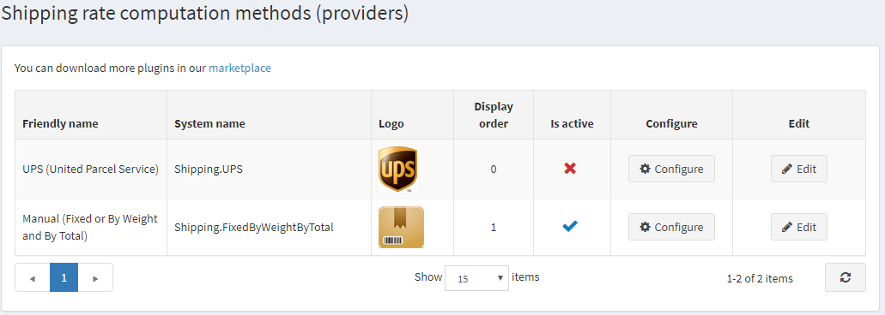

# 如何編寫自己的配送費計算方式

如果顧客購買了需要配送的商品，他們可以在結帳過程中選擇配送方式。這些配送方式由配送費計算方式（例如 *UPS*、*USPS*、*FedEx* 等）回傳。在 nopCommerce 中，配送費計算方式是以「外掛」形式實作的。我們建議您在開始編寫新的配送費計算方式之前，先閱讀 [如何為 nopCommerce 4.90 編寫外掛](xref:zh-Hant/developer/plugins/how-to-write-plugin-4.70)。該文章將向您說明建立外掛所需的步驟。事實上，配送費計算方式就是一個實作了 **IShippingRateComputationMethod** 介面（位於 `Nop.Services.Shipping` 命名空間）的普通外掛。因此，請在解決方案中加入一個新的配送外掛專案（*類別庫*），讓我們開始吧。

## 控制器 (Controllers)、檢視 (Views)、模型 (Models)

加入一個控制器以及對應的 **Configure** 動作方法與檢視。這些將定義商店管理員如何在後台管理介面的 *系統 → 設定 → 配送 → 配送提供程序* 中看到設定選項。本文不說明如何設定外掛，但您可以[在此處找到更多相關資訊](xref:zh-Hant/getting-started/configure-shipping/shipping-providers/index)。



一旦此步驟完成，您就可以開始加入取得配送方式所需的商業邏輯。

## 取得配送方式

現在您需要建立一個實作 **IShippingRateComputationMethod** 介面的類別。這就是負責處理所有實際工作的類別。當 nopCommerce 計算配送總金額或需要取得可用配送方式列表時，就會呼叫您類別中的 **GetShippingOptionsAsync** 或 **GetFixedRateAsync** 方法。以下是 UPSComputationMethod 類別的定義方式（以 "UPS" 方法為例）：

```csharp
public class UPSComputationMethod : BasePlugin, IShippingRateComputationMethod
```

**IShippingRateComputationMethod** 介面包含數個必須實作的方法與屬性。

- **GetShippingOptionsAsync**：此方法會在顧客於結帳過程中選擇配送方式時被呼叫。此方法回傳 **`GetShippingOptionResponse`**，其中包含一個 **ShippingOption** 物件列表。每個 **ShippingOption** 物件都包含關於特定配送方式的資訊，例如選項名稱（例如 "陸運"）、費用（例如 10 美元）以及其他資訊。請將您的所有邏輯放在此處（從您的資料庫取得費率，或向第三方網站（如 *UPS*）發出請求）。
- **GetFixedRateAsync**：如您所知，**GetShippingOptionsAsync** 用於在結帳期間（在 "選擇配送方式" 頁面上）取得配送方式。但有時我們需要在選擇配送方式之前就知道運費（例如在購物車頁面上）。在這種情況下，您可以回傳固定費率。例如，若您的配送費計算方式僅提供一種配送方式，則無需等到顧客在 "選擇配送方式" 頁面進行選擇。如果您的配送方式不支援固定費率，則回傳 **`null`**。在這種情況下，顧客在購物車的 "配送總計" 旁將會看到以下訊息："*於結帳時計算*"。
- **GetShipmentTrackerAsync**：此方法用於取得相關聯的配送追蹤器。結果會回傳一個 **IShipmentTracker**，其中包含用於顯示追蹤資訊的網頁 URL（第三方追蹤頁面），以及關於配送事件的所有資訊。

## 結論

希望這能幫助您開始新增新的配送費計算方式。