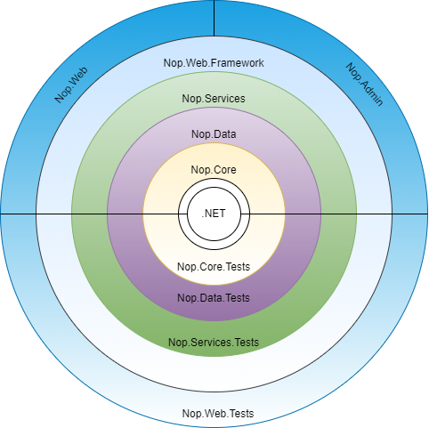

# nopCommerce 架構

## 簡介

nopCommerce 是一套高度可自訂、靈活、支援多商店、多供應商、對 SEO 友善且功能齊全的開源電子商務解決方案。它是建立在 Microsoft `ASP.NET Core` 框架之上。nopCommerce 始終保持採用最新技術並遵循最佳開發實踐。

## 概覽

本文件旨在提供 nopCommerce 系統的全面架構概覽。這份說明文件主要針對 nopCommerce 的新進開發者。在文件中，我們將探索 nopCommerce 解決方案中的每個專案、專案之間的依賴關係等。

## nopCommerce 架構概覽

nopCommerce 是最受歡迎且成功的 `Dot NET` 開源 `電子商務` 解決方案之一。nopCommerce 的成功不僅在於它開箱即用且包含了現代電子商務解決方案所需的大多數功能，且其介面高度可自訂且對使用者友善，更在於 nopCommerce 解決方案結構組織良好，對開發者非常友善。nopCommerce 的主要優勢在於其靈活、可擴充的架構以及組織完善的原始程式碼。nopCommerce 的架構非常接近洋蔥架構（Onion Architecture）。該架構主要專注於控制程式碼耦合。根據此架構，所有程式碼可以依賴於更核心的層級，但程式碼不能依賴於距離核心更外層的層級。換句話說，所有的耦合都是朝向中心的。

這意味著專案只能依賴於位於當前專案向內部的其他專案。例如，觀察上圖，`Nop.Data` 專案可以依賴 `Nop.Core` 專案並將其作為依賴項，但 `Nop.Core` 不能依賴 `Nop.Data`；同樣地，`Nop.Services` 可以將 `Nop.Data` 和 `Nop.Core` 作為其依賴項，但 `Nop.Core` 或 `Nop.Data` 都不能將 `Nop.Service` 作為它們的依賴項。這意味著一個專案只有在依賴項目位於當前層級的向內或更中心時，才能將其作為依賴項。這就是程式碼解耦的關鍵。這種方法/架構的主要優點在於，即使我們沒有應用程式的 `UI`，我們現在也可以測試應用程式核心（Application Core）。因為應用程式核心並不依賴於 `UI 層`。或者，我們可以將我們的 `UI 框架` 從 `Razor` 檢視引擎和 `JQuery` 更改為 `Angular`、`React` 或 `Vue`，而不會影響我們的應用程式核心，並且可以使用相同的核心來構建行動應用程式或桌面應用程式。所有這些都不需要變動應用程式核心中的任何一行程式碼。

## nopCommerce 解決方案中的專案

### 應用程式核心 (Application Core)

這是 nopCommerce 架構中最內部的層級。它是應用程式的核心。所有的資料存取邏輯和業務邏輯類別都位於此層級內。在 nopCommerce 解決方案中，我們可以在 "Libraries" 目錄下找到該層級的所有專案。此層級包含三個專案。

#### Nop.Core

此專案包含一組 nopCommerce 的核心類別。該專案位於架構的中心，對解決方案中的其他專案沒有任何依賴關係。此專案包含與整個解決方案共享的核心類別，例如領域實體（Domain Entities）、快取（Caching）、事件（Events）以及其他輔助類別。

#### Nop.Data

`Nop.Data` 專案依賴於位於架構中間的 `Nop.Core` 專案。它不依賴於解決方案中的任何其他專案。`Nop.Data` 專案包含用於讀寫資料庫或其他資料儲存的類別和函式。它將資料存取邏輯與業務物件分開。

#### Nop.Services

`Nop.Services` 專案是 nopCommerce 架構中應用程式核心的最外層。它依賴於應用程式核心中的另外兩個專案。它包含了核心服務、業務邏輯、驗證以及資料計算。有些人稱其為業務存取層（BAL）或業務邏輯層（BLL）。它作為所有其他層級的對外窗口（Facade）。它擁有服務類別並使用儲存庫模式來公開其特性與功能。這種方法將核心與核心之外的其他層級解耦。如果應用程式核心的邏輯發生變化，它還可以防止或減少其他層級的程式碼變動。這種方法非常適合依賴注入（Dependency Injection）。

### UI 層

此層級位於 "應用程式核心" 之外。在 nopCommerce 解決方案中，我們可以在 "Presentation" 目錄下找到該層級的所有專案。所有的呈現邏輯和 UI 都位於此層級。這是使用者可以互動的 UI 所在的層級。在 nopCommerce 中，此層級拆分為另外兩個層級。

#### Nop.Web.Framework

`Nop.Web.Framework` 專案是呈現層的內層，並依賴於應用程式核心層。這是一個類別庫專案，作為呈現層的框架。它為 nopCommerce 前台網站和後台管理提供了共享邏輯。

#### Nop.Web

`Nop.Web` 專案是 nopCommerce 架構中呈現層的最外層。它擁有使用者可以互動的電子商務前台網站使用者介面。它是一個 ASP.NET Core 應用程式，依賴於 `Nop.Web.Framework` 和應用程式核心。它使用 `Nop.Web.Framework` 進行與後台管理之間的共享邏輯。它使用應用程式核心進行資料存取與操作。

#### Admin (後台管理)

在 nopCommerce 中，它屬於與 `Nop.Web` 專案相同的層級。它存在於 `Nop.Web` 專案內的一個區域（Area）。它也是一個 UI（使用者介面），但呈現層的這個部分包含了後台管理的 UI。後台管理是維護公共網站所有內容的地方，也是我們監控公共網站活動的地方。公共網站可以無限制地存取，但 "後台管理" 需要一些身份驗證（Authentication）和授權（Authorization）才能存取，因為它包含只有網站管理員有權存取的資訊。

### 測試層 (Test Layer)

此層級位於與 "呈現層" 相同的層級，正好在 "應用程式核心" 之外。此層級全部關於測試應用程式的不同部分。由於 nopCommerce 系統設計所遵循的架構，在 nopCommerce 中的測試變得簡單且更加可靠。在 nopCommerce 解決方案中，我們可以在 "Tests" 目錄下找到該層級的所有專案。nopCommerce 使用 **NUnit** 測試框架進行*單元測試*。

#### Nop.Tests

此層級是 "測試層" 的內層，並依賴於 "應用程式核心" 層。此專案包含用於測試的核心邏輯。

#### Nop.Core.Tests

這些測試專為 `Nop.Core` 專案的*單元測試*而構建，用於測試快取、領域實體等等。

#### Nop.Data.Tests

這些測試專為 `Nop.Data` 專案的*單元測試*而建立，它們測試各種資料提供者對實體進行操作（例如插入、刪除等）的工作情形。

#### Nop.Services.Tests

這些測試專為 `Nop.Service` 專案的*單元測試*而構建。它包含了測試每個服務類別中每一項操作的邏輯。

#### Nop.Web.Tests

這些測試可用於測試 nopCommerce 的呈現層，其中包含 "前台網站" 和 "後台管理"。