# 將 nopCommerce 部署至 Azure VM

## 在 Azure 上建立虛擬機器 (VM)

本指南說明建立 Azure 虛擬機器以託管 nopCommerce Web 應用程式，並允許使用 **WebDeploy** 進行發布所需的步驟。

### 建立新的 VM

1. 登入 [Azure 入口網站](https://portal.azure.com/)
1. 點擊 **新增 (Add)** 按鈕

    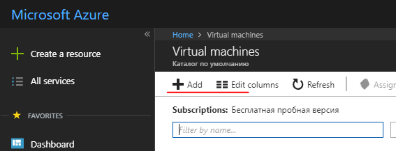

1. 在「快速入門」類別中選擇 *Windows Server 2016 VM*，或在「運算」類別中選擇任何 Windows Server 2016 版本，例如 **Windows Server 2016 Datacenter**
1. 完成設定新 VM 所需的欄位。
    - 使用者名稱/密碼。您將需要此資訊來存取 VM。這是透過 RDP 連線到 VM 時使用的管理員帳戶。
    - 資源群組。這是包含為此 VM 建立的所有資源的「虛擬資料夾」名稱。您可以透過刪除該資源群組來刪除在此過程中建立的所有資源。

### 設定 VM 上的元件與功能

1. DNS 名稱：
    - 從 [Azure 入口網站](https://portal.azure.com/)，瀏覽至您的虛擬機器概觀頁面。
    - 在 DNS 名稱下，點擊 **設定 (Configure)**
    - 提供一個全域唯一的 DNS 名稱。（名稱驗證通過後會出現綠色勾選標記。）
    - 點擊 **儲存 (Save)** 以儲存設定。

### 設定 Azure 防火牆規則

1. 在 Azure 入口網站中設定輸入防火牆規則。在「網路」區段中，新增輸入連接埠規則以建立新的防火牆項目：
    - http - 連接埠 80 (優先順序 100)
    - WebDeploy - 連接埠 8172 (優先順序 1010)
    - RDP - 連接埠 3389 (優先順序 320)

    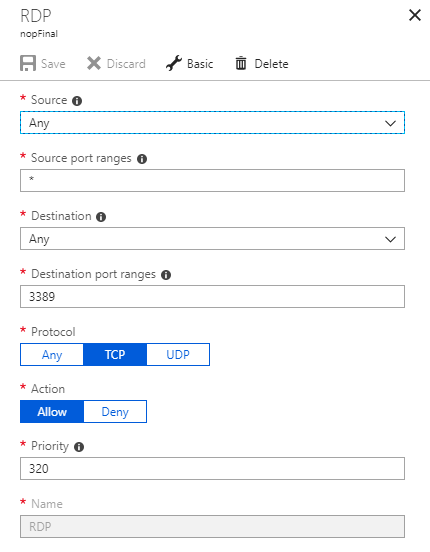

2. 在 Azure 入口網站中設定輸出防火牆規則。在 *網路* 區段中，新增輸出連接埠規則以建立新的防火牆項目：
    - RDP - 連接埠 3389 (優先順序 100)

### 使用登入帳號密碼連線至 VM (RDP)

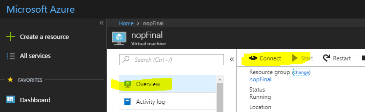

### 安裝 IIS (Web 伺服器) 與 ASP.NET 4.6

1. 開啟 **伺服器管理員儀表板 (Server Manager Dashboard)**（首次啟動時會自動開啟）
1. 選擇 **2 新增角色及功能 (Add roles and features)**

    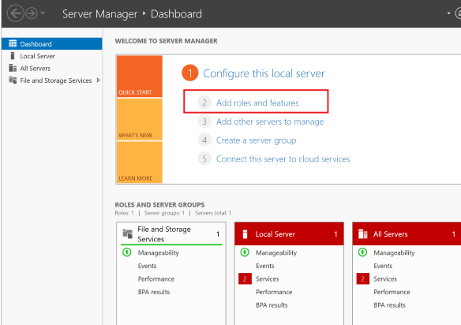

1. 接受預設值並按三次 **下一步 (Next)**，直到進入「伺服器角色」區段。
1. 選擇 **網頁伺服器 (IIS) (Web Server (IIS))**

    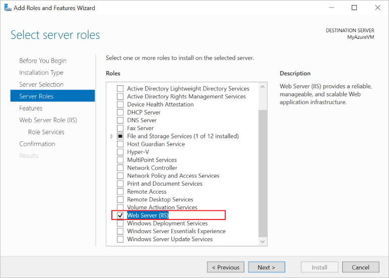

1. 出現提示時，確認安裝額外的 *IIS 管理主控台*。
1. 按三次 **下一步 (Next)**，直到進入 *網頁伺服器角色 (IIS) --> 角色服務* 區段。
1. 選擇 **管理服務 (Management Service)**，這是啟用 Web Deploy（透過連接埠 8172）所必需的。出現提示時，確認安裝額外的 ASP.NET 4.6。

    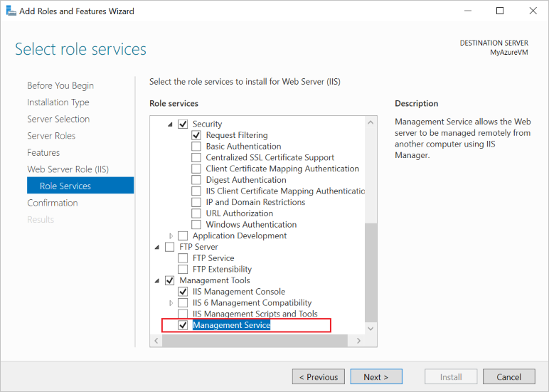

1. 選擇 **下一步 (Next)** 確認設定，然後點擊 **安裝 (Install)** 以完成 IIS 設定。

    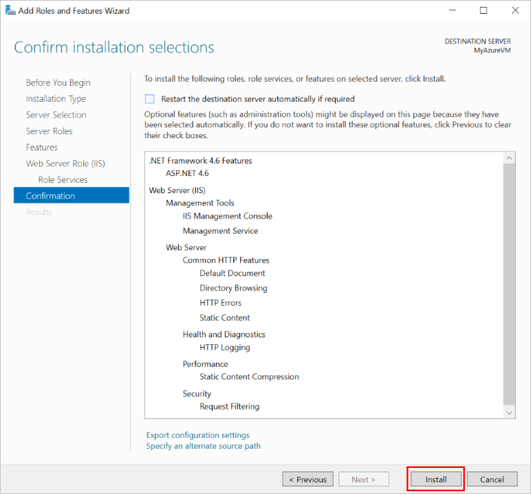

    安裝完成後：
    - IIS 已安裝並執行，同時已建立連接埠 80 的內部防火牆規則。
    - Web 管理服務已安裝，同時已建立連接埠 8172 的內部防火牆規則。

### 設定 IE 增強式安全性 (關閉)

在新的 Azure VM 上，預設安全性規則會防止透過 Internet Explorer 下載執行檔。若要下載 WebDeploy 執行檔，您必須先停用 IE 增強式安全性。

1. 在 **伺服器管理員** 中，開啟左側的 **本機伺服器 (Local Server)** 區段。
1. 在主面板中，「**IE 增強式安全性設定：**」旁，選擇「開啟」。
1. 在出現的對話框中，為「管理員」選擇 **關閉 (Off)**，為「使用者」選擇 **開啟 (On)**，然後點擊 **確定 (OK)**。

    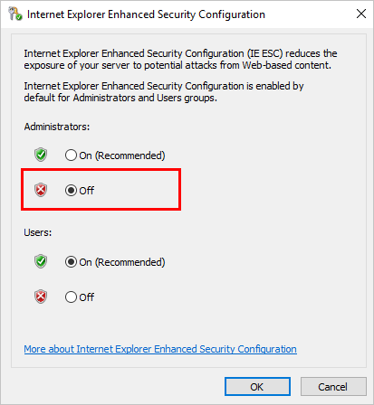

### 安裝 Web Deploy

1. 啟動 Internet Explorer。
1. 接受預設安全性設定。
1. [下載](https://www.microsoft.com/download/details.aspx?id=43717) *WebDeploy_amd64_en-US.msi*
1. 按照 Web Deploy 的安裝步驟進行。
1. 選擇「完整 (Complete)」選項以安裝所有元件。

### 安裝最新版本的 [.NET Core SDK](https://www.microsoft.com/net/download/all)

### 安裝 [.NET Core Windows Server Hosting](https://www.microsoft.com/net/download/all) 套件

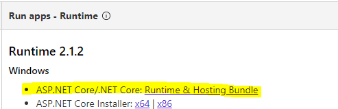

IIS 用於託管 ASP.NET Core Web 應用程式，其角色將簡化為代理伺服器。ASP.NET Core 應用程式在 IIS 上的託管是透過原生的 *AspNetCoreModuleV2* 來實現，該模組設定為將請求重新導向至 *Kestrel* Web 伺服器。此模組控制外部處理序 `dotnet.exe` 的啟動（應用程式即託管於其中），並將所有來自 IIS 的請求轉送至此託管處理序。

安裝此套件後，請在命令列執行 **iisreset** 指令，或手動重新啟動 IIS，以便伺服器套用變更。

### 設定 IIS

1. 您必須授權 `wwwroot` 資料夾的權限。在 **IIS 管理員** 中選取該網站，選擇 **編輯權限 (Edit Permissions)**，並確保 *IUSR*、*IIS_IUSRS* 或為應用程式集區設定的使用者，是具有「讀取與執行」權限的授權使用者。如果這些使用者都不存在，請新增 *IUSR* 並給予「讀取與執行」權限。

    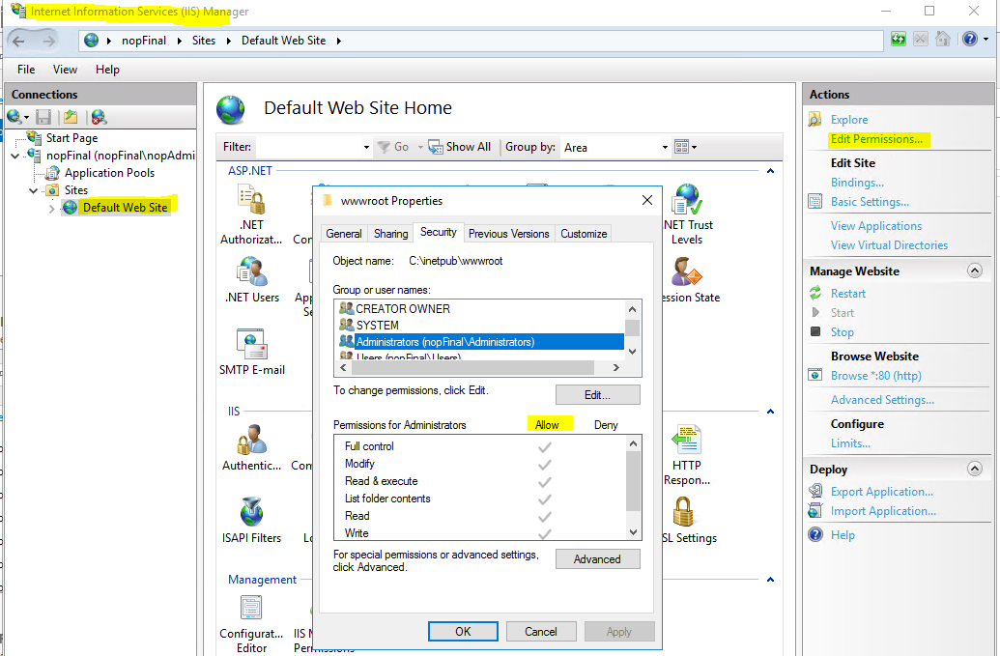

1. 點擊右側面板的 **重新啟動 (Restart)** 以重新啟動 IIS。

現在一切準備就緒，可以發布專案了。

## 將 nopCommerce 發布至 Azure VM（從 Microsoft Visual Studio）

發布 nopCommerce 應用程式與發布任何其他 ASP.NET Core 應用程式並無不同。因此，以下僅說明執行發布的最低要求。詳細資訊可在此處 [取得](https://docs.microsoft.com/aspnet/core/tutorials/publish-to-azure-webapp-using-vs?view=aspnetcore-2.1#deploy-the-app-to-azure)。

## 發布 `Nop.Web` 專案

1. 在 Microsoft Visual Studio 中開啟您的 Web 應用程式方案。在 *方案總管 (Solution Explorer)* 中右鍵點擊專案，並選擇 **發布 (Publish)**。

    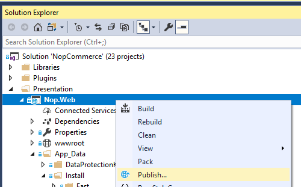

1. 使用頁面右側的箭頭捲動發布選項，直到找到 **Microsoft Azure Virtual Machines**。從「現有虛擬機器」清單中選擇適當的 VM。
1. 點擊 **建立設定檔 (Create Profile)**。

    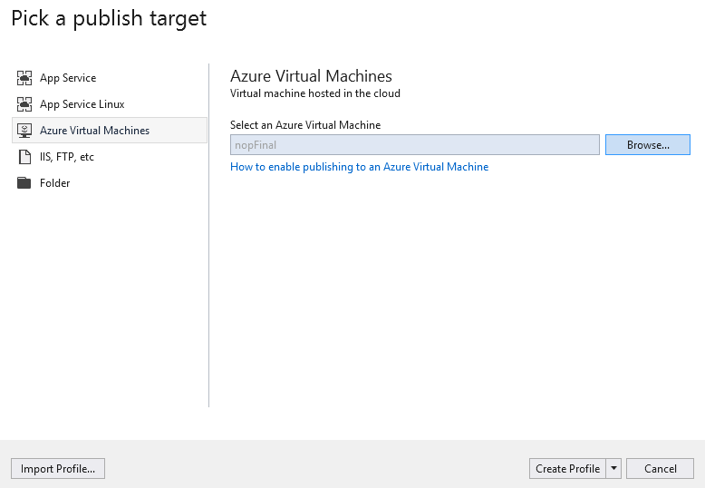

1. 若要檢視及修改發布設定檔，請選擇 **設定 (Configure)**。使用 **驗證連線 (Validate Connection)** 按鈕確認您已輸入正確的資訊。

    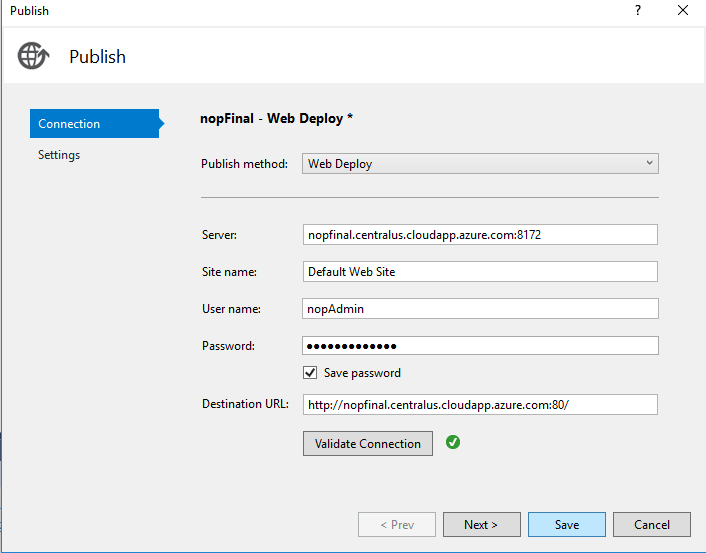

1. 如果您希望確保每次上傳後 Web 伺服器都有乾淨的應用程式副本（且沒有殘留先前部署的檔案），可以在 **設定 (Settings)** 索引標籤中勾選 **移除目的地的其他檔案 (Remove additional files at destination)** 核取方塊。警告：啟用此設定進行發布，會刪除 Web 伺服器（*wwwroot* 目錄）上存在的所有檔案。請務必在啟用此選項發布前，確認該機器狀態。

    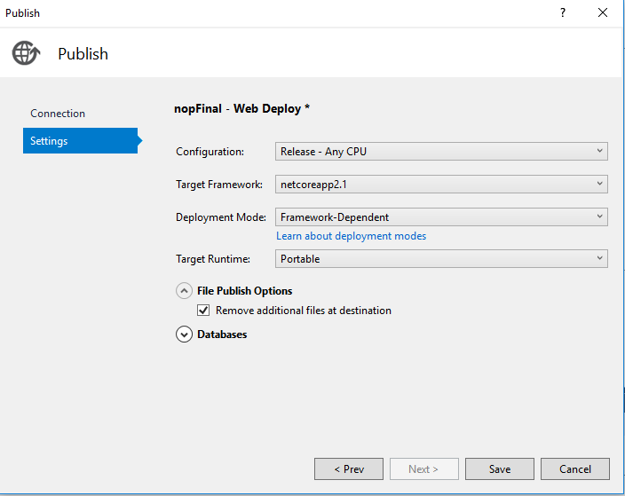

1. 點擊 **儲存 (Save)**。
1. 點擊 **發布 (Publish)** 開始發布。

您現在已將 Web 應用程式發布至 Azure 虛擬機器。

## 潛在問題與解決方案

若要 [更](https://docs.microsoft.com/aspnet/core/host-and-deploy/aspnet-core-module) 準確地調查任何問題，您需要啟用記錄功能 - 在 `web.config` 中啟用 `stdoutLog`：

```sh
stdoutLogEnabled="true" stdoutLogFile=".\logs\stdout"
```

### IIS 無法找到 web.config

可能的解決方案請見：[support.microsoft.com](http://support.microsoft.com/kb/942055)