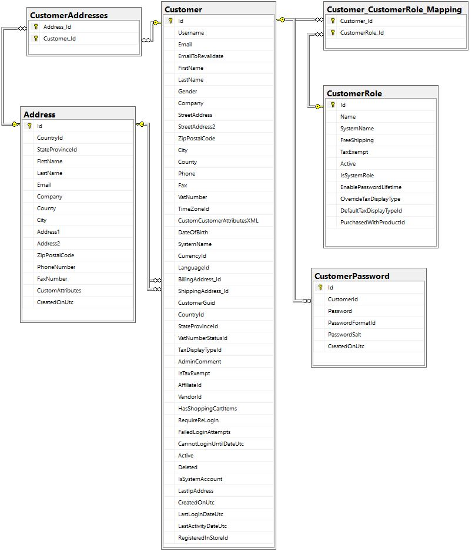
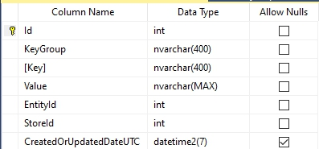
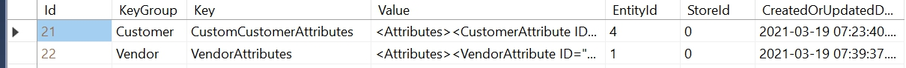
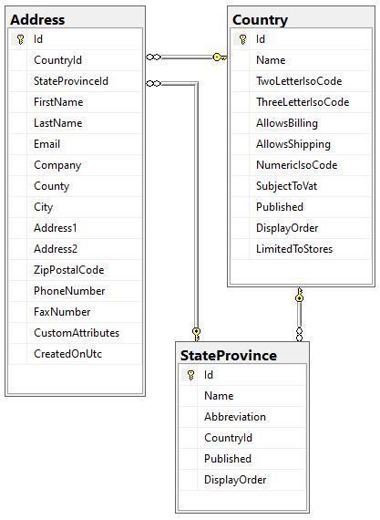

# 預設資料庫綱要

在本文中，我們將檢視在初始安裝期間所建立，且在 90% 的情況下保持不變的資料庫綱要。

我們不會列出整個綱要，但會說明預設安裝所建立的 126 個資料表。

為了便於理解這樣的綱要，我們將其拆分為多個部分。以下我們以最自然且易懂的方式對這些資料表進行分組：

* [顧客資訊](#customers-info)
* [商品資訊](#products-info)
  * [商品屬性](#product-attributes)
  * [階梯價格](#tier-price)
  * [各倉庫庫存](#inventory-by-warehouses)
* [訂單](#orders)
* [出貨單](#shipments)
* [折扣](#discounts)
* [購物車](#shopping-cart)
* [地址](#addresses)
* [資料庫命名慣例](#database-naming-convention)

## 顧客資訊



此圖表顯示了一組包含基本顧客資訊的資料表，並標示了連結的方向。

我們不會深入探討資料表和欄位的用途，因為它們的名稱已經足夠具備描述性。

### 功能 (顧客資訊)

* 在 **Customer** 資料表中，有三個欄位實際上應該定義為外鍵，但在實務上並未如此設定：
    1. AffiliateId
    1. VendorId
    1. RegisteredInStoreId

    這麼做是為了刻意避免因不必要的連結而造成系統負擔，因為這些欄位並非在每個商店中都會使用。

* 部分使用者資料儲存在 **GenericAttribute** 資料表中。您可以在 `\src\Libraries\Nop.Core\Domain\Customers\NopCustomerDefaults.cs` 中找到所有相關內容。

    此資料表的結構如下所示：

    

    除了上述的顧客資料外，此資料表也可以儲存其他實體的任何資料。我們特意加入了此資料表，讓您可以在不更動資料表結構的情況下擴充任何實體。

    此外，此資料表亦以 XML 格式儲存自訂的 **顧客屬性** 與 **供應商屬性**，並包含供應商與顧客所選擇的值。請參考下列列資料，以了解其外觀：

    

    透過 *Value* 欄位中的 XML 字串範例，我們可以清楚看出特定供應商的屬性值是如何儲存的：

    ```csharp
    /// <summary>
    /// Represents an interaction type within the group of requirements
    /// </summary>
    public enum RequirementGroupInteractionType
    {
        /// <summary>
        /// All requirements within the group must be met
        /// </summary>
        And = 0,

        /// <summary>
        /// At least one of the requirements within the group must be met 
        /// </summary>
        Or = 2
    }
    ```

    ```csharp
    /// <summary>
    /// Represents a shopping cart type
    /// </summary>
    public enum ShoppingCartType
    {
        /// <summary>
        /// Shopping cart
        /// </summary>
        ShoppingCart = 1,

        /// <summary>
        /// Wishlist
        /// </summary>
        Wishlist = 2
    }
    ```

## 地址

您可能也會對涉及儲存地址（包括配送地址與顧客地址）的資料表綱要感興趣：



如您所見，標準安裝包含更多的資料表。我們未對所有資料表進行說明，因為其中許多資料表沒有關聯且僅用於特定目的，而其他資料表則極少被使用。

## 資料庫命名慣例

您可能已經注意到，資料庫在資料表和欄位的命名上使用了混合方式（包含 `_` 字元、不含 `_` 以及 CamelCase）。很久以前我們使用過 `_` 字元，但現在我們已完全轉向使用 **PascalCase** 標記法。我們選擇不變更現有資料表或欄位的名稱，因為我們的許多使用者已經撰寫了自訂指令碼，若變更將會導致這些指令碼失效。

為了保持與新標準的向後相容性，我們引入了 `INameCompatibility` 介面。它允許您重新命名資料表與欄位，以便將物件正確映射到遵循舊命名標準的資料表。位於 `Nop.Data.Mapping` 命名空間中的 [BaseNameCompatibility](https://github.com/nopSolutions/nopCommerce/blob/develop/src/Libraries/Nop.Data/Mapping/BaseNameCompatibility.cs) 類別包含了完整的覆寫清單。