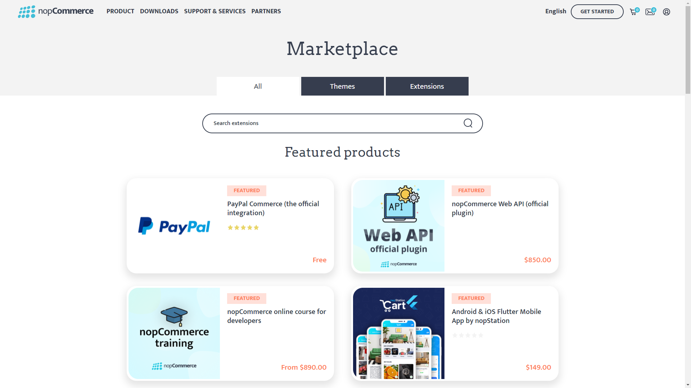

# 外掛系統簡介

## 如何初始化新的外掛系統（如何建立新的外掛專案）

nopCommerce 使用外掛系統來擴充 nopCommerce 商店的功能。外掛是一組獨立的程式或元件，可以新增到現有系統中以擴充特定功能，並且可以在過程中從系統中移除，而不會影響主系統。

> [!NOTE]
> 有關如何建立外掛的更多資訊，您可以造訪 [**此頁面**](xref:zh-Hant/developer/plugins/index)。

## 如何搜尋並使用來自 nopCommerce 商店的外掛

nopCommerce 已經內建了多個外掛，開箱即用。您也可以搜尋並找到 nopCommerce 官方市集中已有的多個外掛，看看是否已經有人開發了符合您需求的外掛。如果沒有，您隨時可以根據自己的需求建立自己的外掛。現在讓我們看看如何尋找並使用來自 nopCommerce 商店的外掛。為此，nopCommerce 設有一個市集，我們可以在其中找到不同的佈景主題與外掛。您可以在 [nopCommerce 市集](https://www.nopcommerce.com/marketplace) 找到它。



在這裡您可以看到三個分頁。**全部 (All)** 分頁包含所有佈景主題與擴充功能，**佈景主題 (Themes)** 分頁包含所有 nopCommerce 佈景主題（用於 nopCommerce 網站外觀），最後是 **擴充功能 (Extensions)** 分頁，我們可以在這裡找到外掛。請前往「擴充功能」分頁。在這裡您可以找到所有免費與付費的外掛。若要尋找特定的外掛，您可以從此處搜尋。在右側，您可以找到篩選區塊，從中可以縮小您的篩選範圍。找到您搜尋的外掛後，只需下載並安裝即可。每個外掛在其下載頁面上都有關於如何使用的完整說明，因此請務必閱讀這些說明。

## 介面 `IPlugin`

`IPlugin` 是一個公開在安裝或解除安裝外掛時所使用功能的介面。每個外掛專案都必須有一個繼承自此介面的類別，nopCommerce 才能將該專案視為外掛。

### 方法 `GetConfigurationPageUrl`

```cs
string GetConfigurationPageUrl()
```

此方法應回傳設定檢視的 URL。當我們安裝外掛時，會看到一個「設定 (Configuration)」按鈕，因此如果我們在類別中實作此方法，則由此方法回傳的字串值將用作該「設定」按鈕的 URL。

### 屬性 `PluginDescriptor`

```cs
PluginDescriptor PluginDescriptor{ get; set; }
```

此屬性用於取得或設定描述目前外掛的資訊。當我們編寫新的外掛或小部件時，需要建立一個 **plugin.json** 檔案。nopCommerce 會使用該檔案來初始化此屬性的值。

### 方法 `InstallAsync`

```cs
Task InstallAsync();
```

此方法在安裝外掛時執行，此邏輯通常會實作設定、在地化與其他基礎設施的初始化，以正確配置外掛。

### 方法 `UninstallAsync`

```cs
Task UninstallAsync();
```

此方法與 "InstallAsync" 相反，它應該在解除安裝後完全刪除配置給該外掛的所有資源。

### 方法 `UpdateAsync`

```cs
Task UpdateAsync(string currentVersion, string targetVersion);
```

此方法用於將外掛更新至指定版本。

### 方法 `PreparePluginToUninstallAsync`

```cs
Task PreparePluginToUninstallAsync()
```

當我們點擊外掛的 `UninstallAsync` 按鈕時，會呼叫此方法。此方法內的程式碼將在 nopCommerce 從系統中解除安裝該外掛之前執行。在此方法中，我們可能想要編寫驗證外掛是否可解除安裝的邏輯。例如，我們可以在這裡檢查是否有其他外掛依賴於我們正嘗試解除安裝的外掛。如果是這樣，我們可能不希望使用者在依賴目前外掛的外掛被解除安裝之前，就將其解除安裝。

## 類別 `PluginDescriptor`

正如其名，此類別包含描述外掛的資訊。如果您將此類別中的 *屬性 (properties)* 與 **plugin.json** 檔案中的 *鍵 (key)* 進行比較，您會看到類似的結構。這是因為此類別 **PluginDescriptor.cs** 被用來將該 **plugin.json** 檔案映射到 C# 類別，以便 nopCommerce 可以使用 **plugin.json** 中提供的資訊。除了這些屬性外，`PluginDescriptor` 類別還包含一些額外的屬性和輔助方法。

### 屬性 `Installed`

```cs
public virtual bool Installed { get; set; }
```

此屬性用於驗證外掛是否已安裝在我們的 nopCommerce 應用程式中。

### 屬性 `PluginType`

```cs
public virtual Type PluginType { get; set; }
```

它用於取得或設定外掛的類型。此類型參照了在外掛專案中實作 `IPlugin` 介面的類別。

### 屬性 `OriginalAssemblyFile`

```cs
public virtual string OriginalAssemblyFile { get; set; }
```

它用於取得或設定建立陰影複製 (shadow copy) 所依據的原始組件檔案。

### 屬性 `ReferencedAssembly`

```cs
public virtual Assembly ReferencedAssembly { get; set; }
```

它用於取得或設定應用程式中處於作用中狀態的已陰影複製之組件。

### 屬性 `ShowInPluginsList`

```cs
public virtual bool ShowInPluginsList { get; set; } = true;
```

此屬性用於指示我們是否要在外掛列表中顯示該外掛。

### 方法 `GetPluginDescriptorFromText`

```cs
public static PluginDescriptor GetPluginDescriptorFromText(string text)
```

此方法接收 *json 字串* 作為輸入，並將 *json 字串* 解析為 `PluginDescriptor` 類型，並回傳從 *json 字串* 解析出的 `PluginDescriptor`。

### 方法 `Save`

```cs
public virtual void Save()
```

它用於將來自 `PluginDescriptor` 的外掛描述儲存到 **plugin.json** 檔案中。

### 方法 `CompareTo`

```cs
public int CompareTo(PluginDescriptor other)
```

它透過比較 *FriendlyName* 屬性，將 `PluginDescriptor` 的目前實例與作為參數提供的其他 `PluginDescriptor` 實例進行比較。並回傳一個整數，指示此實例在排序順序中是位於指定參數之前、之後還是相同位置。

### 方法 `Instance`

```cs
public virtual TPlugin Instance<TPlugin>() where TPlugin : class, IPlugin
```

此方法用於從目前的 `PluginDescriptor` 取得 `PluginType` 屬性類型的 *外掛* 實例。

## 介面 `IPluginManager`

`IPluginManager` 是一個類別類型的泛型介面。它包含用於使用不同篩選參數載入外掛的方法宣告。我們可以在位於命名空間 `{Nop.Services.Plugins}` 下的 `PluginManager` 中找到此介面的實作。