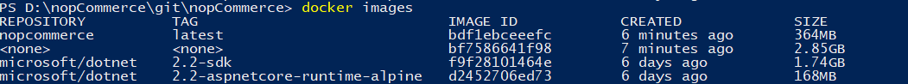
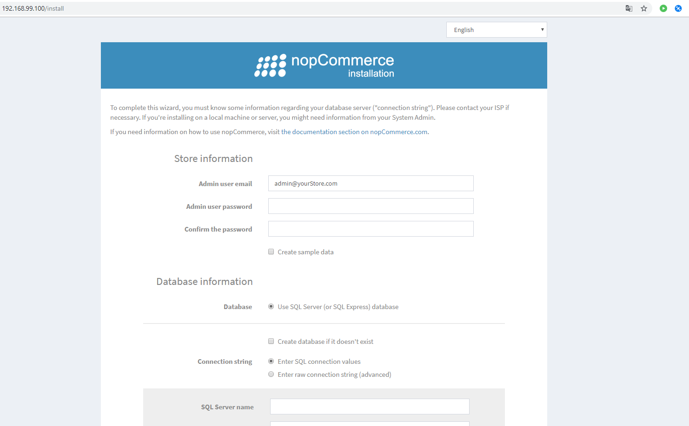

# 使用 Docker

本文件是建置與執行 Docker 容器的逐步指南。

1. **安裝 Docker** 於 Windows 環境。

    首先，我們需要在個人電腦上安裝 Docker。我們將使用 Windows 版的 [Docker Desktop](https://www.docker.com/products/docker-desktop/)，它能協助我們建置並分享容器化應用程式與微服務。Docker Desktop 同樣適用於 Linux 與 Mac。

    安裝並執行該應用程式後，您將能運用容器化的所有功能。接下來，我們將在 PowerShell 中執行所有操作，因為指令模式在任何環境下皆相同。

2. **建置 Docker 容器**。為了方便執行指令，請前往 `Dockerfile` 所在的目錄（nopCommerce 原始碼的根目錄）。

    我們需要的指令如下：

    ```csharp
    [docker build -t nopcommerce .]
    ```

    This command builds the container according to the instructions described in the "Dockerfile" file. The first launch of the assembly will take a lot of time since it will require downloading two basic images for .Net Core applications.

    The first image containing the SDK is required for the intermediate container, which will assemble the application by repairing all the dependencies, and then execute the process of publishing the `Nop.Web` application to a separate directory, from which you will create the resulting container with the name *nopcommerce* later (you can create an image without the name, but the name is more convenient. To specify the name of the container during assembly, you must specify the flag [–t], as was done in our case).

    After installation, if everything went well, execute the next command:

    ```csharp
    [docker images]
    ```

    We should see something similar to the following image:

    

    This is a list of all loaded containers, among which we can easily see our container, it is created and is ready to go.

3. **Run and test the container**

    First, let's start the container with the command:

    ```bash
    docker run -d -p 80:80 nopcommerce
    ```

    This command will launch our container in the background (flag [-d]) and set port 80 from the container to port 80 of the host machine (flag [–p]).

    > [!TIP]
    >
    > You can view the list of running containers using the next command:
    >
    > ```bash
    > docker ps
    > ```

    On the browser, we should see the installation page of nopCommerce.

    

    This will be our verification that the container is being created, launched, and successfully operating.

4. But to **fully test** the operation of the application in this way will only work if you have an SQL server that our container can access. But, as a rule, our and user environments are limited, so we have prepared a layout file that will allow you to deploy the nopCommerce container in conjunction with the container containing the SQL server.

    To deploy container composition, use the command:

    ```bash
    docker-compose up -d
    ```

    This command uses the docker-compose.yml file for deployment, which describes the creation of two containers "nopcommerce_web" and "nopcommerce_database", which provide a bundle of applications and a database.

    And by opening the page on the browser we will be able to test everything we want. To connect to the database server, we use the following data (as described in the docker-compose.yml file):

    ```bash
    Server name: nopcommerce_mssql_server
    User: sa
    Password: nopCommerce_db_password
    ```

5. After testing is complete, you can remove all containers so that they do not interfere next time. Two commands will help to accomplish this:

    ```bash
    docker stop $ (docker ps -a -q)
    ```

    and

    ```bash
    docker system prune -a
    ```

## Docker Hub

Starting from nopCommerce version 4.20, we publish the completed image on the GitHub service, you can check the available versions by [this link](https://hub.docker.com/r/nopcommerceteam/nopcommerce), or download the latest version with the following command:

```bash
docker pull nopcommerceteam/nopcommerce:latest
```