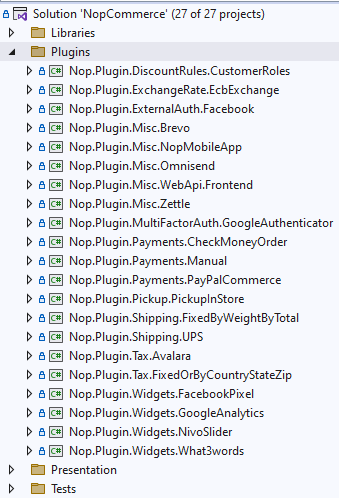
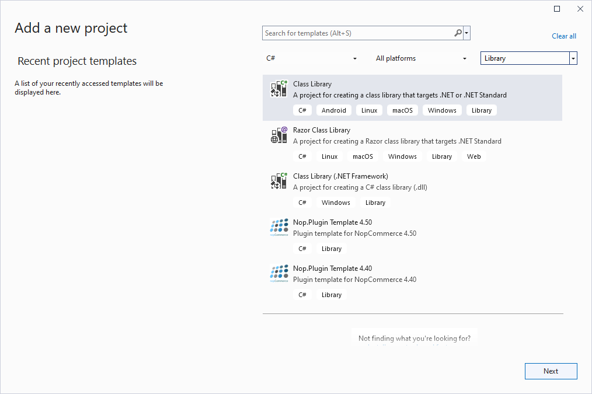
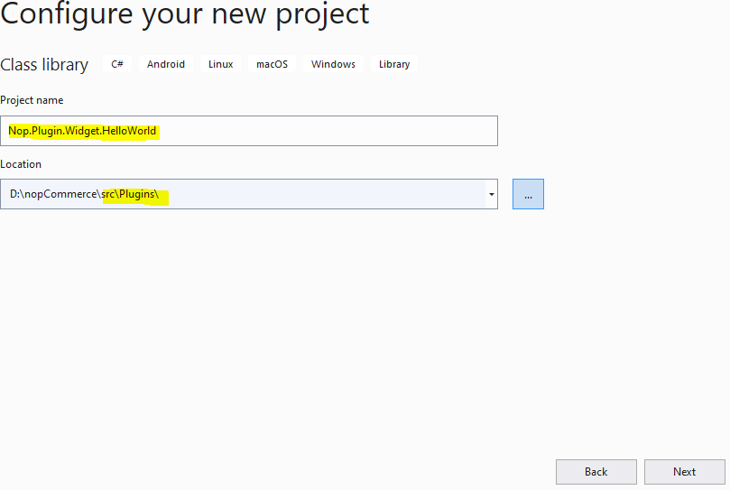
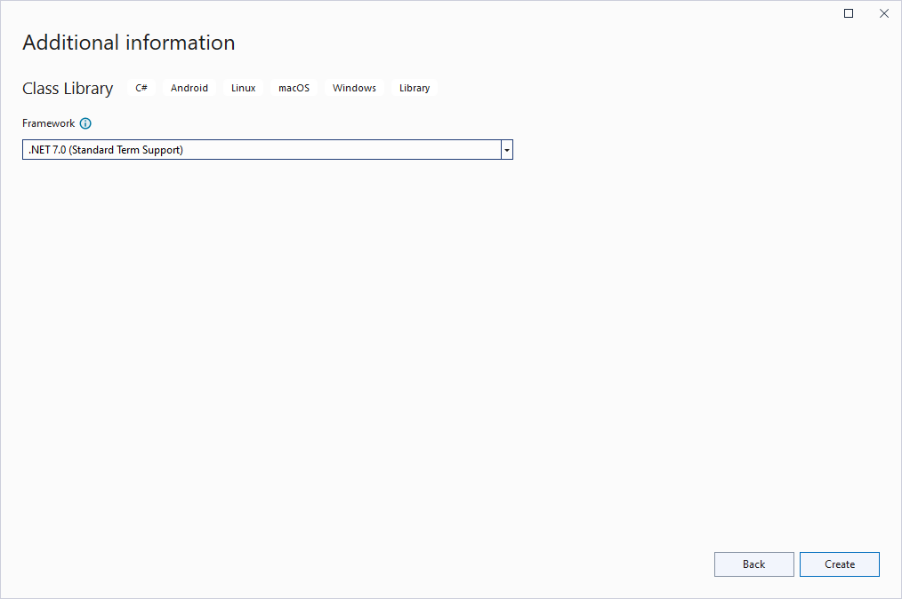
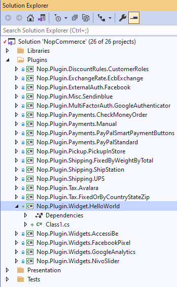
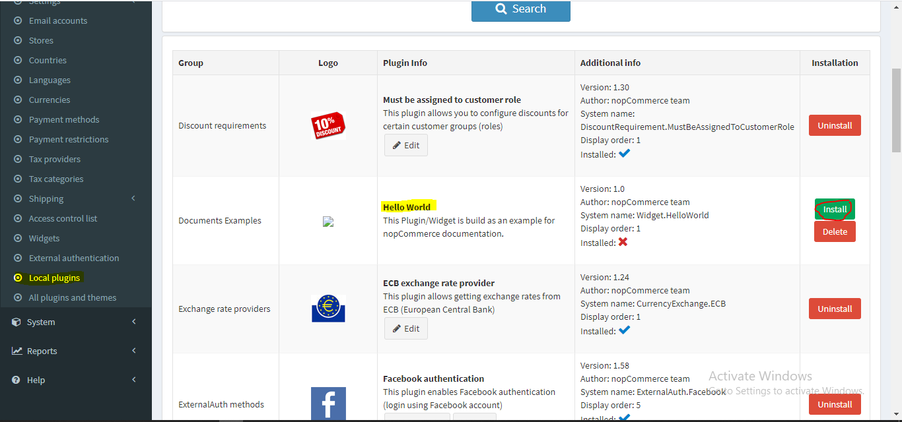
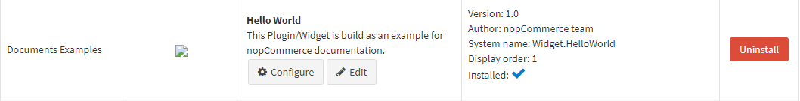
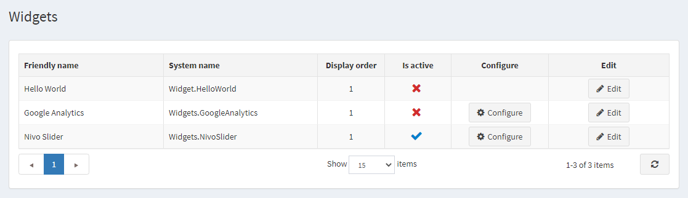
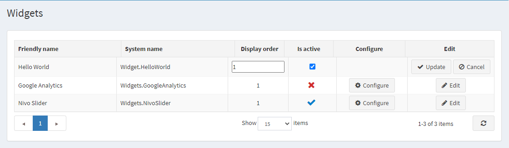
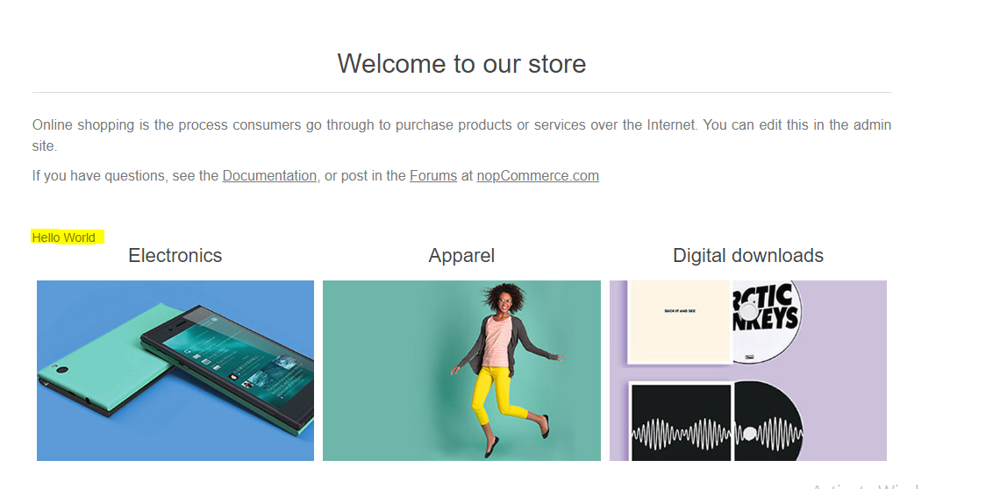

# 開發新外掛

## 概觀

nopCommerce 使用外掛系統來擴充後台管理功能的靈活性，並使用小部件系統來擴充網站的功能。外掛與小部件是一組獨立的程式或組件，可以添加到現有系統中以擴充特定功能，並且可以在不影響主系統運作的情況下從系統中移除。因此，透過使用外掛和小部件的概念，我們可以在不更動或編輯 nopCommerce 解決方案核心原始程式碼的情況下，為系統新增更多功能並進行建構。這使我們能夠隨心所欲地將 nopCommerce 解決方案升級或降級到最新版本或舊版本，而無需重寫我們已經建立的外掛和小部件。

## 外掛 vs. 小部件

我們知道外掛和小部件都是為了擴充 nopCommerce 解決方案的功能。那麼，您可能會問「它們之間有什麼區別」。基本上在 nopCommerce 中，您可以將小部件視為一種帶有額外功能的外掛。建立小部件的過程與建立外掛大致相同，但透過使用小部件，我們可以在 nopCommerce 前台網站的特定區域（由 nopCommerce 預先定義，稱為小部件區域 widget-zones）顯示 UI（使用者介面），這是在純外掛中無法實現的。您可以將小部件視為外掛的一個子集。

>[!NOTE]
>所有可用的 widget-zones 可以在 `Nop.Web.Framework.Infrastructure` 命名空間中找到：
>
>- 後台管理的小部件區域可以在 **AdminWidgetZones.cs** 檔案中找到。
>
>- 前台商店的小部件區域可以在 **PublicWidgetZones.cs** 檔案中找到。

您現在應該更清楚什麼是小部件和外掛，何時可以使用它們，以及使用它們的好處。那麼，現在讓我們來建立一個簡單的小部件，在公開網站上顯示「Hello World」訊息，藉此了解如何在 nopCommerce 中建立小部件。

## 初始化外掛專案

### 步驟 1：建立新專案

前往 nopCommerce 官方網站並下載最新的 nopCommerce 原始程式碼。在您偏好的 IDE（建議使用 Microsoft Visual Studio）中開啟您的 nopCommerce 解決方案。如果您想進一步了解專案結構，請先參閱["原始程式碼組織"](xref:zh-Hant/developer/tutorials/source-code-organization)一文。在解決方案的頂部，您會看到一個 *Plugins* 資料夾，展開該資料夾，您會看到 nopCommerce 預設提供的外掛專案列表。



為了建立一個新的小部件專案，請右鍵點擊 *Plugins* 資料夾：**Add** -> **New Project**，接著會出現「add new project」視窗。



選擇 **Class Library** 專案範本並進入下一步，您需要在該步驟指定專案名稱。



nopCommerce 遵循一些標準命名規範，您可以從 nopCommerce 文件中獲得更多資訊。我依照 nopCommerce 的命名規範，選擇了 `Nop.Plugin.Widget.HelloWorld` 作為我的專案名稱。位置應位於 */src/Plugins* 目錄內。現在點擊 **Next**。



這應該會在 Plugin 目錄中建立一個新專案。您會在解決方案中看到如下畫面：



### 步驟 2：將新專案配置為小部件

我們需要針對我們的專案進行幾項配置，才能使其作為 *外掛* 或 *小部件* 使用。

成功建立專案後，開啟其 `.csproj` 檔案。右鍵點擊您的專案，從內容選單中點擊 `{Your_Project_Name.csproj}` 選項，並將其內容替換為以下程式碼。

```xml
<Project Sdk="Microsoft.NET.Sdk">
    <PropertyGroup>
        <TargetFramework>net9.0</TargetFramework>
        <Copyright>SOME_COPYRIGHT</Copyright>
        <Company>YOUR_COMPANY</Company>
        <Authors>SOME_AUTHORS</Authors>
        <PackageLicenseUrl>PACKAGE_LICENSE_URL</PackageLicenseUrl>
        <PackageProjectUrl>PACKAGE_PROJECT_URL</PackageProjectUrl>
        <RepositoryUrl>REPOSITORY_URL</RepositoryUrl>
        <RepositoryType>Git</RepositoryType>
        <OutputPath>$(SolutionDir)\Presentation\Nop.Web\Plugins\{PLUGIN_OUTPUT_DIRECTORY}</OutputPath>
        <OutDir>$(OutputPath)</OutDir>
        <!--Set this parameter to true to get the dlls copied from the NuGet cache to the output of your    project. You need to set this parameter to true if your plugin has a nuget package to ensure that   the dlls copied from the NuGet cache to the output of your project-->
        <CopyLocalLockFileAssemblies>false</CopyLocalLockFileAssemblies>
        <ImplicitUsings>enable</ImplicitUsings>
    </PropertyGroup>
    <ItemGroup>
        <ProjectReference Include="$(SolutionDir)\Presentation\Nop.Web.Framework\Nop.Web.Framework.csproj" />
        <ClearPluginAssemblies Include="$(SolutionDir)\Build\ClearPluginAssemblies.proj" />
    </ItemGroup>
    <!-- This target execute after "Build" target -->
    <Target Name="NopTarget" AfterTargets="Build">
        <!-- Delete unnecessary libraries from plugins path -->
        <MSBuild Projects="@(ClearPluginAssemblies)" Properties="PluginPath=$(OutDir)" Targets="NopClear" />
    </Target>
</Project>
```

在此處將 `{Plugin_Output_Directory}` 替換為您的專案名稱，以我的案例來說是 *Widget.HelloWorld*。

這樣做的目的是將所有與此專案相關的 DLL 檔案複製到 `Nop.Web/Plugin/{Plugin_Output_Directory}` 中，因為 `Nop.Web` 內的 *Plugin* 目錄是 nopCommerce 搜尋外掛和小部件以顯示在後台管理 *Plugin* 或 *Widget* 列表中的位置。

### 步驟 3：建立 plugin.json 檔案

我們為 nopCommerce 建立的每個 *外掛* 或 *小部件* 都需要此檔案。此檔案包含關於我們外掛的後設資料（meta information），用於描述該外掛。它包含諸如外掛名稱、目標/建置所依據的 nopCommerce 版本、外掛描述、外掛版本等資訊。如需更多資訊，請參閱 [plugin.json 檔案](xref:zh-Hant/developer/plugins/plugin_json)一文。

### 步驟 4：建立繼承 BasePlugin 類別的類別

我們需要一個繼承 `IPlugin` 介面的類別，這樣 nopCommerce 才會將我們的專案視為外掛。但 nopCommerce 已經有一個繼承 `IPlugin` 介面並實作該介面所有方法的 `BasePlugin` 類別。因此，我們不需要直接繼承 `IPlugin` 介面，而是可以擴充 `BasePlugin` 類別。如果我們有需要在外掛/小部件安裝和解除安裝過程中執行的邏輯，我們可以從 `BasePlugin` 類別覆寫 `InstallAsync` 和 `UninstallAsync` 方法到我們的類別中。最終，該類別看起來應該像這樣：

```cs
public class HelloWorldPlugin: BasePlugin
{
    public override async Task InstallAsync()
    {
        //Logic during installation goes here...

        await base.InstallAsync();
    }

    public override async Task UninstallAsync()
    {
        //Logic during uninstallation goes here...

         await base.UninstallAsync();
    }
}
```

現在編譯並執行您的專案。導航到後台管理介面，在 **Configuration** 下方有一個 **Local plugins** 選單，請點擊該選單。在這裡，您將看到列出了所有存在於 `Nop.Web/Plugins` 目錄中的外掛。您會在那裡看到您剛建立的外掛。如果您沒看到它，請點擊 **Reload list of plugins** 按鈕，這會重新啟動您的應用程式並列出所有可用的外掛。現在您應該能看到您的外掛了。點擊該外掛列中的綠色 **Install** 按鈕。



點擊安裝按鈕後，點擊 **Restart your application to apply changes** 按鈕。這將重新啟動您的應用程式並安裝您的外掛。安裝完成後，您將看到 *Configure*、*Edit* 按鈕以及一個 *Uninstall* 按鈕，如下所示。

 現在您的外掛已經安裝完畢。但 *Configure* 按鈕將無法運作，因為我們在外掛中尚未建立任何配置頁面。

## 建立小部件以在前台網站上顯示 UI

如前所述，*小部件* 與外掛相同，但具有額外功能。因此，我們可以利用相同的專案將其轉換為小部件，並在前台網站上渲染 UI。讓我們看看如何擴充此外掛並使其成為小部件。

首先，我們需要建立一個 `ViewComponent`。在專案根目錄中建立一個 *Components* 目錄，並建立一個 **`ViewComponent`** 類別。我們需要從 `NopViewComponent` 基底類別繼承此類別。

```cs
public class ExampleWidgetViewComponent: NopViewComponent
{
    public IViewComponentResult Invoke(string widgetZone, object additionalData)
    {
        return Content("Hello World");
    }
}
```

現在回到我們先前建立的擴充 `BasePlugin` 的類別，使其繼承 `IWidgetPlugin` 介面。此介面有兩個函數宣告 `GetWidgetZones` 和 `GetWidgetViewComponent`，我們需要在類別中實作它們。

```cs
public class HelloWorldPlugin: BasePlugin, IWidgetPlugin
{
    /// <summary>
    /// Gets a value indicating whether to hide this plugin on the widget list page in the admin area
    /// </summary>
    public bool HideInWidgetList => false;

    /// <summary>
    /// Gets a type of a view component for displaying widget
    /// </summary>
    /// <param name="widgetZone">Name of the widget zone</param>
    /// <returns>View component type</returns>
    public Type GetWidgetViewComponent(string widgetZone)
    {
        return typeof(ExampleWidgetViewComponent);
    }
    
    /// <summary>
    /// Gets widget zones where this widget should be rendered
    /// </summary>
    /// <returns>
    /// A task that represents the asynchronous operation
    /// The task result contains the widget zones
    /// </returns>
    public Task<IList<string>> GetWidgetZonesAsync()
    {
        return Task.FromResult<IList<string>>(new List<string> { "home_page_before_categories" });        
    }

    public override async Task InstallAsync()
    {
        //Logic during installation goes here...

        await base.InstallAsync();
    }

    public override async Task UninstallAsync()
    {
        //Logic during uninstallation goes here...

         await base.UninstallAsync();
    }
}
```

現在，如果您編譯專案並導航到後台管理介面，前往 **Configuration -> Widgets**，您將能夠在列表中看到您的小部件。



在這裡您可能會注意到這個小部件沒有 *Configure* 按鈕。這是因為我們沒有為此小部件建立設定視圖檔案，也沒有覆寫 `BasePlugin` 類別中的 `GetConfigurationPageUrl` 方法。由於我們已經安裝了外掛，不需要再次安裝，但您可以看到該小部件目前未啟用。我們可以透過點擊 *Edit* 按鈕來啟用它。



現在，在我們將小部件設定為啟用後，它應該能如預期般運作。如果我們回到首頁，在分類顯示之前，我們應該會看到圖片中（黃色高亮顯示的）「Hello World」訊息。

