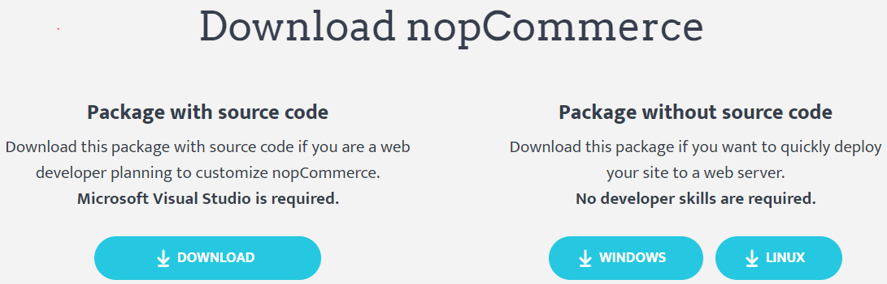
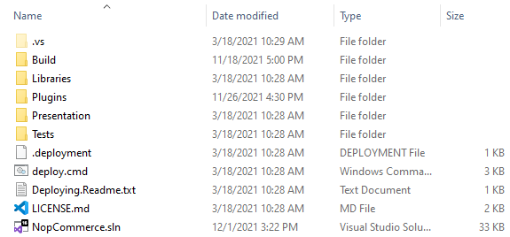
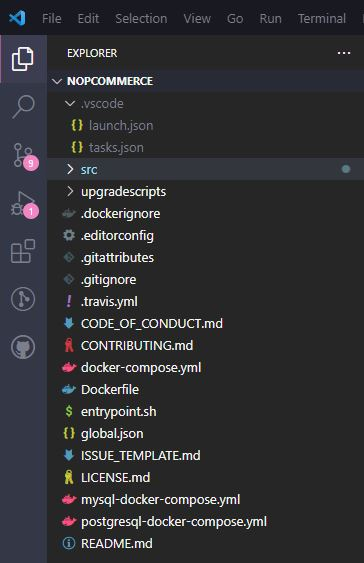

# nopCommerce 開發入門

nopCommerce 是一個基於 Microsoft ASP.NET 的開源電子商務解決方案。這是為開發人員提供的基礎指南，說明如何開始進行 nopCommerce 開發。

## 1. 開發所需工具

您可以透過 **「[開發所需工具](xref:zh-Hant/developer/tutorials/system-requirements-for-developing#tools-required-for-development)」** 一文了解技術與系統需求。

## 2. nopCommerce 使用的技術堆疊

nopCommerce 最棒的一點在於其原始碼完全可客製化，且其外掛式架構使得開發自訂功能變得相當容易，並能透過外掛系統滿足任何商業需求。它遵循知名的軟體架構、設計模式以及最佳安全實踐。最重要的是，它運作於最新技術之上，為終端使用者提供最佳體驗。為了實現這些目標，nopCommerce 在其架構中使用了以下技術堆疊：

* 應用程式層 (Application Layer)
  * Razor View Engine

    用於在客戶端渲染 HTML 頁面。Razor View Engine 是一種標記語法，協助我們在網頁中使用 C# 或 VB.NET 編寫 HTML 與伺服器端程式碼。
  * JQuery

    這是一個 JavaScript 函式庫，用於擴展 HTML 頁面的 UI 與 UX 功能。

* 商業邏輯層 (Business Layer)
  * Fluent Validation

    這是一個用於 .NET 的驗證函式庫，使用 Fluent 介面與 Lambda 表達式來建立驗證規則。
  * AutoMapper

    AutoMapper 是一個簡單的函式庫，協助我們將一種物件型別轉換為另一種型別。這是一個基於慣例的物件對物件映射工具，僅需極少的設定。
  * ASP.NET Core 內建依賴注入 (Dependency Injection)

    ASP IOC 管理類別之間的依賴關係，使應用程式在規模與複雜度成長時，仍易於變更。
  * Linq2DB

    Linq2DB 是用於 .NET 應用程式的開源 ORM 框架，也是 .NET 基金會 ( .NET Foundation) 的專案。它使開發人員能夠使用領域特定類別 (domain-specific classes) 的物件來處理資料，而不必專注於這些資料所儲存的底層資料庫資料表與欄位。因此，它是商業邏輯層與資料層之間的橋樑。
  * FluentMigrator

    Fluent Migrator 是 .NET 的遷移 (migration) 框架。遷移是一種結構化的資料庫結構變更方式，是用來替代手動執行大量 SQL 指令碼的方法（每一位開發人員都必須手動執行這些指令碼）。遷移解決了多個資料庫（例如開發人員的本機資料庫、測試資料庫與正式環境資料庫）之間資料庫結構演進的問題。資料庫結構的變更會被描述在 C# 類別中，並可提交至版本控制系統中。
* 資料層 (Data Layer)
  * Microsoft SQL Server

    SQL Server 是 Microsoft 功能完整且成熟的關聯式資料庫管理系統 (RDBMS)。
  * MySQL

    MySQL 是全球最受歡迎的開源資料庫。憑藉其經過驗證的效能、可靠性與易用性，MySQL 已成為 Web 應用程式的主流資料庫選擇。
  * PostgreSQL

    PostgreSQL 是一個強大的開源物件關聯式資料庫系統，擁有超過 30 年的活躍開發歷史，在可靠性、功能穩健性與效能方面享有盛譽。
  * Redis (快取)

    Redis 是一個開源（BSD 授權）、記憶體內的資料結構儲存庫，可用作資料庫、快取與訊息代理。在 nopCommerce 中，Redis 用於將舊資料儲存為記憶體內的快取資料集，從而提升應用程式的運作速度與效能。
  * Microsoft Azure (選用)

    Azure 是一個公用雲端運算平台，提供基礎設施即服務 (IaaS)、平台即服務 (PaaS) 與軟體即服務 (SaaS) 等解決方案，可用於分析、虛擬運算、儲存、網路等各類服務。

## 3. 如何下載專案並在本機執行

在開始使用 nopCommerce 之前，我們需要確保本機已完成正確設定，且所有必要的工具都已安裝並運作正常。現在，讓我們按照步驟說明如何下載並在本機執行 nopCommerce。

### 步驟 1：下載 nopCommerce 原始碼

請前往 [www.nopcommerce.com](https://www.nopcommerce.com/download-nopcommerce) 下載。您會看到兩個下載按鈕，一個包含原始碼，另一個則否，如下圖所示。



由於我們是為了開發目的而下載 nopCommerce，因此我們需要下載標示為 "Package with source code" 的版本，其中包含 nopCommerce 的原始碼。下載 nopCommerce 前，您需要登入或註冊新帳號。下載完成後，您會得到一個 RAR 檔案，請將其解壓縮至您指定的資料夾位置。

### 步驟 2：開啟 nopCommerce 解決方案

* 使用 Microsoft Visual Studio 開啟

  開啟資料夾。在資料夾內，您會看到組成 nopCommerce 原始碼的一系列檔案與資料夾。

  

  您還會看到一個副檔名為 `.sln` 的解決方案檔案，雙擊該檔案即可在 Microsoft Visual Studio 中開啟 nopCommerce 專案。

* 使用 Visual Studio Code 開啟

  啟動時，指定根目錄：

  

### 步驟 3：執行 nopCommerce 專案

nopCommerce 不需要額外的設定即可執行，開箱即用。

* 執行 Microsoft Visual Studio

  現在，您可以在 *Microsoft Visual Studio* 中按下 `ctrl+F5` 或直接按下 `F5` 以偵錯模式執行專案，或者按下 *Microsoft Visual Studio* 中的播放圖示按鈕來執行。

* 執行 Visual Studio Code

  **launch.json** 檔案用於在 *Visual Studio Code* 中設定偵錯器。此檔案包含關於專案如何啟動的資訊。當您首次啟動 *Visual Studio Code* 時，它會根據標準範本沿著 `.vscode/launch.json` 路徑產生此檔案。

  除了 *launch.json* 檔案外，您也可以使用 launchSettings.json 檔案設定啟動設定。**launchSettings.json** 檔案的優勢在於它允許在 *Visual Studio Code* 與完整版的 *Microsoft Visual Studio* 之間共用設定。此檔案已隨附在 nopCommerce 原始碼中，我們只需要在啟動專案時指定要使用的設定檔 (profile) 即可。

  ```json
"serverReadyAction": {
  "action": "openExternally",
  "pattern": "\\bNow listening on:\\s+(https?://\\S+)"
}
```

> [!NOTE]
>
> **launch.json** 中的設定優先權高於 **launchSettings.json** 中的設定。因此，舉例來說，如果 launch.json 中的 args 已經設定為非空字串或陣列，那麼 launchSettings.json 的內容將會被忽略。