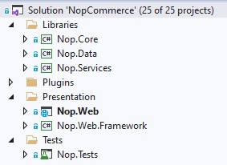

# 原始程式碼結構

這份文件是給開發者參考的 nopCommerce 解決方案結構指南，旨在幫助新進開發者了解原始程式碼。首先，nopCommerce 是一個開源應用程式，您可以從 [GitHub](https://github.com/nopSolutions/nopCommerce) 免費下載。專案與資料夾的列出順序與 *Visual Studio* 中的排序一致。建議您在 *Visual Studio* 中開啟 nopCommerce 解決方案，並在閱讀本文件時同步查看相關專案與檔案。

大多數的專案、目錄和檔案命名都能讓您大致了解其用途。例如，您甚至不需要查看名為 `Nop.Plugin.Payments.PayPalStandard` 的專案內部，就能猜出它的功能。

## `\Libraries\Nop.Core`

`Nop.Core` 專案包含了一組 nopCommerce 的核心類別，例如快取、事件、輔助工具以及商業物件（例如 `Order` 和 `Customer` 實體）。

## `\Libraries\Nop.Data`

`Nop.Data` 專案包含了一組用於從資料庫或其他資料儲存區進行讀寫的類別與函式。`Nop.Data` 函式庫有助於將資料存取邏輯與商業物件分離。nopCommerce 使用 *Linq2DB* 的 Code-First（程式碼優先）開發模式。Code-First 允許開發者在原始程式碼中定義實體（所有核心實體皆定義於 `Nop.Core` 專案中），然後使用 *Linq2DB* 和 *FluentMigrator* 從 C# 類別產生資料庫結構。這就是為什麼它被稱為 Code-First。隨後，您可以使用 LINQ 來查詢您的物件，這些查詢會在背景轉換為 SQL 並在資料庫上執行。nopCommerce 使用 [Fluent API](https://fluentmigrator.github.io/articles/technical/fluent-api-create.html) 來完整自訂資料持久化映射（Persistence Mapping）。

## `\Libraries\Nop.Services`

此專案包含一組核心服務、商業邏輯、驗證，或視需要而定的相關資料運算。有些人將其稱為 *商業存取層*（Business Access Layer, BAL）。

## `\Plugins\` 解決方案資料夾中的專案

`Plugins` 是一個 *Visual Studio* 解決方案資料夾，其中包含各個外掛專案。在實體路徑上，它位於解決方案的根目錄。但外掛的 DLL 會被自動複製到 `\Presentation\Nop.Web\Plugins` 目錄中，該目錄用於已部署的外掛，因為所有外掛的建置輸出路徑都設定為 `..\..\Presentation\Nop.Web\Plugins\{Group}.{Name}`。這允許外掛包含一些外部檔案（例如靜態內容，如 CSS 或 JS 檔案），而無需在專案之間複製檔案即可執行該專案。

## `\Presentation\Nop.Web`

`Nop.Web` 是一個 MVC Web 應用程式專案，它是前台網站的表現層，也包含了以區域（Area）形式呈現的後台管理系統。如果您以前未曾使用過 `ASP.NET`，請在[此處](http://www.asp.net/)查看更多資訊。這是您執行應用程式時所使用的專案，同時也是應用程式的啟動專案。

## `\Presentation\Nop.Web.Framework`

`Nop.Web.Framework` 是一個類別庫專案，其中包含 `Nop.Web` 專案通用的表現層功能。

## `\Test\Nop.Tests`

`Nop.Tests` 是一個類別庫專案，包含一些供其他測試專案使用的通用測試類別與輔助工具。它本身不包含任何測試。關於 nopCommerce 單元測試的詳細資訊，請參閱以下文章：[單元測試](xref:zh-Hant/developer/tutorials/unit-tests)。

### `\Nop.Core.Tests`

Nop.Core.Tests 是 Nop.Core 專案的測試專案。

### `\Nop.Services.Tests`

Nop.Services.Tests 是 Nop.Services 專案的測試專案。

### `\Nop.Web.Tests`

`Nop.Web.Tests` 是表現層專案的測試專案。

## 教學課程

- [nopCommerce 電商平台的架構說明](https://www.youtube.com/watch?v=6gLbizzSA9o&list=PLnL_aDfmRHwtJmzeA7SxrpH3-XDY2ue0a)