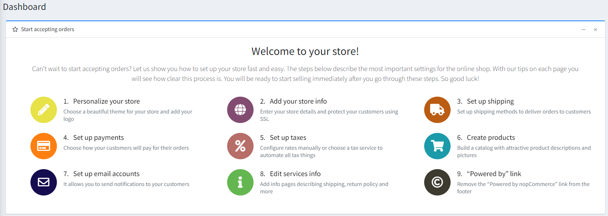
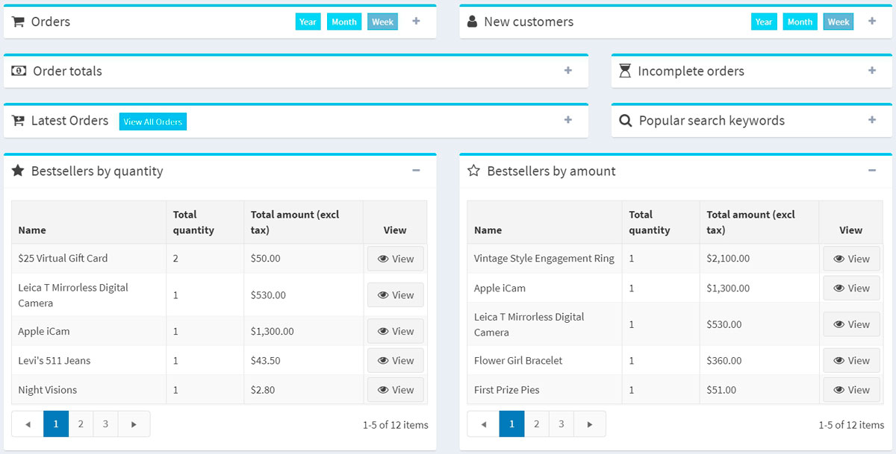
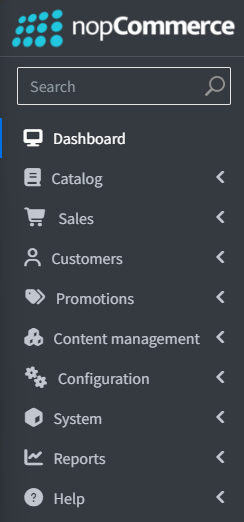
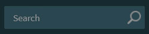
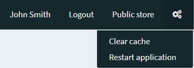
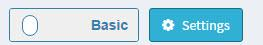
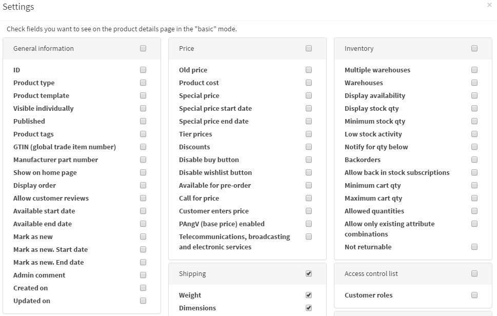

# nopCommerce 介面

本章涵蓋 nopCommerce 介面的基礎知識。

登入後，您應該會在網站頂部看到 **Administration（管理）** 超連結。或者，您也可以直接在網站網址後方加上 `/admin` 來開啟後台管理區域。例如：`www.example.com/admin`。

登入 nopCommerce 後台管理區域後，第一個顯示的畫面是 *儀表板 (Dashboard)*：

儀表板包含以下區塊：

* **開始接受訂單 (Start accepting orders)**：此區塊包含與設定商店相關的所有主要主題。此引導程式將會「手把手」地帶領您熟悉管理面板，並說明各項功能運作方式。

* **nopCommerce 新聞 (nopCommerce news)**：此區塊顯示來自 nopCommerce 的重要新聞、銷售與促銷資訊。

* **常用統計資料 (Common statistics)**：顯示您網路商店的數據，包括訂單數量、待處理退貨申請、已註冊顧客以及庫存不足的商品。

* 其他顯示網路商店關鍵統計資料的區塊：**訂單、新顧客、訂單總額、未完成訂單、最新訂單、熱門搜尋關鍵字、暢銷商品（依數量）、暢銷商品（依金額）**：

關於[這些報表的詳細資訊請見此處](xref:zh-Hant/running-your-store/reports)。

點擊  圖示可輕鬆收合儀表板區塊。

## 常見的 nopCommerce 頁面元素

### 側邊欄 (Sidebar)

側邊欄位於管理區域每個頁面的左側。它讓您能夠瀏覽 nopCommerce 管理員的所有功能。

點擊標誌旁的「漢堡」選單圖示  即可輕鬆收合側邊欄。

### 搜尋欄位 (Search field)

在側邊欄頂部有一個搜尋欄位。開始輸入您想前往的頁面名稱，搜尋列會自動建議選項，並直接帶您前往目標頁面。

### 系統選單 (System menu)

介面的這個部分會顯示目前登入的使用者名稱、登出按鈕、前台商店連結，以及一個小選單，使用者可從中選擇清除快取或重新啟動應用程式。

## 基礎與進階模式 (Basic and advanced modes)

在後台管理區域的某些頁面上，您會看到以下切換開關：

此二段式的 *基礎-進階 (Basic-Advanced)* 開關可讓您在頁面顯示模式之間切換。

為了方便使用，我們建立了 **基礎 (Basic)** 模式，其中僅顯示最常用的設定。

如果您在頁面上找不到所需的設定，請切換至 **進階 (Advanced)** 模式以檢視所有可用的設定。

在某些頁面上，開關旁邊還有一個 **設定 (Settings)** 按鈕。您可以透過它來新增或移除所需的設定，藉此根據您的需求調整基礎模式。

點擊 **設定 (Settings)** 以查看可用設定清單。勾選 **所需的設定**。新增的設定隨後將會顯示在 **基礎 (Basic)** 模式中。

