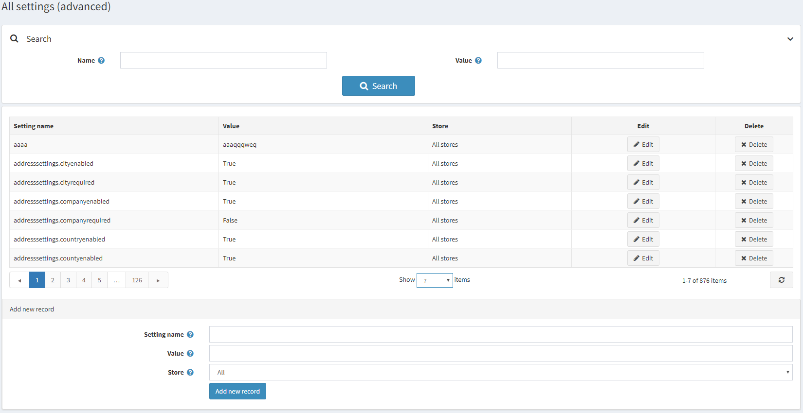
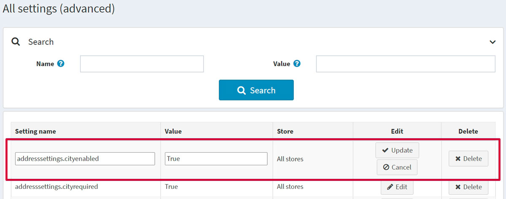

# 所有設定

*所有設定* 是一個進階工具，用於在單一畫面中修改網站的所有設定。例如，若您有多個商店，且需要將第一個商店的設定完全複製到其他商店，那麼透過 *所有設定* 在單一畫面上進行所有變更，可以為您節省大量時間。

> [!NOTE]
>
> 僅建議進階使用者在該視窗中修改設定。除非使用者非常熟悉系統，否則不建議修改這些設定。

若要定義設定：

前往 **設定 → 設定 → 所有設定 (進階)**。隨即會顯示 *所有設定 (進階)* 視窗：

## 新增設定

您可以使用頁面底部的 *新增記錄* 面板來新增設定。請為新設定定義下列欄位：

* 輸入 **設定名稱**。
* 輸入設定的 **值**。
* 定義該設定適用於哪個 **商店**。

點擊 **新增記錄** 以新增此設定。

## 編輯現有設定

若要編輯現有設定，請點擊設定列中的 **編輯** 按鈕。您將可以編輯 **設定名稱** 及其 **值**。接著點擊 **更新** 以儲存變更。

