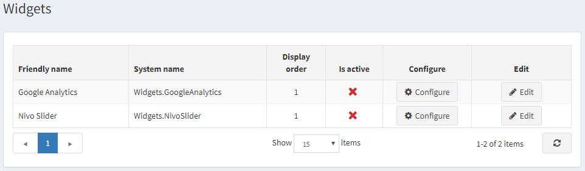
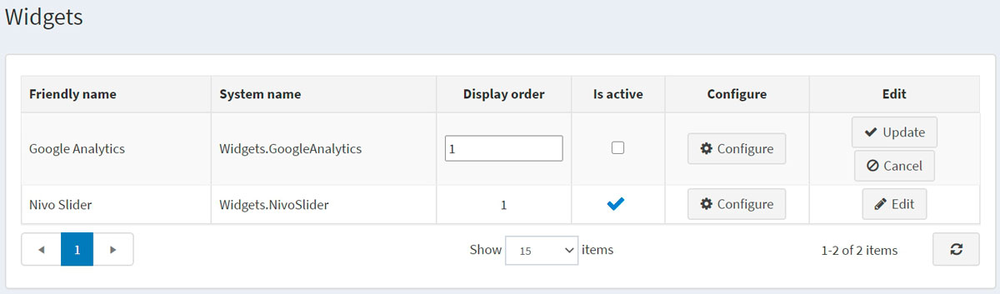
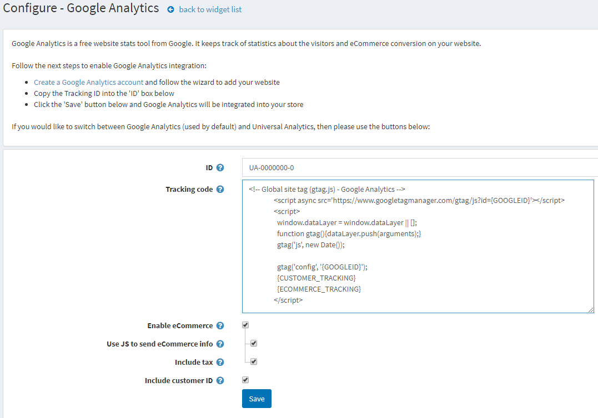

# Google Analytics 外掛

本節說明如何新增並整合 **Google Analytics** 外掛至您的商店。

若要設定 Google Analytics 外掛：

前往 **設定 (Configuration) → 小部件 (Widgets)**。系統將顯示 *小部件* 視窗：

## 啟用外掛

點擊 **Google Analytics** 旁邊的 **編輯 (Edit)**。視窗將展開如下：

勾選 **是否啟用 (Is active)** 核取方塊以啟用 Google Analytics 外掛。接著點擊 **更新 (Update)** 按鈕以儲存變更。

## 設定外掛

點擊 **Google Analytics** 旁邊的 **設定 (Configure)**。系統將顯示 *設定 – Google Analytics* 視窗如下：

請執行以下步驟以啟用 Google Analytics 整合：

* 建立一個 **Google Analytics 帳戶**，請參閱連結 [http://www.google.com/analytics/](http://www.google.com/analytics/) 並按照精靈步驟新增您的網站。
* 將 **Google Analytics ID** 複製到表單中的 **ID** 欄位。
* 輸入由 Google Analytics 產生的 **追蹤程式碼 (Tracking code)**。{GOOGLEID} 與 {CUSTOMER_TRACKING} 將會被動態取代。
* 勾選 **啟用電子商務 (Enable eCommerce)** 核取方塊，將訂單相關資訊傳送至 Google 電子商務功能。若勾選此項，將顯示以下欄位：
  * 勾選 **使用 JS 傳送電子商務資訊 (Use JS to send eCommerce info)**，以使用 JavaScript 程式碼從訂單完成頁面傳送電子商務資訊。若使用重新導向式的付款方式，部分顧客可能會跳過此頁面。否則，電子商務資訊將會透過 HTTP 請求傳送。資訊會在每次訂單付款時傳送，但此模式不支援 UTM。
  * 勾選 **包含稅額 (Include tax)**，以在產生電子商務部分的追蹤程式碼時包含稅額。
* 勾選 **包含顧客 ID (Include customer ID)** 核取方塊，以便將顧客識別碼包含在指令碼中。

點擊 **儲存 (Save)**。Google Analytics 即會整合至您的商店。