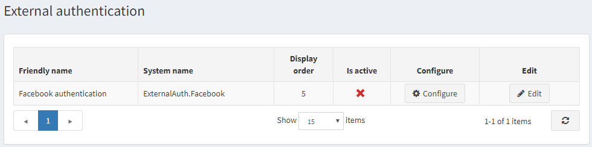
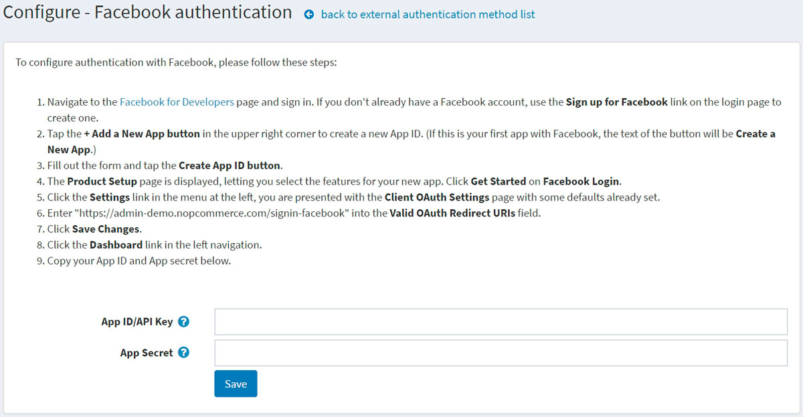

# 外部驗證方法

外部驗證方法允許使用者無需輸入電子郵件和密碼等憑證，即可登入 nopCommerce 網站。使用者可以使用外部網站（例如 Facebook 或 Google）進行身分驗證。nopCommerce 內建了透過 Facebook 進行外部驗證的功能。您可以使用來自 [市場 (marketplace)](https://www.nopcommerce.com/marketplace) 的外掛來設定其他驗證方法。

在設定好外部驗證方法並標記為啟用後，使用者將會在登入頁面上看到新的驗證選項。

## 管理外部驗證方法

前往 **設定 (Configuration) → 驗證 (Authentication) → 外部驗證 (External authentication)**。系統將顯示 *外部驗證* 視窗：

點擊驗證方法旁邊的 **編輯 (Edit)**，並勾選 **啟用 (Is active)** 以啟用該方法。您也可以定義該方法的 **顯示順序 (Display order)**。接著點擊 **更新 (Update)** 按鈕以儲存變更。

點擊該方法對應的 **設定 (Configure)** 進行配置。

## 管理 Facebook 驗證

Facebook 驗證方法是一個內建的外部驗證外掛。若要設定 Facebook 驗證，請按照下列步驟操作：

1. 在 **設定 (Configuration) → 驗證 (Authentication) → 外部驗證 (External authentication)** 頁面上，點擊 **Facebook 驗證 (Facebook authentication)** 旁邊的 **設定 (Configure)**。系統將顯示 *設定 - Facebook 驗證* 視窗：

   

1. 前往 [Facebook 開發者 (Facebook for Developers)](https://developers.facebook.com/apps) 頁面並登入。如果您沒有 Facebook 帳號，請使用登入頁面上的註冊連結建立一個帳號。
1. 點擊右上角的 **+ 新增應用程式 (+ Add a New App)** 按鈕來建立新的應用程式 ID (App ID)。(如果這是您在 Facebook 上的第一個應用程式，按鈕文字將會是 **建立新應用程式 (Create a New App)**。)
1. 填寫表單並點擊 **建立應用程式 ID (Create App ID)** 按鈕。
1. 系統將顯示 *產品設定 (Product Setup)* 頁面，讓您選擇新應用程式的功能。點擊 *Facebook 登入 (Facebook Login)* 上的 **開始使用 (Get Started)**。
1. 點擊左側選單中的 **設定 (Settings)** 連結；您將會看到已預設好部分選項的 *用戶端 OAuth 設定 (Client OAuth Settings)* 頁面。
1. 在 **有效的 OAuth 重新導向 URI (Valid OAuth Redirect URIs)** 欄位中輸入 `https://yoursitename.com/signin-facebook`，並將 `yoursitename.com` 替換為您的網站網址。
1. 點擊 **儲存變更 (Save Changes)**。
1. 點擊左側導覽中的 **儀表板 (Dashboard)** 連結。
1. 將您的 **應用程式 ID/API 金鑰 (App ID/API Key)** 和 **應用程式密鑰 (App secret)** 複製到外掛設定頁面的表單中。

點擊 **儲存 (Save)** 按鈕。在商店前台的登入頁面上，您將會看到新加入的驗證方法。

## 參閱

* [nopCommerce 中的外掛 (Plugins in nopCommerce)](xref:zh-Hant/getting-started/advanced-configuration/plugins-in-nopcommerce)