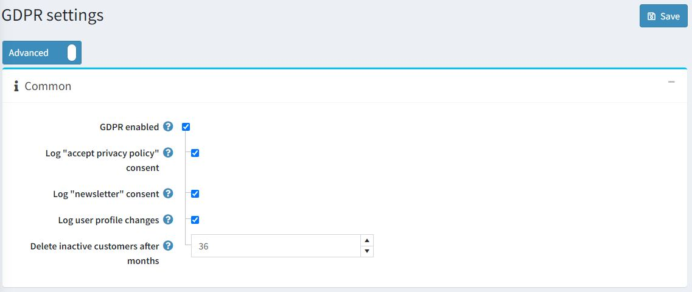
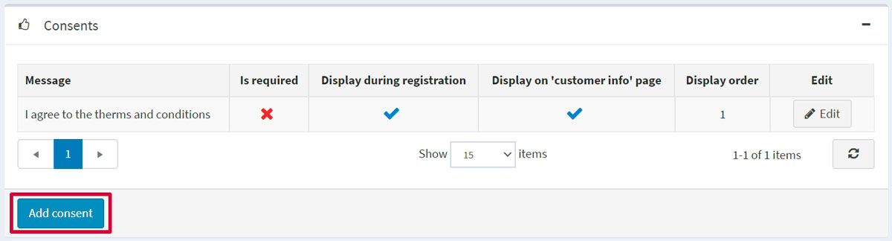
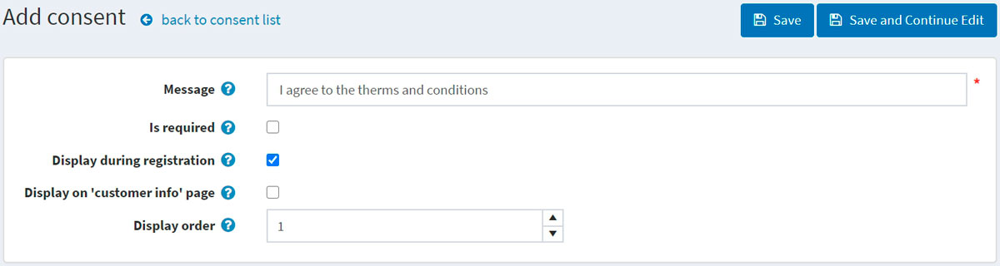
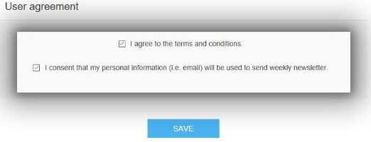
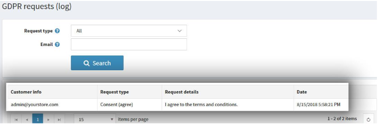
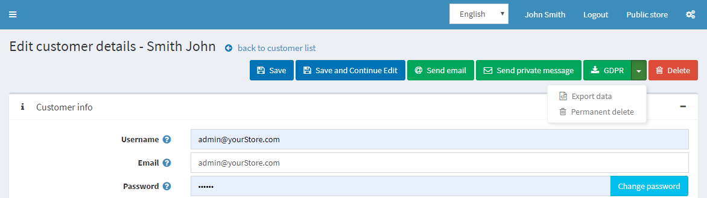

# GDPR 設定

*GDPR*（一般資料保護規範）是歐盟修訂的新資料隱私法，影響所有公司如何收集、使用及分享其歐洲顧客的個人資料。該法規於 2016 年 5 月 24 日生效，並自 2018 年 5 月 25 日起實施。該法規是數位時代強化個人基本權利的重要步驟，並透過釐清數位單一市場中公司與公共機構的規則來促進業務發展。

更多資訊請參閱此來源：

[https://ec.europa.eu/info/law/law-topic/data-protection/data-protection-eu_en](https://ec.europa.eu/info/law/law-topic/data-protection/data-protection-eu_en)

## 設定 GDPR

若要在您的 nopCommerce 商店中啟用 GDPR 設定，請前往 **後台管理 → 設定 → 一般設定 → GDPR 設定**。

接著勾選 **啟用 GDPR** 核取方塊。其他設定將允許您記錄下列活動：

* **記錄「接受隱私權政策」同意事項**。
* **記錄「訂閱電子報」同意事項**。
* **記錄使用者個人資料變更**。
* **刪除不活躍顧客（月）** - 預設值為 36 個月。

您可以點擊 *同意事項 (Consents)* 面板中的 **新增同意事項** 按鈕，在您的 nopCommerce 網站上加入同意選項：

若要新增同意事項，系統會將您重新導向至 *新增同意事項* 視窗：

定義下列同意事項設定：

* **訊息** 或將顯示給顧客的問題。
* 同意事項是否 **為必填**。
* 同意事項是否 **在註冊時顯示**。
* 同意事項是否 **在「我的帳戶」中的「顧客資訊」頁面顯示**。
* **顯示順序** 為同意事項的排列順序。1 代表清單中的第一個項目。

以下是顧客資訊頁面上同意選項的範例：

如果您已啟用同意事項記錄設定，您可以透過以下路徑查看記錄活動：**後台管理 → 顧客 → GDPR 請求 (日誌)**。

啟用 GDPR 設定後，商店管理員還可以執行以下動作：

* **永久刪除**：用於刪除顧客記錄。
* **匯出資料**：用於匯出顧客資料。

若要執行此操作，請前往 **後台管理 → 顧客 → 編輯顧客** 頁面。

## 教學課程

* [在 nopCommerce 中管理 GDPR 設定](https://www.youtube.com/watch?v=6bLc_TDqD18&feature=youtu.be)