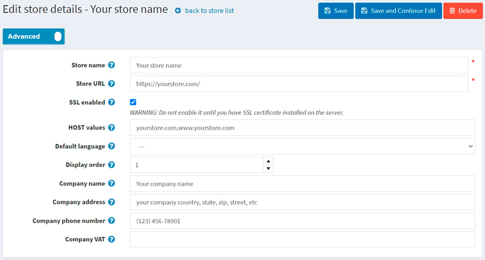

# 如何安裝與設定 SSL 憑證

什麼是 SSL 憑證？SSL 代表安全通訊協定（Secure Socket Layer）。SSL 憑證可以驗證您網站的身分，並加密訪客傳送至您的網站（或從中接收）的資訊。當您擁有保護網站的 SSL 憑證時，您的顧客可以放心，他們在任何安全頁面上輸入的資訊都是隱私的，且不會被網路駭客竊取。

## 如何取得 SSL 憑證

1. 首先，若要在您的網站上實作 SSL，您需要向 SSL 憑證提供者（又稱為憑證授權單位，Certification Authority）取得 SSL 憑證。市面上有許多可以為您的網站確保 SSL 憑證安全的憑證授權單位，例如 SSL.com、Namecheap 或 GoDaddy。

2. 接著，您需要將購買的 SSL 憑證安裝在您的伺服器上。執行此操作的方式取決於您的伺服器類型。如需更多說明與建議，請參考您的 SSL 憑證提供者的指南或伺服器文件。在本文中，我僅提供 GoDaddy 的相關指南連結供您參考：[安裝 SSL 憑證](https://www.godaddy.com/help/install-ssl-certificates-16623)。

3. 最後一步，您需要在後台管理設定您的 nopCommerce 商店。請前往 **設定 → 商店** 頁面。選取您要設定的商店，並點擊其旁邊的 **編輯** 按鈕。系統將顯示 *編輯商店詳細資料* 視窗，如下所示：
  

- 輸入包含 `https://` 前綴的 **商店 URL**。
- 勾選 **SSL 已啟用** 核取方塊。
    > [!WARNING]
    >
    > 在您於伺服器上安裝 SSL 憑證之前，請勿啟用此選項。

## 疑難排解

### 因 SSL 憑證問題導致無法存取後台管理

常見的問題是伺服器未安裝 SSL 憑證，或是 SSL 設定出現問題。同時，商店中的 **SSL 已啟用 (SSL enabled)** 設定已被啟動（正如我們在前一節所做的那樣）。

**受影響版本**：所有版本

**解決方案**：
執行以下 SQL 查詢：

  ```sql
  UPDATE [dbo].[Store] SET [SslEnabled] = 'False'
  ```

### 混合內容 HTTP 與 HTTPS

當網站透過 SSL 安全協定運作，但部分資源（例如圖片）卻透過不安全的 HTTP 連線載入時，就會發生混合內容的問題。這會導致頁面出現錯誤，因為原始請求是透過 HTTPS 進行保護的。

當使用負載平衡器時，由於它與應用程式之間是透過 HTTP 進行通訊，因此也可能產生類似的問題。

**受影響版本**：4.20 以下

**解決方案**：

- 請確保您已啟用以下設定：

  ```json
  securitysettings.forcesslforallpages = true
  ```
  
- 請確保您的網站已在主機伺服器上監聽 443 連接埠。

**受影響版本**：全部

**解決方案**：

- 請求標頭中缺少 `UseHttpXForwardedProto` 欄位。請嘗試在 `appsettings.json` 檔案中啟用 `UseHttpXForwardedProto` 設定並重新啟動網站。

  ```json
  "UseHttpXForwardedProto": true
  ```

- 您可以透過新增 CSP "upgrade-insecure-requests" 指令來修正此問題。這可以在 `web.config` 檔案中完成，或是使用 `<meta>` 元素將相同的內嵌指令嵌入到文件的 `<head>` 區段中：

  ```XML
  <meta http-equiv = "Content-Security-Policy" content = "upgrade-insecure-requests">
  ```

- 若您使用 Cloudflare，請登入您的 Cloudflare 儀表板並點擊 `SSL/TLS app`，檢查您的 SSL 設定是否處於 `Full` 或 `Flexible` 模式。

### 無窮重新導向迴圈 (ERR_TOO_MANY_REDIRECTS)

當未經授權的使用者嘗試登入或瀏覽購物車時，網站進入了無窮重新導向迴圈。

**受影響版本**：所有版本

**解決方案**：

- 嘗試刪除網站的 Cookie；此步驟可能會根據您使用的瀏覽器而略有不同。或者，您可以直接以隱私瀏覽模式開啟頁面，以確認這是否為錯誤原因。
- 清除伺服器、代理伺服器以及瀏覽器的快取。
- 檢查伺服器上的 HTTP 轉 HTTPS 重新導向。很有可能是您伺服器上的 HTTPS 重新導向規則設定錯誤。您可以在 IIS 中新增從 http 到 https 的重新導向規則。規則模式如下所示：

  ```xml
  <configuration>
    <system.webServer>
      <rewrite>
        <rules>
          <rule name="http_to_https" stopProcessing="true">
            <match url="(.*)" />
            <conditions logicalGrouping="MatchAll" trackAllCaptures="false">
              <add input="{HTTPS}" pattern="^OFF$" />
            </conditions>
            <action type="Redirect" url="https://{HTTP_HOST}/{R:1}" redirectType="SeeOther" />
          </rule>
        </rules>
      </rewrite>
    </system.webServer>
  </configuration>
  ```

- ERR_TOO_MANY_REDIRECTS 也經常是由反向代理服務（例如 Cloudflare）所引起。這通常發生在啟用了他們的「彈性 SSL」(Flexible SSL) 選項，且您的網站主機已經安裝了 SSL 憑證的情況下。當選擇「彈性」模式時，所有對主機伺服器的請求都會透過 HTTP 發送。您的主機伺服器很可能已經設定了從 HTTP 到 HTTPS 的重新導向，因此導致了重新導向迴圈。若要解決此問題，您需要將 Cloudflare 的加密 (Crypto) 設定從「彈性」(Flexible) 更改為「完整」(Full) 或「完整 (嚴格)」(Full (strict))。