# 在地化

在 nopCommerce 中，您的商店可以安裝多種語言。然而，顧客只會看到以其所選語言定義的資料。

> [!TIP]
>
> 系統預設會安裝英文。

若要查看或編輯已安裝的語言，請前往 **設定 → 語言**：
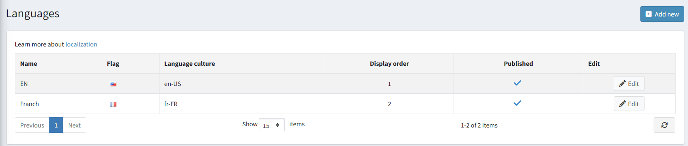

> [!NOTE]
>
> 您可以從官方的 [翻譯](https://www.nopcommerce.com/translations) 頁面下載新的語言包。

## 新增語言

若要新增語言，請點擊 **新增 (Add new)**。在 *新增語言 (Add a new language)* 視窗中，定義下列設定：

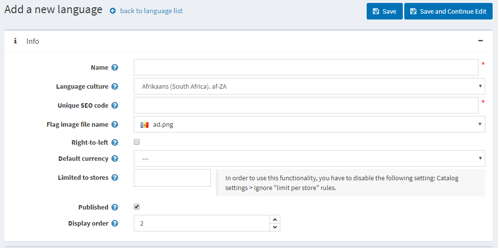

* **名稱 (Name)**：新語言的名稱。
* **語言文化 (Language culture)** — 特定的語言代碼（例如，de-AT 代表奧地利德語）。

  > [!NOTE]
  >
  > 更新 **語言文化** 欄位時，請確保已為此文化安裝了適當的 CLDR 套件。您可以在 **設定 (Configuration) → 設定 (Settings) → 一般設定 (General Settings)** 頁面的 *在地化 (Localization)* 面板中，為指定的文化設定 CLDR。

* **唯一 SEO 代碼 (Unique SEO code)** — 用於產生 URL（例如 `http://www.yourstore.com/en/`）的兩字母語言 SEO 代碼，當您擁有超過一個已發布的語言時使用。

  > [!NOTE]
  >
  > 必須在 **設定 (Configuration) → 設定 (Settings) → 一般設定 (General settings) → 在地化設定 (Localization settings)** 面板中啟用 **多語言 SEO 友善網址 (SEO friendly URLs with multiple languages)** 選項。

* **國旗圖片檔名 (Flag image file name)** — 輸入國旗圖片的檔名。圖片應儲存在 `…/images/flags` 目錄下。您也可以從預先定義的列表中選擇圖片。
* 若有需要，請勾選 **由右至左 (Right-to-Left)**（例如阿拉伯語或希伯來語）。
  
  > [!NOTE]
  >
  > 使用中的佈景主題必須支援 RTL（擁有對應的 CSS 樣式檔案）。此選項僅影響前台網站。

* 該語言的 **預設貨幣 (Default currency)**。若未指定，則會使用系統中找到的第一個貨幣（顯示順序最前者）。
* **限制於商店 (Limited to stores)** 選項允許您將此語言設定為僅適用於特定商店。您可以從預先建立的列表中選擇商店。若未使用此選項，請將此欄位留空。
  
  > [!NOTE]
  >
  > 若要使用商店限制功能，必須在 **設定 (Configuration) → 設定 (Settings) → 商品目錄設定 (Catalog settings) → 效能 (Performance)** 面板中停用 **忽略「各商店限制」規則 (全站) (Ignore "limit per store" rules (sitewide))** 選項。

* **發布 (Publish)**：發布該語言，使其可見並供您的商店訪客選擇。
* **顯示順序 (Display order)**：語言的顯示順序。1 代表列表的最上方。

點擊 **儲存 (Save)** 以儲存變更。

> [!NOTE]
>
> 由於語言文化僅在應用程式啟動時載入，因此在新增或刪除語言後，您必須重新啟動應用程式。
>
> [!NOTE]
>
> 新增語言後，您可以使用頁面上方的 **匯入資源 (Import resources)** 和 **匯出資源 (Export resources)** 按鈕來匯入與匯出字串資源。語言編輯頁面上的 *字串資源 (String resources)* 面板將允許您檢視現有的語言資源，並手動新增資源。

## 匯入語言包

若您希望為您的商店新增一種語言，您應該：

1. 造訪 nopCommerce [翻譯](https://www.nopcommerce.com/translations) 頁面。
1. 選擇 nopCommerce 版本並下載所需的語言包。
1. 前往 **設定 → 語言** 並點擊 **新增** 按鈕。
    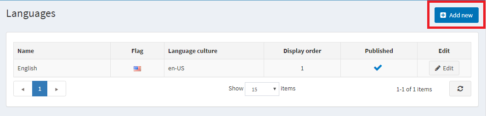

1. 填寫必填欄位並點擊 **儲存並繼續編輯**。
  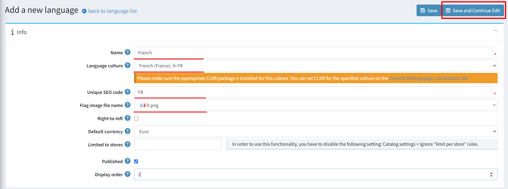

1. 點擊 **匯入資源**。並指定您下載的語言包檔案 (*.xml) 路徑。
  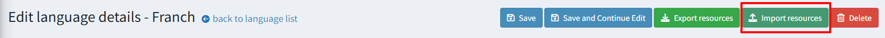

如果您發現翻譯有誤或想要自訂名稱，您可以在 *字串資源* 面板中編輯字串資源。

## 管理字串資源

前往 **設定 → 語言**。此時會顯示 *語言* 視窗：

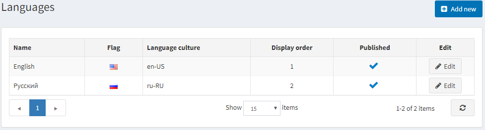

點擊該語言旁邊的 **編輯** 按鈕。在 **編輯語言詳細資料** 視窗中，找到 **字串資源** 面板。

例如，您想要將頁面頂端面板的名稱從「Administration」（如下圖所示）更改為「Control panel」。

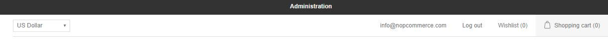

1. 若要尋找您需要編輯的地區設定資源，請在 **資源名稱** 欄位中輸入「administration」。如果該資源存在，它將會被搜尋出來。點擊該項目旁邊的 **編輯**。
1. 在 **值** 欄位中輸入新的數值，並點擊 **更新**。
  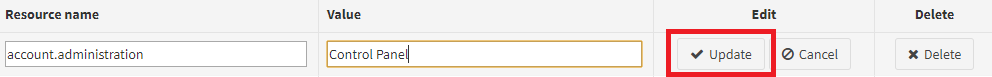

1. 變更將會套用：
  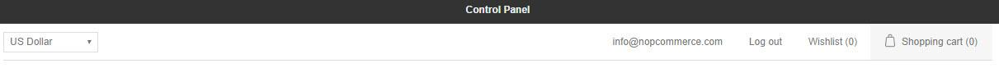

若要新增字串資源，請使用 **新增記錄** 面板。此視窗讓您可以依照下列方式將新的資源記錄新增至格線中：
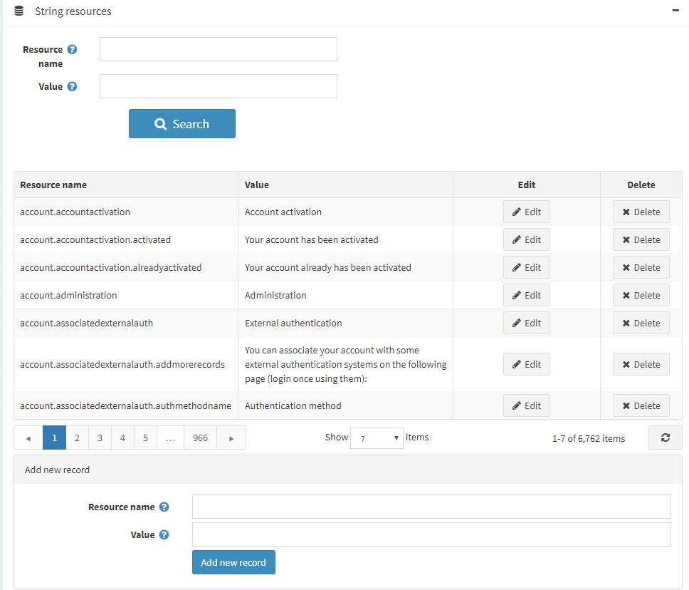

* 在 **資源名稱** 欄位中，輸入資源字串的識別碼。
* 在 **值** 欄位中，為此資源字串識別碼輸入一個值。

點擊 **儲存**。

## 在地化設定

若要設定在地化設定，請前往 **組態 → 設定 → 一般設定**：

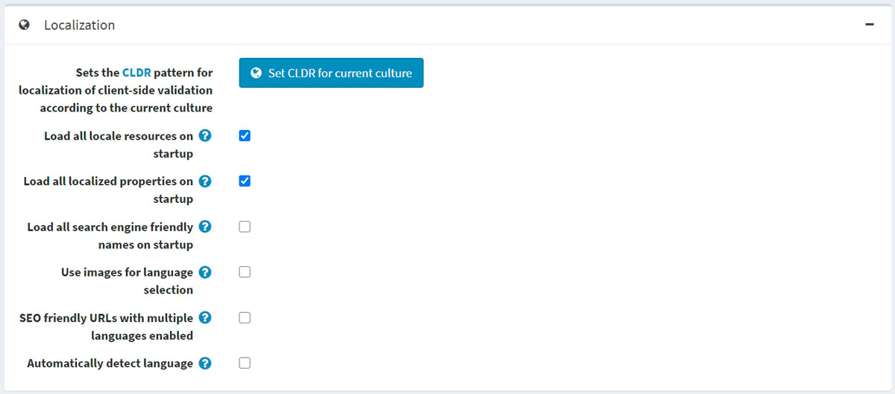

* 若要設定用於將用戶端驗證在地化為目前文化特性的 [CLDR](http://cldr.unicode.org/) 模式，請點擊 **為目前文化特性設定 CLDR** 按鈕。
* 勾選 **在啟動時載入所有地區資源** 核取方塊，以便在應用程式啟動時載入所有地區資源。啟用後，所有地區資源將於應用程式啟動時載入。應用程式啟動速度會變慢，但後續所有頁面的開啟速度會大幅提升。
* 勾選 **在啟動時載入所有在地化屬性** 核取方塊，以便在應用程式啟動時載入所有在地化屬性。啟用後，所有在地化屬性（例如商品在地化屬性）將於應用程式啟動時載入。應用程式啟動速度會變慢，但後續所有頁面的開啟速度會大幅提升。此功能僅建議在啟用兩種或更多語言時使用。若您擁有龐大的商品目錄（數千個在地化實體），則不建議啟用此項。
* 勾選 **在啟動時載入所有搜尋引擎友善名稱** 核取方塊，以便在應用程式啟動時載入所有搜尋引擎友善名稱（網址別名）。啟用後，所有網址別名將於應用程式啟動時載入。應用程式啟動速度會變慢，但後續所有頁面的開啟速度會大幅提升。若您擁有龐大的商品目錄（數千個實體），則不建議啟用此項。
* 勾選 **使用圖片進行語言選擇** 核取方塊，以使用圖片代替語言名稱顯示。
* 勾選 **在啟用多種語言時使用 SEO 友善網址** 核取方塊，以允許所有語言使用 SEO 友善網址。啟用後，您的網址將變為 `http://www.yourStore.com/en/` 或 `http://www.yourStore.com/fr/`（SEO 友善）。
  > [!NOTE]
  >
  > 更新 **在啟用多種語言時使用 SEO 友善網址** 設定後，您必須重新啟動應用程式，否則可能會導致錯誤。
* 勾選 **自動偵測語言** 核取方塊，根據顧客的瀏覽器設定自動偵測語言。

## 在地化實體

如果您的商店安裝了多種語言，您將能夠輸入一些以不同語言顯示給顧客的欄位。例如：

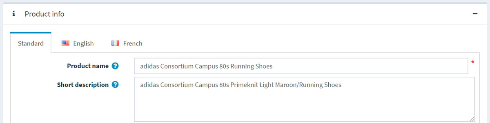

* 在 *標準分頁 (Standard tab)* 中，輸入當未指定在地化欄位時，將顯示給顧客的文字。
* 在 *包含語言名稱的分頁* 中，輸入對應語言的在地化文字。