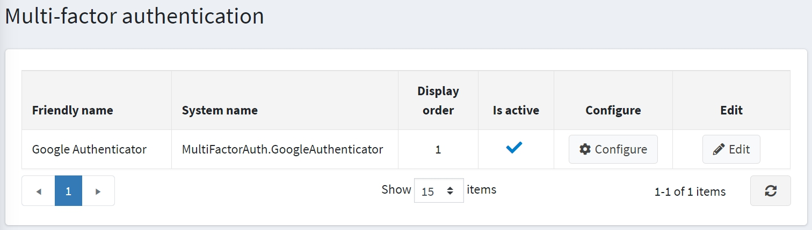
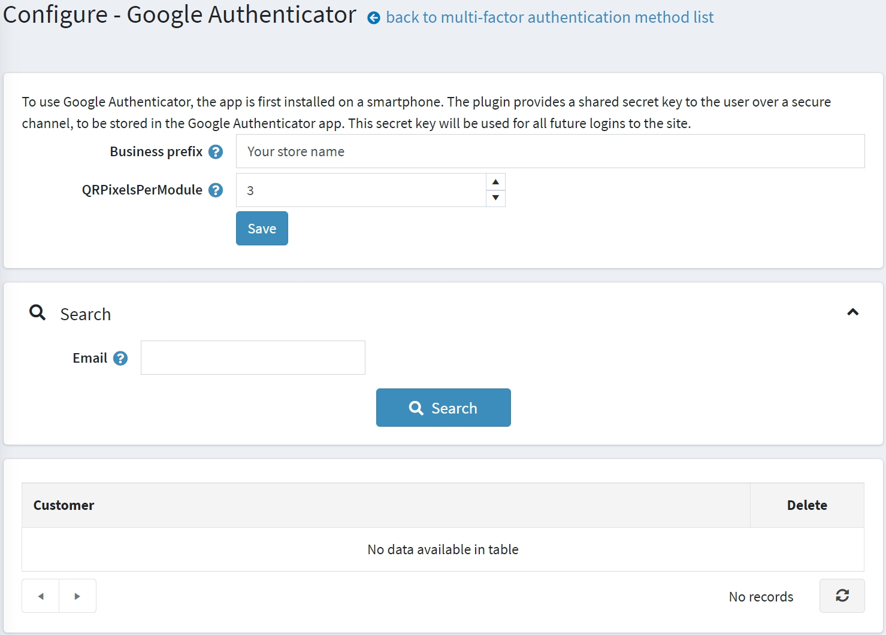
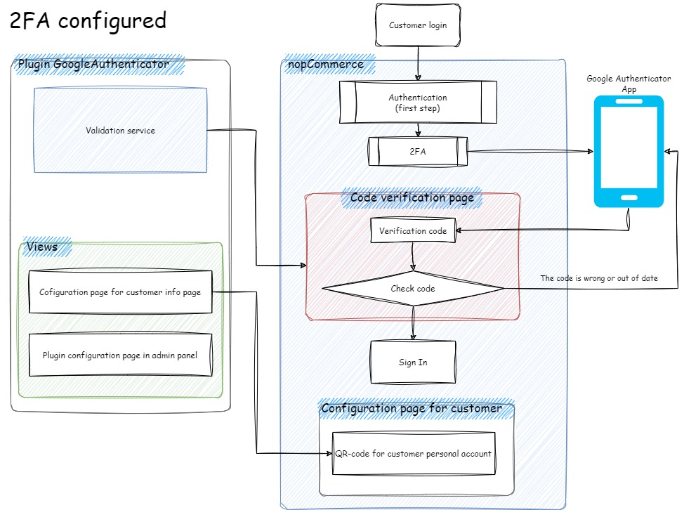
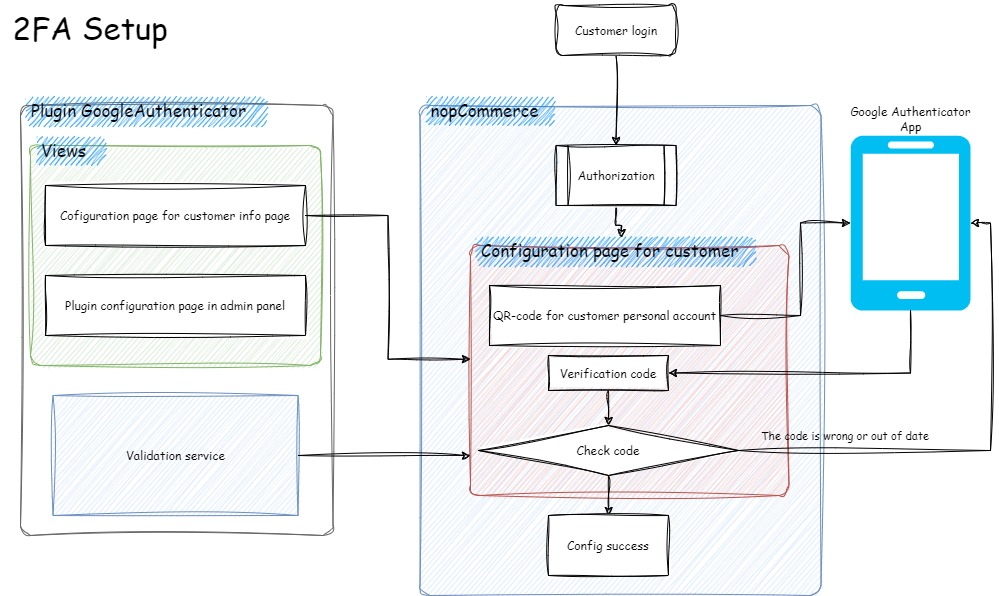
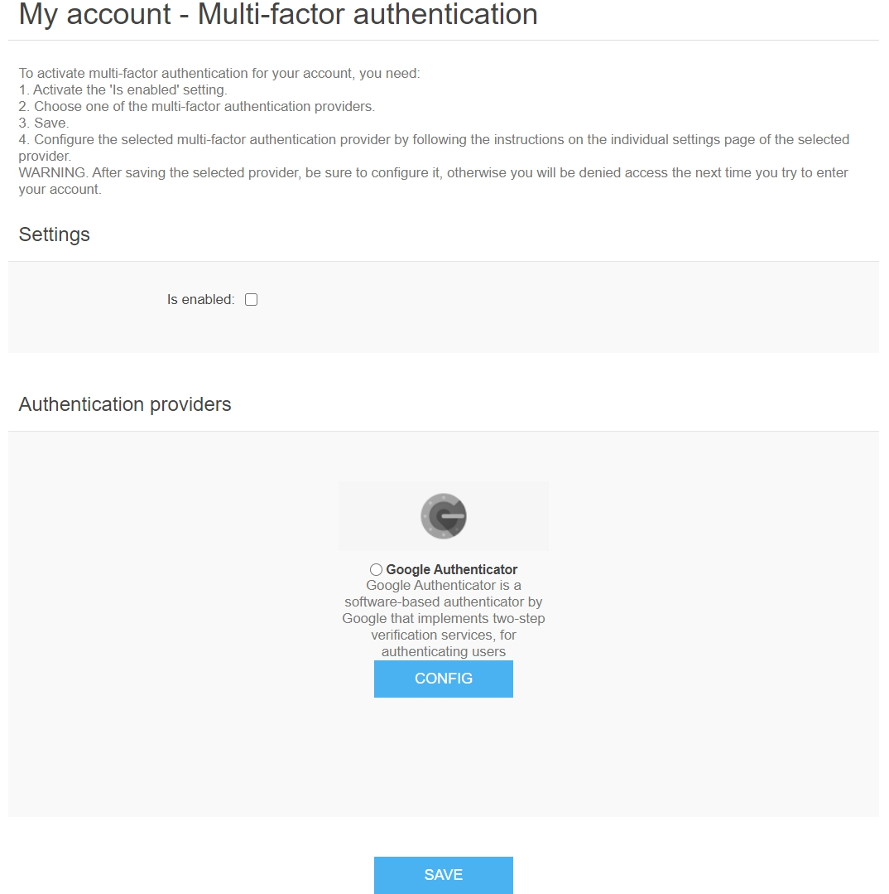

# 多重驗證

多重驗證 (MFA)（在我們的案例中是指雙重驗證 – 2FA）是一種驗證方法，要求使用者提供兩個或多個驗證因素才能存取資源。MFA 是強大身分與存取管理 (IAM) 政策的核心組件。MFA 不僅僅是要求使用者名稱和密碼，還需要一個或多個額外的驗證因素，這降低了網路攻擊成功的可能性。

nopCommerce 透過 Google Authenticator 實現了內建的多重驗證。您可以使用來自 [市集](https://www.nopcommerce.com/marketplace) 的外掛來設定其他方法。

## 管理多重驗證方法

預設情況下，Google Authenticator 外掛並未安裝。若要安裝該外掛，請前往 **組態 → 本地外掛**。

1. 在 **外掛名稱** 欄位中搜尋 *Google Authenticator*。
1. 點擊 **安裝** 按鈕。
1. 然後點擊 **重新啟動應用程式以套用變更** 按鈕來套用變更。
1. 前往 **組態 → 驗證 → 多重驗證**。系統將顯示 *多重驗證* 視窗：

   

1. 點擊驗證方法旁邊的 **編輯**，並勾選 **已啟用** 以啟用該方法。您也可以定義該方法的 **顯示順序**。完成後，點擊 **更新** 按鈕以儲存變更。

## 設定 Google Authenticator 外掛

點擊 **設定** 以進行方法配置。系統將顯示如下的 *設定 - Google Authenticator* 頁面：

在此頁面上，您必須輸入：

- 您的 **企業前綴 (Business prefix)**，以便使用者可以在 Google Authenticator 應用程式中區分您商店的帳戶資訊。
- **每個模組的 QR 像素 (QRPixelsPerModule)**，用於設定每個單元的像素數。模組是 QR Code 中的一個小方塊。預設情況下，171 × 171 像素的圖片其值為 3。

然後點擊 **儲存**。

在此頁面上，您也可以使用 *搜尋* 面板透過電子郵件搜尋顧客。

## 運作方式

若要了解多重驗證在 nopCommerce 中如何運作，請參閱上方的圖表。

- **2FA 已設定 (2FA configured)** 流程圖表示顧客已設定 2FA 時的程序。

- **2FA 設定 (2FA setup)** 流程圖表示需要由顧客完成 2FA 設定時的程序。

## 前台網站中的多重驗證頁面

若要設定多重驗證，顧客應造訪 **我的帳戶 - 多重驗證** 頁面，顯示如下：

啟用 MFA 的步驟：

1. 啟用 **已啟用** 設定。
1. 選擇其中一個多重驗證提供程序（預設情況下僅有一個）。
1. 儲存。
1. 按照所選提供程序的個別設定頁面上的說明，設定該多重驗證提供程序。

> [!WARNING]
>
> 儲存所選的提供程序後，請務必完成後續設定；否則，您下次嘗試進入帳戶時將會被拒絕存取。