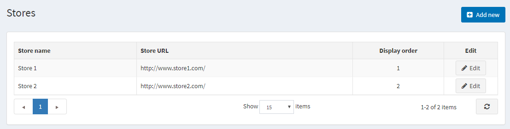
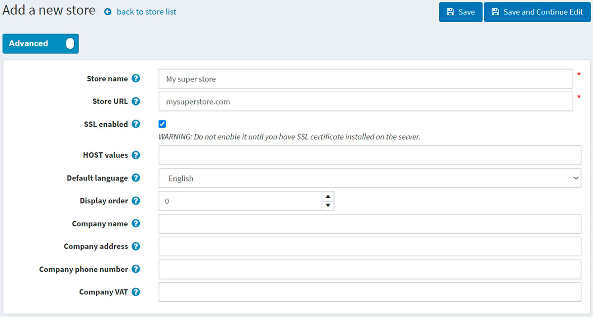
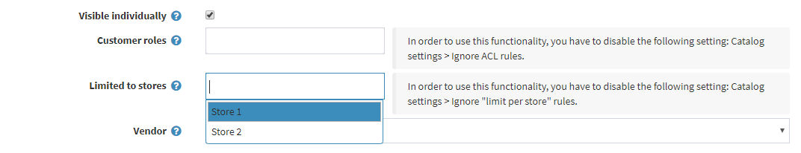
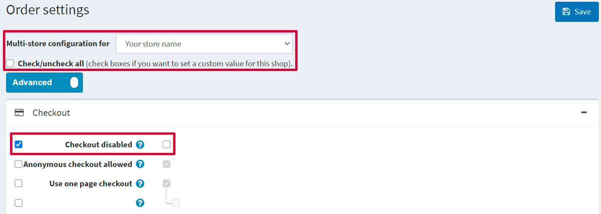

# 多商店

nopCommerce 讓您能透過單一 nopCommerce 安裝，使用同一個介面來經營多個商店。

這使您能夠在不同的網域上架設多個前台網站，並從單一的後台管理介面中管理所有的管理操作。您可以在商店之間共享商品目錄資料，讓同一款商品出現在多個商店中，且您的顧客可以使用相同的帳號憑證登入您所有的商店。

## 設定多商店

### 1. 虛擬主機控制台部分

在以下範例中，我們將說明如何設定兩個範例商店：

* `www.store1.com`
* `www.store2.com`

1. 將網站上傳並安裝至 `www.store1.com`。這是唯一存放 nopCommerce 檔案與 DLL 的地方。
      > [!NOTE]
      >
      > 關於如何安裝 nopCommerce 的詳細資訊，請參閱下一章：[安裝 nopCommerce](xref:zh-Hant/installation-and-upgrading/installing-nopcommerce/index)。

1. 在 `www.store2.com` 的控制台中（指的是您的虛擬主機控制台，而非 nopCommerce 後台管理介面），確保所有對 `www.store2.com` 的請求皆已轉發（而非重新導向）至 `www.store1.com`。請使用 CNAME 記錄來執行此操作。此步驟至關重要。

1. 在 `www.store1.com` 的控制台中，為 `www.store2.com` 設定一個網域別名（domain alias）。對於某些使用者而言，此步驟可能較為複雜（如果您遇到問題，請請求您的系統管理員協助執行此步驟）。

    完成上述步驟後，當您從瀏覽器存取 `www.store2.com` 時，將會顯示 `www.store1.com` 的內容。下一步是在 nopCommerce 後台管理介面中設定商店，內容將在下方說明。隨後，您即可開始為這兩間商店上傳內容。

1. 選用（範例）：此步驟可從下方的 Plesk 控制台執行，操作如下：
  
      每當 `www.store2.com` 被重新導向至 `www.store1.com` 時，Plesk 的網頁伺服器因為使用「名稱基礎虛擬主機（Name-Based Virtual Hosting）」技術，而無法識別如何顯示 `www.store2.com`。因此，您必須如下所述為 `www.store2.com` 建立網域別名：

      * 直接登入 `www.store1.com` 的網域面板，或透過伺服器管理面板中的 **Open in Control Panel** 連結登入。

      * 在 **Websites & Domains**（網站與網域）索引標籤中，選擇位於頁面底部附近的 **Add New Domain Alias**（新增網域別名）連結。

      * 輸入完整的別名。例如：`store2.com`。

      * 確保已選取 **Web service**（網頁服務）選項。

      * **Mail**（郵件）服務為選用項目。如果您希望 `www.store2.com` 的電子郵件以類似方式轉發，請選取此選項。

      * 確保 **Synchronize DNS zone with the primary domain**（與主要網域同步 DNS 區域）選項未被勾選。

### 2. nopCommerce 後台管理區域

安裝與技術設定完成後，您就可以透過 nopCommerce 後台管理區域來管理您的商店。前往 **組態 → 商店**。隨即會顯示 *商店* 視窗：

> [!NOTE]
>
> 預設情況下，只會建立一個商店。

若要設定多個商店，請點擊 **新增** 並定義以下商店設定：

* 定義 **商店名稱**。
* 輸入您的 **商店網址 (Store URL)**。
* 若您的商店有受 SSL 保護，請勾選 **啟用 SSL** 核取方塊。SSL (Secure Sockets Layer) 是一種標準安全技術，用於在網頁伺服器與瀏覽器之間建立加密連線。此連線確保網頁伺服器與瀏覽器之間傳輸的所有資料皆保持隱私且完整。SSL 是全球數百萬個網站用來保護其與顧客之間線上交易的產業標準。

  > [!IMPORTANT]
  >
  > 僅在您已於伺服器上安裝 SSL 憑證後，才勾選此選項。否則，您將無法存取您的網站，並且必須手動編輯資料庫中的對應紀錄（[Store] 資料表）。
  >
  > [!TIP]
  >
  > 閱讀下列章節以了解更多關於設定 SSL 的資訊：[如何安裝與設定 SSL 憑證](xref:zh-Hant/getting-started/advanced-configuration/how-to-install-and-configure-ssl-certificates)。

* **主機值 (HOST values)** 欄位是您商店可能使用的 HTTP_HOST 值清單（例如：`store1.com`、`www.store1.com`）。只有在您使用多商店解決方案以判斷目前商店時，才需要填寫此欄位。此欄位有助於區分對不同網址的請求，並判斷目前的商店。您也可以在 **系統 → 系統資訊** 中查看目前的 HTTP_HOST 值。
* 在 **預設語言** 欄位中，選擇您商店的預設語言。您也可以留空不選；在此情況下，系統將使用找到的第一個語言（顯示順序最前者）。
* 定義此商店的 **顯示順序**。1 代表清單的最上方。
* 定義 **公司名稱**。
* 定義 **公司地址**。
* 設定您的 **公司電話號碼**。
* 在 **公司 VAT** 欄位中，輸入您公司的 VAT 號碼（用於歐盟地區）。

透過在 **組態 → 商店** 頁面點擊 **新增** 按鈕並填寫類似的欄位，即可新增另一個商店。

現在，這兩個商店已使用單一 nopCommerce 安裝進行了設定：

* www.store1.com
* www.store2.com

> [!NOTE]
>
> 多商店解決方案（透過 HTTP_HOST 區分商店）不適用於相同網域下虛擬目錄中的網站。

例如，您無法將一個商店設在 `http://www.site.com/store1`，而將第二個商店設在 `http://www.site.com/store2`，因為這兩個網站的 HTTP_HOST 值是相同的 (`www.site.com`)。

## 設定多商店的實體

一旦商店設定並配置完成，您就可以為每個商店定義實體。您可以透過填寫下列各項詳細資料頁面中的 **Limited to stores**（僅限於商店）欄位來達成：[商品](xref:zh-Hant/running-your-store/catalog/products/index)、[分類](xref:zh-Hant/running-your-store/catalog/categories)、[製造商](xref:zh-Hant/running-your-store/catalog/manufacturers)、[語言](xref:zh-Hant/getting-started/advanced-configuration/localization)、[貨幣](xref:zh-Hant/getting-started/configure-payments/advanced-configuration/currencies)、[訊息範本](xref:zh-Hant/running-your-store/content-management/message-templates)、[部落格](xref:zh-Hant/running-your-store/content-management/blog)、[最新消息](xref:zh-Hant/running-your-store/content-management/news)、[內容頁面](xref:zh-Hant/running-your-store/content-management/topics-pages)。

向下捲動至 **Limited to stores** 欄位，並從下拉式選單中選擇現有商店的名稱，如下方的 *Edit product details*（編輯商品詳細資料）畫面所示：

## 設定多商店的參數

不同的 [佈景主題](xref:zh-Hant/getting-started/design-your-store/choose-and-install-a-theme) 也可以針對不同的商店進行設定。

此外，您可以針對個別商店覆寫任何設定值。例如，前往 **設定 → 訂單設定**，並查看 **多商店設定目標為** 的下拉式選單，您可以從中選擇想要覆寫設定的目標商店：

當您選擇該商店後，頁面將會重新整理，接著您就能夠為該商店定義任何欄位。完成後，只需點擊 **儲存** 即可儲存設定。