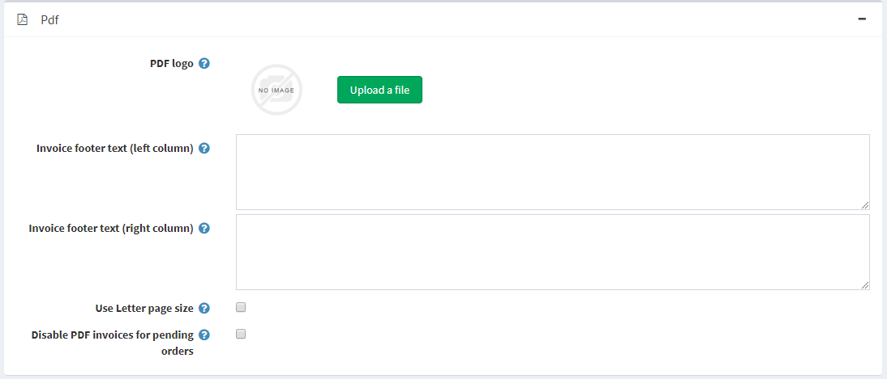

# PDF 設定

經營商店時，您可能需要自動產生 PDF 檔案，例如發票和協議條款。

若要定義 PDF 設定，請前往 **設定 → 設定 → 一般設定**，並找到 *PDF* 面板：

* 在 **PDF 標誌區域**，拖放要上傳的標誌檔案。此圖片檔案將顯示在 PDF 訂單發票上。建議使用較小的圖片。
* 在 **發票頁尾文字（左欄）** 欄位中，輸入將顯示在已產生發票底部（左欄）的文字。
* 在 **發票頁尾文字（右欄）** 欄位中，輸入將顯示在已產生發票底部（右欄）的文字。
* 如果您希望 PDF 文件採用 Letter 頁面大小，請勾選 **使用 Letter 頁面大小**。當取消勾選此核取方塊時，預設會使用 A4 頁面大小。
* 如果您不希望顧客能夠列印待處理訂單的 PDF 發票，請勾選 **停用待處理訂單的 PDF 發票**。

## 教學課程

* [在 PDF 發票上新增企業資訊（品牌標識）](https://youtu.be/TeXmuNWsdD4)