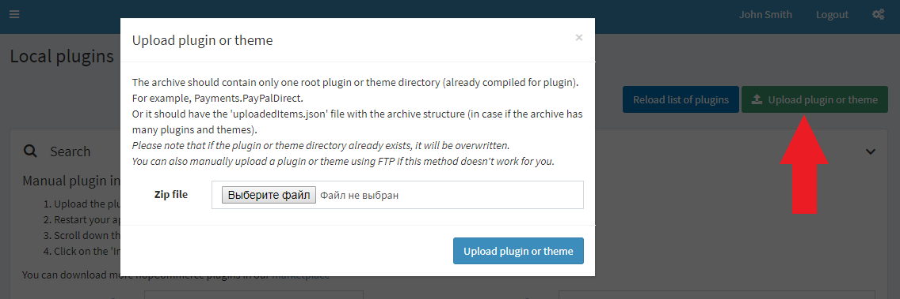
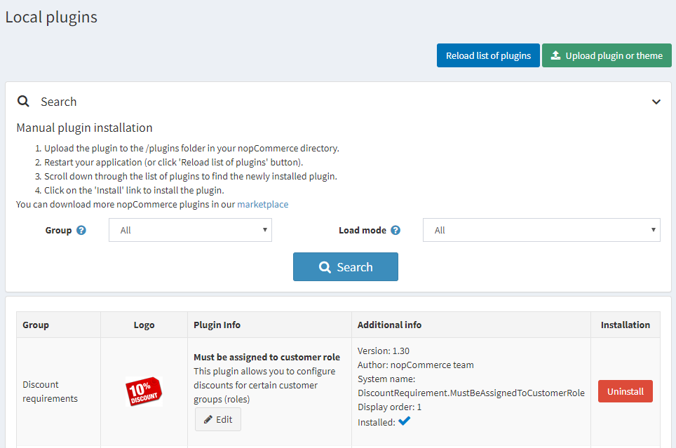
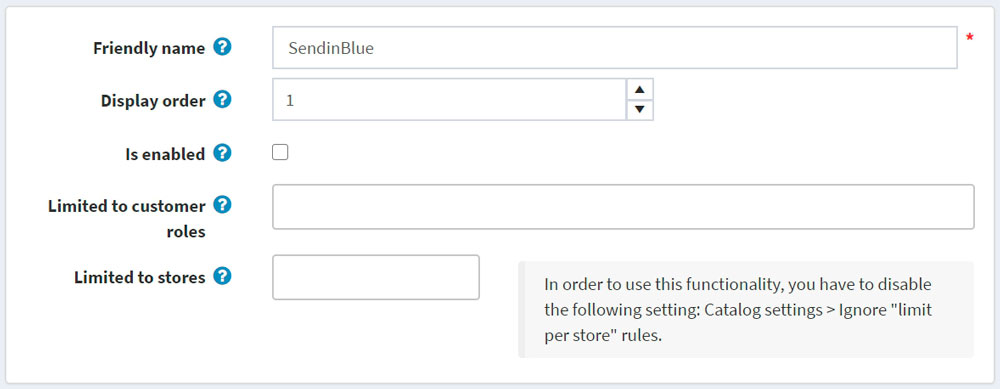

# nopCommerce 中的外掛

外掛是一組為 nopCommerce 商店增加特定功能的元件。外掛的範例包括付款模組、運費計算方式等。本章節介紹如何手動安裝外掛。

nopCommerce [市集](http://www.nopcommerce.com/marketplace) 擁有各種可以擴充您商店功能的外掛。您可以透過從市集下載，或直接從後台管理介面前往市集頁面來安裝外掛。

市集上的外掛可以依照類別、版本、名稱或評分進行排序，且分為免費與付費類型。

市集上提供的外掛是由 nopCommerce 團隊、解決方案合作夥伴或第三方供應商所開發。

> [!NOTE]
>
> 標記為「By nopCommerce team」的外掛是由 nopCommerce 團隊開發並免費發布的。第三方服務連接器是在 *技術合作夥伴計畫* 下開發的；它們同樣適用於 nopCommerce [高級支援服務](http://www.nopcommerce.com/nopcommerce-premium-support-services)，並且同樣免費提供。

## 安裝外掛

1. 使用者有兩種上傳外掛的方式。您可以擇一使用：
    * 將外掛上傳至 nopCommerce 目錄中的 `/plugins` 資料夾，並重新啟動您的應用程式（或點擊 **重新載入外掛清單** 按鈕）。
    * 使用 **上傳外掛或佈景主題** 按鈕，指定本地儲存空間中外掛封存檔的路徑來進行上傳。

    > [!TIP]
    >
    > 您可以在我們的 [擴充功能目錄](https://www.nopcommerce.com/marketplace) 下載更多 nopCommerce 外掛。

    

1. 捲動外掛清單以找到剛安裝的外掛。
1. 點擊 **安裝** 連結來安裝該外掛。
1. 點擊頂端面板中的 **重新啟動應用程式以套用變更** 按鈕，以完成安裝程序。
1. 該外掛將顯示在「外掛」清單中（**設定 → 本地外掛**）。

    > [!NOTE]
    >
    > 如果您是在「中度信任 (medium trust)」模式下執行 nopCommerce，建議您清除 `\Plugins\bin\` 目錄。

## 設定外掛

1. 前往 **設定 → 本地外掛**。系統將顯示外掛清單：
    
1. 點擊外掛旁邊的 **設定** 連結，前往該外掛的設定頁面。如果外掛旁邊沒有 **設定** 按鈕，則表示該外掛無需設定。

## 變更外掛的易讀名稱、顯示順序與限制

1. 前往 **設定 → 本地外掛**。系統將顯示外掛清單：
    
1. 點擊外掛旁邊的 **編輯** 按鈕。依照下列說明編輯外掛詳細資訊：
    
1. 輸入 **易讀名稱**。
1. 在 **顯示順序** 欄位中，定義顯示該外掛的位置。1 代表清單的最上方。
1. 若要啟用該外掛，請勾選 **已啟用** 欄位。
1. 從 **限制給予顧客角色** 下拉式選單中，選擇您希望可以使用此特定外掛的角色。
1. 在 **限制給予商店** 欄位中，定義該外掛將使用的商店。
1. 點擊頁面上方的 **儲存**。

## 解除安裝外掛

1. 前往 **設定 → 本地外掛**。系統將顯示外掛清單：

1. 點擊外掛旁邊的 **解除安裝** 連結來進行解除安裝。外掛將會被移除。「安裝」欄位中的連結將變更為 **安裝**，讓您可以隨時重新安裝該外掛。
1. 點擊頂端面板中的 **重新啟動應用程式以套用變更** 按鈕，以完成解除安裝程序。

## 教學課程

* [安裝外掛（適用於 3.90 - 4.10 版本）](https://youtu.be/eLDsSm-4gKA)
* [管理各顧客角色的外掛存取權限](https://www.youtube.com/watch?v=52lVVpQ3Qag)