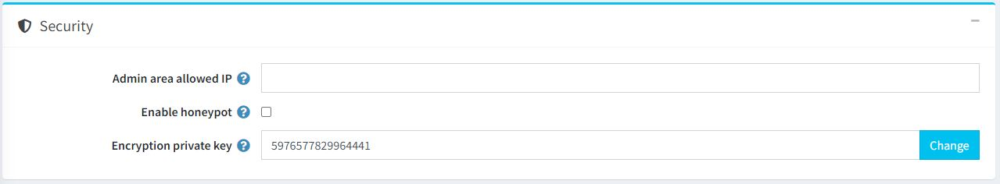
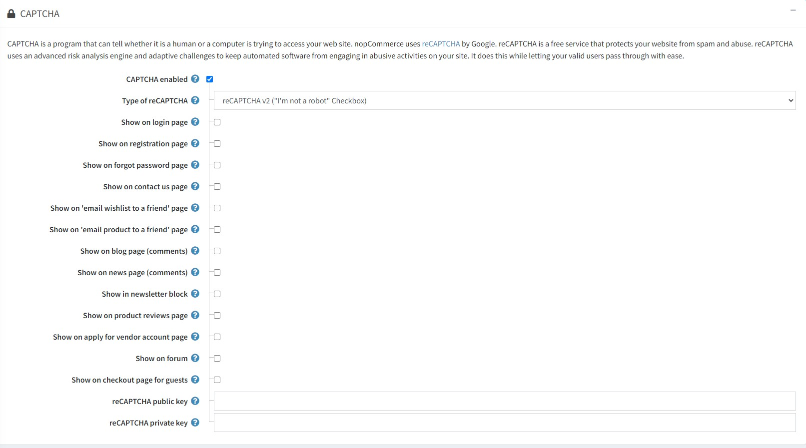

# 安全性設定

若要管理安全性設定，請前往 **設定 → 設定 → 一般設定**。

此頁面支援多商店設定；這意味著相同的設定可以套用於所有商店，也可以針對不同商店進行個別設定。如果您想管理特定商店的設定，請從多商店設定下拉選單中選擇該商店名稱，並勾選左側所需的核取方塊，以設定其自訂值。詳情請參閱 [多商店](xref:zh-Hant/getting-started/advanced-configuration/multi-store)。

## 安全性

請依照下列方式定義 *安全性* 設定：

* 在 **允許存取後台的 IP** 欄位中，輸入允許存取後台管理系統的 IP 位址。如果您不想限制後台存取權限，請將此欄位留空。請使用逗號分隔多個 IP 位址（例如：127.0.0.10, 232.18.204.16）。
* 勾選 **啟用蜜罐 (Honeypot)** 以啟用 [蜜罐](https://en.wikipedia.org/wiki/Honeypot_(computing) 機制。在電腦術語中，蜜罐是一種誘餌，用於偵測、阻擋或以某種方式抵禦未經授權使用資訊系統的嘗試。
* 在 **加密私鑰** 欄位中，輸入用於儲存敏感資料的加密私鑰。您可以隨時點擊 **變更** 來修改此金鑰。所有敏感資料皆會使用此私鑰進行加密。

> [!NOTE]
>
> 建議您在變更加密金鑰之前先備份資料庫。敏感資料包含所有信用卡資訊（僅限於這些信用卡資訊儲存於商店資料庫的情況下）。

## CAPTCHA

CAPTCHA 是一種能夠分辨存取網站的是人類還是電腦程式的機制。nopCommerce 使用 Google 的 reCAPTCHA。reCAPTCHA 是一項免費服務，可保護您的網站免受垃圾郵件與惡意攻擊。reCAPTCHA 採用進階風險分析引擎與自適應驗證機制，防止自動化軟體對您的網站進行惡意行為，同時讓合法使用者能輕鬆通過驗證。

請依照下列方式定義 *CAPTCHA* 設定：

當勾選 **啟用 CAPTCHA** 時，此面板將顯示以下設定：

* **reCAPTCHA 類型**：選擇 `reCAPTCHA v2` 或 `reCAPTCHA v3`。兩者的差異在於，reCAPTCHA v2 會顯示「我不是機器人」核取方塊，而 reCAPTCHA v3 對顧客來說則是隱形的。閱讀更多關於 [reCAPTCHA v2](https://developers.google.com/recaptcha/docs/display) 與 [reCAPTCHA v3](https://developers.google.com/recaptcha/docs/v3) 的資訊。
* **reCAPTCHA v3 分數門檻**：當選擇 reCAPTCHA v3 時啟用此選項。閱讀更多關於分數門檻的說明 [here](https://developers.google.com/recaptcha/docs/v3)。
* 在 **登入** 頁面顯示 CAPTCHA。
* 在 **註冊** 頁面顯示 CAPTCHA。
* 在 **忘記密碼** 頁面顯示 CAPTCHA。
* 在 **聯絡我們** 頁面顯示 CAPTCHA。
* 在 **將願望清單 Email 給朋友** 頁面顯示 CAPTCHA。
* 在 **將商品 Email 給朋友** 頁面顯示 CAPTCHA。
* 在 **部落格頁面 (留言)** 顯示 CAPTCHA。
* 在 **最新消息頁面 (留言)** 顯示 CAPTCHA。
* 在 **電子報區塊** 顯示 CAPTCHA。
* 在 **商品評論** 頁面顯示 CAPTCHA。
* 在 **申請供應商帳號** 頁面顯示 CAPTCHA。
* 在 **論壇** 頁面顯示 CAPTCHA。
* 在 **訪客結帳** 頁面顯示 CAPTCHA。
* 輸入 reCAPTCHA **公開金鑰 (Public key)**。
* 輸入 reCAPTCHA **私密金鑰 (Private key)**。

> [!NOTE]
>
> 已終止對 Recaptcha v1 的支援。