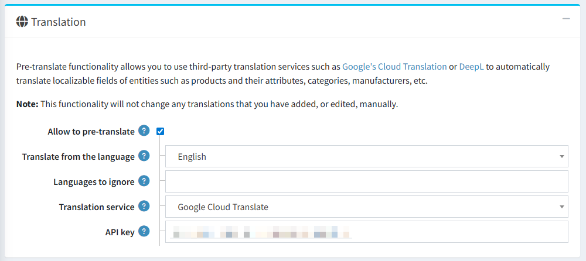
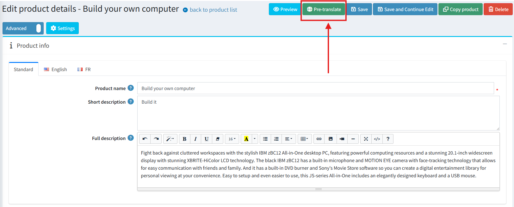
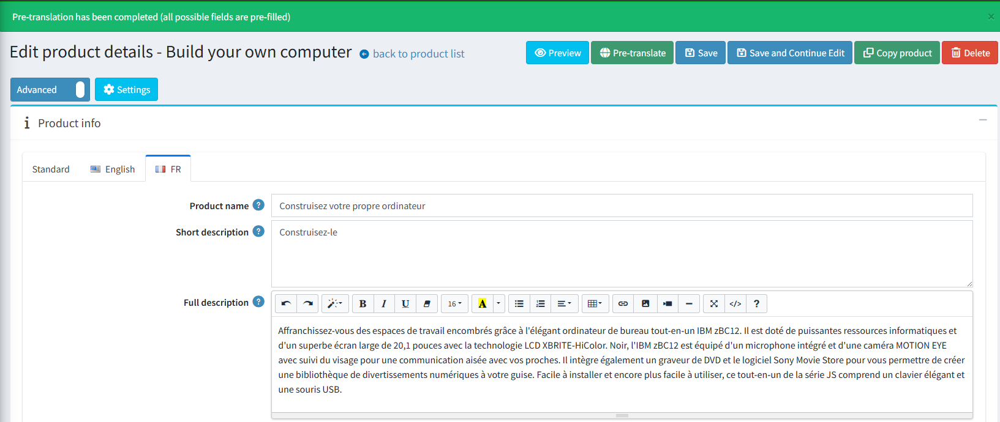
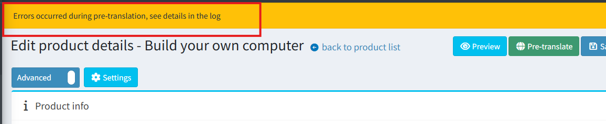

# 自動化內容翻譯

## 概覽

此功能將自動化翻譯能力整合至核心應用程式中，允許商店管理員使用兩個最受歡迎的機器翻譯平台：**DeepL** 與 **Google Translate**，將網站內容翻譯成多種語言。

目前，自動化翻譯支援以下實體：

- 分類
- 製造商
- 商品
- 商品屬性
- 規格屬性

## 設定

此功能的所有設定皆位於 **一般設定** 頁面中的 **翻譯** 區塊。

關鍵設定選項包括：

- **允許預先翻譯**：一個主開關，用於開啟或關閉整體的翻譯功能。
- **從該語言翻譯**：在「標準」分頁中，您可以指定預設語言，所有翻譯皆會由此語言產生。
- **忽略的語言**：列出應在自動翻譯過程中排除的語言。
- **翻譯服務**：一個下拉式選單，用於選擇要使用的翻譯服務（DeepL 或 Google Translate）。
  - **DeepL**：需要 **Auth key**。
  - **Google Translate**：需要 **API key**。

> [!NOTE]
>
> 系統不會自動翻譯已經包含手動儲存值的欄位。

## 如何使用

一旦啟用此功能，使用方式非常簡單。在所有支援實體的編輯頁面上，主按鈕容器中會出現一個新的按鈕。例如，在商品編輯頁面上，它看起來如下：

1. 點擊 **「預先翻譯」** 按鈕。
1. 如果翻譯成功，將會出現確認訊息。其他語言的在地化欄位將會填入翻譯後的文字。

    

1. 如果在翻譯過程中發生錯誤，將會顯示警告訊息。

    

> [!WARNING]
>
> 請務必注意，此功能僅作為 **預先翻譯** 工具使用。翻譯後的內容會填入欄位中，但 **不會自動儲存**。這讓使用者擁有完全的控制權，可以在手動儲存變更之前審閱、編輯或捨棄這些翻譯。