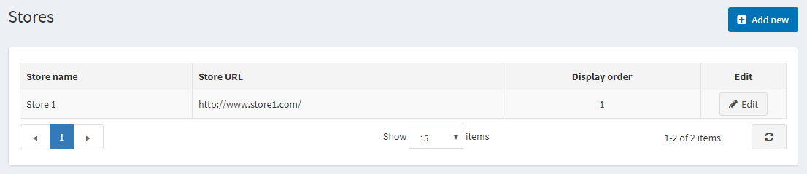
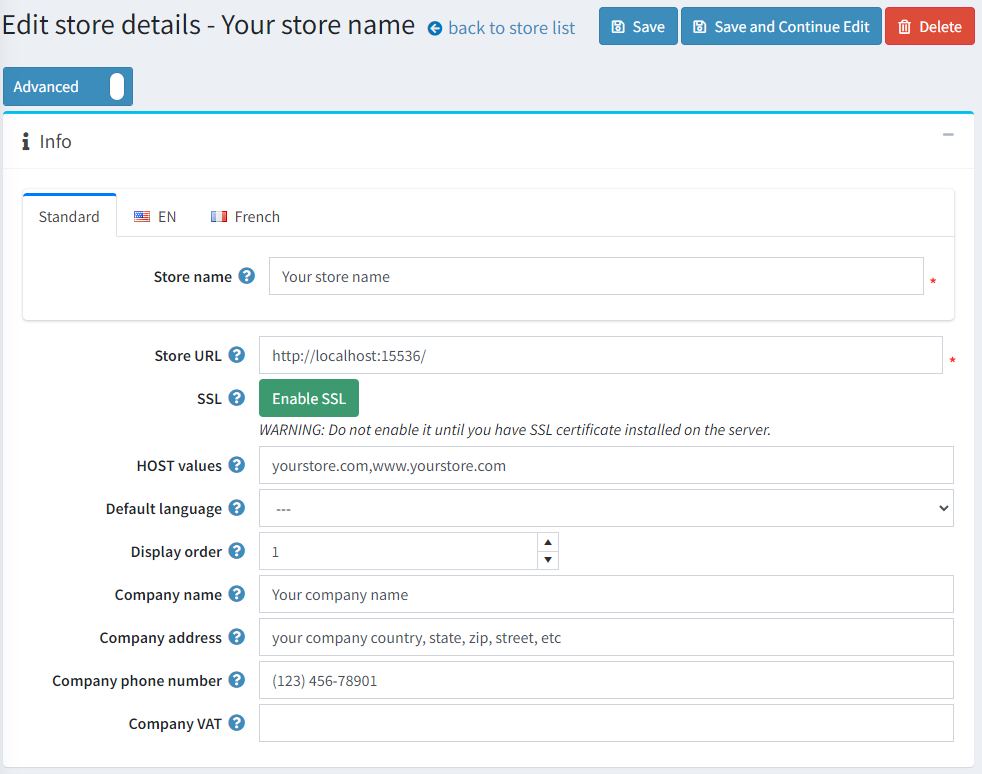

# 商店資訊

在預設的 nopCommerce 安裝中，系統會自動建立並需要設定一個商店，說明如下。
若要設定預設商店，請前往 **設定 (Configuration) → 商店 (Stores)**。

點擊預設商店旁邊的 **編輯 (Edit)** 按鈕進行設定。

## 資訊 (Info)

設定您的主要商店詳細資訊如下：

* 定義 **商店名稱 (Store name)**。
* 輸入您的 **商店網址 (Store URL)**。
* 如果您的商店已啟用 SSL 加密，請按下 **SSL** 按鈕。SSL (Secure Sockets Layer) 是建立網頁伺服器與瀏覽器之間加密連結的標準安全技術。此連結確保在網頁伺服器與瀏覽器之間傳遞的所有資料保持隱密且完整。SSL 是數百萬個網站用來保護其與顧客之間線上交易的產業標準。

  > [!IMPORTANT]
  >
  > 請僅在您已於伺服器上安裝 SSL 憑證後才按下此按鈕。否則，您將無法存取您的網站，並且必須手動編輯資料庫中的對應紀錄 ([Store] 資料表)。
  >
  > [!TIP]
  >
  > 在下列章節閱讀更多關於設定 SSL 的資訊：[如何安裝與設定 SSL 憑證](xref:zh-Hant/getting-started/advanced-configuration/how-to-install-and-configure-ssl-certificates)。

* **主機值 (HOST values)** 欄位是您商店所有可能的 HTTP_HOST 值清單 (例如 `yourstore.com`, `www.yourstore.com`)。只有在您擁有 [多商店解決方案](xref:zh-Hant/getting-started/advanced-configuration/multi-store) 時，才需要填寫此欄位以判定當前商店。此欄位能區分不同網址的請求並判定當前商店。您也可以在 **系統 (System) → 系統資訊 (System information)** 中查看當前的 HTTP_HOST 值。
* 在 **預設語言 (Default language)** 欄位中，選擇您商店的預設語言。您也可以選擇不設定，在這種情況下，系統將使用找到的第一個語言 (顯示順序最小者)。
* 定義此商店的 **顯示順序 (Display order)**。1 代表清單的最上方。
* 定義 **公司名稱 (Company name)**。
* 定義 **公司地址 (Company address)**。
* 設定您的 **公司電話號碼 (Company phone number)**。
* 在 **公司增值稅號 (Company VAT)** 欄位中，輸入您公司的增值稅號 (用於歐盟地區)。

## SEO

商店擁有者可以針對每個商店在地化主要的網站關鍵字、Meta 標題與 Meta 描述。

## 參閱

* [設定多商店 (Setting up multi-Store)](xref:zh-Hant/getting-started/advanced-configuration/multi-store)
* [國家 (Countries)](xref:zh-Hant/getting-started/configure-shipping/advanced-configuration/countries-states)
* [語言 (Languages)](xref:zh-Hant/getting-started/advanced-configuration/localization)
* [安全性設定 (Security settings)](xref:zh-Hant/getting-started/advanced-configuration/security-settings)
* [PDF 設定 (PDF settings)](xref:zh-Hant/getting-started/advanced-configuration/pdf-settings)
* [GDPR 設定 (GDPR settings)](xref:zh-Hant/getting-started/advanced-configuration/gdpr-settings)