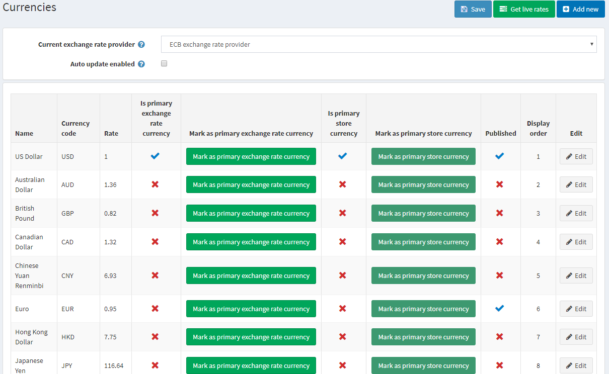
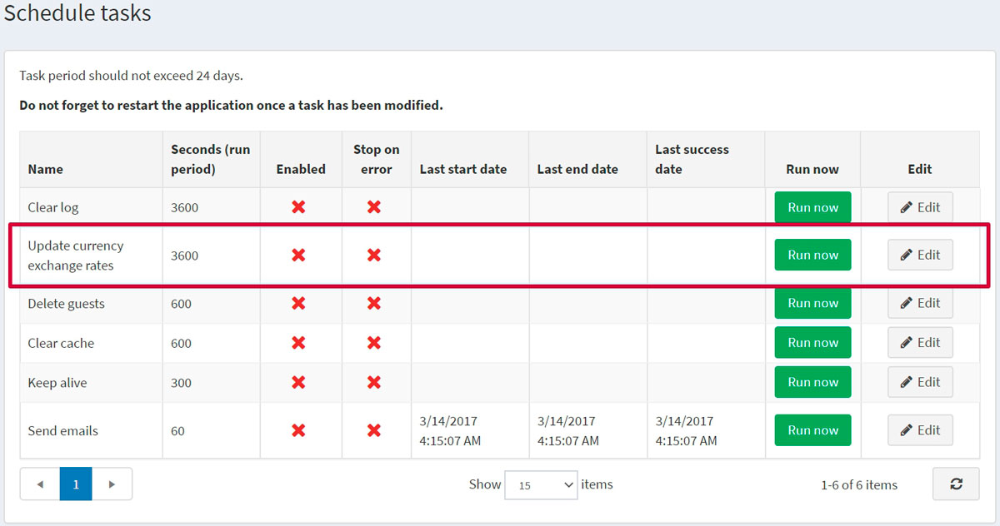
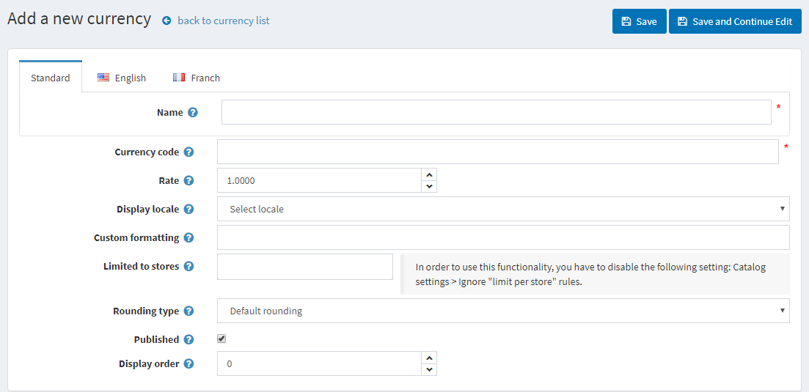
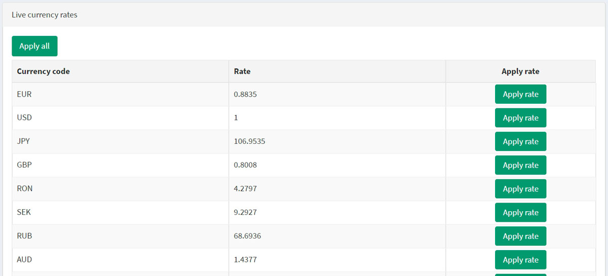

# 貨幣

在 nopCommerce 中，**僅使用一種主要商店貨幣**。主要商店貨幣是設定所有其他允許貨幣的基準。雖然 nopCommerce 允許使用多種貨幣來顯示您的商品價格，但主要貨幣會用於與線上付款提供程序進行的付款交易。

如果您使用線上付款提供程序（例如 PayPal），系統會將金額發送至該提供程序，且金額即為您以主要商店貨幣輸入的價格。

主要商店貨幣僅供商店管理員使用。它用於設定商品價格，且不必與已發布的貨幣相同。

如果您只有一種已發布的貨幣，商店將不會顯示貨幣選擇器，也不會在價格旁顯示貨幣符號。如果已發布多種貨幣，所有價格都會標記目前所選的貨幣。nopCommerce 建議移除任何不需要的貨幣。

nopCommerce 使用**匯率**來計算已發布貨幣的金額。匯率是在新增或編輯貨幣時輸入的。或者，您可以使用**即時匯率**服務來計算金額，商品價格將乘以所提供的匯率。

匯率每天都在波動。因此，您可以視需要隨時編輯匯率以保持最新狀態。實際交易僅會以商店的主要貨幣處理。在信用卡交易中，銀行通常會根據最新的貨幣價值自動進行換算。

若要定義貨幣設定，請前往 **設定 → 貨幣**。

從 **目前匯率提供程序** 下拉式清單中，選取將用於獲取即時匯率的匯率提供程序。

> [!NOTE]
>
> 預設情況下，nopCommerce 中只有一個可用的匯率提供程序 — ECB。若要從 ECB 獲取即時匯率，您應該選擇 EUR 作為主要匯率貨幣。

勾選 **啟用自動更新** 核取方塊，以啟用每小時自動更新匯率的功能。

點擊 **儲存**。

> [!NOTE]
>
> 預設情況下，所有匯率每小時更新一次。您可以在 **系統 → 排程工作** 中變更匯率更新設定；選擇 **更新貨幣匯率**。

## 新增貨幣

點擊 **新增 (Add new)** 按鈕。

定義貨幣設定：

* 貨幣 **名稱 (Name)**。
* **貨幣代碼 (Currency code)**。欲查看貨幣代碼列表，請前往：<https://en.wikipedia.org/wiki/ISO_4217>
* 輸入相對於主要匯率的 **匯率 (Rate)**。
* 從 **顯示地區設定 (Display locale)** 下拉選單中，選擇貨幣數值的顯示地區。
* 輸入要套用於貨幣數值的 **自訂格式 (Custom formatting)**。在此欄位中，您可以指定前台商店顯示貨幣時使用的符號、小數位數等。
* 在 **限制商店 (Limited to stores)** 中，從下拉選單選擇一個預先建立的商店。如果不需要此功能，請將此欄位留空。
  > [!NOTE]
  >
  > 若要使用此功能，您必須停用下列設定：**商品目錄設定 → 忽略「限制商店」規則 (全站適用) (Catalog settings → Ignore "limit per store" rules (sitewide))**。閱讀更多關於多商店功能的說明 [here](xref:zh-Hant/getting-started/advanced-configuration/multi-store)。

* 從 **捨入類型 (Rounding type)** 下拉選單中，選擇一種捨入類型：
  * *預設捨入 (Default rounding)*
  * *向上捨入至 0.05 間隔 (0.06 捨入為 0.10) (Rounding up with 0.05 intervals)*
  * *向下捨入至 0.05 間隔 (0.06 捨入為 0.05) (Rounding down with 0.05 intervals)*
  * *向上捨入至 0.10 間隔 (1.05 捨入為 1.10) (Rounding up with 0.10 intervals)*
  * *向下捨入至 0.10 間隔 (1.05 捨入為 1.00) (Rounding down with 0.10 intervals)*
  * *捨入至 0.50 間隔 (Rounding with 0.50 intervals)*
  * *捨入至 1.00 間隔 (1.01–1.49 捨入為 1.00，1.50–1.99 捨入為 2.00) (Rounding with 1.00 intervals)*
  * *向上捨入至 1.00 間隔 (1.01–1.99 捨入為 2.00) (Rounding up with 1.00 intervals)*

* 勾選 **已發佈 (Published)** 核取方塊，以啟用此貨幣，讓商店訪客能夠看見並選取。nopCommerce 支援多貨幣價格顯示。如果您有多個已發佈的貨幣，顧客將能夠選擇他們想要的貨幣。
* 在 **顯示順序 (Display order)** 欄位中，輸入此貨幣的顯示順序。數值 1 代表顯示在列表最上方。

點擊 **儲存 (Save)**。

## 取得即時匯率

點擊 *貨幣* 視窗右上角的 **取得即時匯率 (Get live rates)** 按鈕。頁面底部將會展開一個面板，如下所示：

點擊此處的 **全部套用 (Apply all)**，或者使用 **套用匯率 (Apply rate)** 按鈕手動為所有需要的貨幣套用新的匯率。

## 教學課程

* [在 nopCommerce 中管理貨幣](https://www.youtube.com/watch?v=2nzVxGyc5-M)